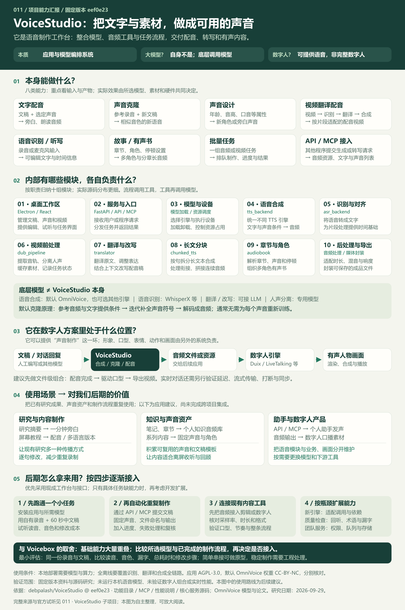
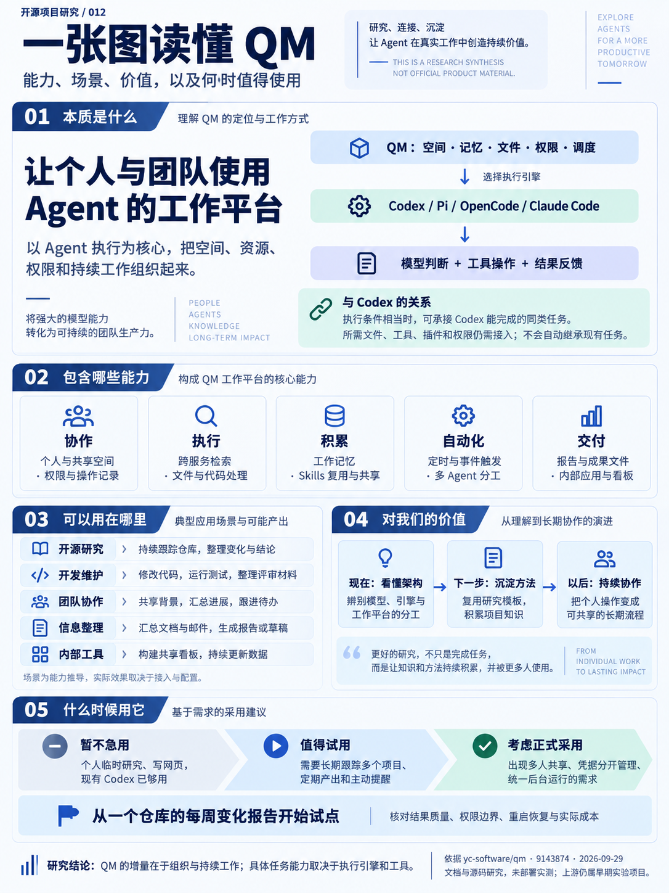

# GitHub 项目研究集

记录近期遇到的优秀开源项目：理解设计思路，验证核心能力，沉淀可复用的经验，并按需制作 Web 演示。

这里是研究总入口。每个子项目都有固定编号、独立研究文档和图片目录；本页保留摘要与索引，详细过程放在对应子项目中。

## 项目索引

按编号升序排列。编号代表收录顺序，不代表排名；已分配编号保持不变，归档后也不复用。

点击“源库”中的作者/仓库名查看上游，点击“中文研究”查看本仓库的分析，点击“在线展示”打开网页。“已完成”仅表示本轮研究与展示已完成，具体实测范围见各项目文档。

| 编号 | 源库 | 中文研究 | 能力与用途 | 研究进度 | 在线展示 |
| :--- | :--- | :--- | :--- | :--- | :--- |
| 001 | [VoltAgent/awesome-agent-skills](https://github.com/VoltAgent/awesome-agent-skills) | [Awesome Agent Skills](projects/001-awesome-agent-skills/README.md) | 外部技能发现目录：按任务寻找研究、文档、网页与自动化方法 | 已完成 | [能力摘要](https://yydshly.github.io/0929_codex_project/001-awesome-agent-skills/) |
| 002 | [addyosmani/agent-skills](https://github.com/addyosmani/agent-skills) | [Agent Skills](projects/002-agent-skills/README.md) | 研发流程技能：组织需求、实现、测试、审查与发布 | 已完成 | [能力摘要](https://yydshly.github.io/0929_codex_project/002-agent-skills/) |
| 003 | [mattpocock/skills](https://github.com/mattpocock/skills) | [Matt Pocock Skills](projects/003-mattpocock-skills/README.md) | AI 工程与协作技能：形成规格、代码、研究与交接材料 | 已完成 | [能力摘要与场景](https://yydshly.github.io/0929_codex_project/003-mattpocock-skills/) |
| 004 | [MengTo/Skills](https://github.com/MengTo/Skills) | [MengTo/Skills](projects/004-mengto-skills/README.md) | 视觉与前端技能：指导页面、交互、动效与视觉实现 | 已完成 | [能力摘要与实景](https://yydshly.github.io/0929_codex_project/004-mengto-skills/) |
| 005 | [qufei1993/skills-hub](https://github.com/qufei1993/skills-hub) | [Skills Hub](projects/005-skills-hub/README.md) | Skill 管理工具：外部接入、增删改查与分发 | 已完成 | [能力摘要](https://yydshly.github.io/0929_codex_project/005-skills-hub/) |
| 006 | [jakubkrehel/skills](https://github.com/jakubkrehel/skills) | [Jakub Krehel Skills](projects/006-jakubkrehel-skills/README.md) | Web 界面技能：设计、优化、审查与效果验证 | 已完成 | [能力摘要与个人场景](https://yydshly.github.io/0929_codex_project/006-jakubkrehel-skills/) |
| 007 | [touchine-ojo/OJO-Design-Skills](https://github.com/touchine-ojo/OJO-Design-Skills) | [OJO Design Skills](projects/007-ojo-design-skills/README.md) | 产品界面设计技能：从需求形成视觉与交互规范 | 已完成 | [能力与使用价值](https://yydshly.github.io/0929_codex_project/007-ojo-design-skills/) |
| 008 | [yang0/handraw-style](https://github.com/yang0/handraw-style) | [Handraw Style](projects/008-handraw-style/README.md) | 手绘提示词与参考库：组合风格、版式和配色，交给模型出图 | 已完成 | [在线摘要](https://yydshly.github.io/0929_codex_project/008-handraw-style/) · [一图总览](https://yydshly.github.io/0929_codex_project/008-handraw-style/capability-map.png) · [场景实测](https://yydshly.github.io/0929_codex_project/008-handraw-style/scenarios.html) |
| 009 | [duixcom/Duix-Avatar](https://github.com/duixcom/Duix-Avatar) | [Duix Avatar](projects/009-duix-avatar/README.md) | 数字人口播工具：人物素材＋文稿或音频生成新口播 | 已完成 | [在线能力、效果与价值](https://yydshly.github.io/0929_codex_project/009-duix-avatar/) |
| 010 | [earendil-works/pi](https://github.com/earendil-works/pi) | [Pi Agent Harness](projects/010-pi/README.md) | Agent 执行基础：连接模型与工具，可供 QM 等产品集成 | 已完成 | [Pi 对照研究](https://yydshly.github.io/0929_codex_project/010-pi/) |
| 011 | [debpalash/VoiceStudio](https://github.com/debpalash/VoiceStudio) | [VoiceStudio](projects/011-voicestudio/README.md) | 语音工作台：配音、克隆、转写、视频配音与有声书 | 已完成 | [能力、效果与个人价值](https://yydshly.github.io/0929_codex_project/011-voicestudio/) |
| 012 | [yc-software/qm](https://github.com/yc-software/qm) | [QM](projects/012-qm/README.md) | Agent 工作平台：组织执行、记忆、权限、协作与后台任务 | 已完成 | [能力、效果与采用时机](https://yydshly.github.io/0929_codex_project/012-qm/) |

## 项目图览

### 001 · Awesome Agent Skills

源库：[VoltAgent/awesome-agent-skills](https://github.com/VoltAgent/awesome-agent-skills)

这是一个外部技能与技能集合的发现目录。下图直接展示 20 类能力、预期产物和使用时机；结合具体技能与工具，可以用于研究资料、交付文档、制作网页及自动化重复工作。


[完整研究](projects/001-awesome-agent-skills/README.md) · [能力摘要网页](https://yydshly.github.io/0929_codex_project/001-awesome-agent-skills/) · [下载摘要图](projects/001-awesome-agent-skills/assets/capability-summary.svg)

图示为固定版本目录的中文研究归纳；目录包含技能集合，1,108 是入口数，实际技能效果尚未逐项实测。

### 002 · Agent Skills

源库：[addyosmani/agent-skills](https://github.com/addyosmani/agent-skills)

这是 Addy Osmani 的软件研发流程技能库：25 项工作流指导 AI 澄清需求、规划、实现、验证、审查和发布，产出规格、代码、测试及发布准备材料。摘要图直接展示全部技能类别的能力、场景和预期效果。


对你：现在借鉴它组织开源研究的目标、上下文和决策记录；做网页或个人工具时直接采用开发验证流程；长期维护时补齐流水线、观测与发布。价值是让临时对话沉淀为可复用的工程方法。研究场景属于方法迁移，效果未实测。

[完整研究](projects/002-agent-skills/README.md) · [在线能力摘要](https://yydshly.github.io/0929_codex_project/002-agent-skills/) · [25 项全量图](https://yydshly.github.io/0929_codex_project/002-agent-skills/full-map.html)

### 003 · Matt Pocock Skills

源库：[mattpocock/skills](https://github.com/mattpocock/skills)

把需求澄清、研究、开发验证、协作交接和学习写作组织成可复用的 AI 工作方法。38 项技能按六类用途说明，能留下规格、研究结论、原型、代码与测试、交接材料和文章；摘要图直接展示成果样张。


对你：现在用来核对开源资料、解释能力、整理分享与跨会话续做；以后制作网页和个人工具时增加需求、原型、实施与验证；长期沉淀术语、规则、决策和检查证据。无需把所有技能都纳入日常工作。

[在线能力摘要](https://yydshly.github.io/0929_codex_project/003-mattpocock-skills/) · [直接看场景](https://yydshly.github.io/0929_codex_project/003-mattpocock-skills/#scenarios) · [放大摘要图](https://yydshly.github.io/0929_codex_project/003-mattpocock-skills/capability-summary.svg) · [完整研究](projects/003-mattpocock-skills/README.md)

固定版本 c55ee460；成果样张与小组件为本项目制作，上游技能未运行实测，效率收益未量化。

### 004 · MengTo/Skills

源库：[MengTo/Skills](https://github.com/MengTo/Skills)

以视觉设计与前端体验为核心的 146 项技能：指导整页表达、风格布局、动效细节、三维与游戏原型，并支持参考拆解、素材、审查和交付。提供完整能力图、六种实际构造效果，以及面向开源研究、产品官网和长期方法积累的使用建议。


对你：先用于开源研究展示页与个人工具介绍页；有参考时拆解交互，需要空间或玩法时再选择三维与游戏能力。长期把成功实现和验收经验积累为自己的制作方法。企业 AI 页面能说明审批、审计与回退，实际后台能力仍需另行开发。

[在线能力摘要](https://yydshly.github.io/0929_codex_project/004-mengto-skills/) · [直接看六种实际效果](https://yydshly.github.io/0929_codex_project/004-mengto-skills/#real-effects) · [可切换风格实景](https://yydshly.github.io/0929_codex_project/004-mengto-skills/styles-lab.html) · [放大能力图](https://yydshly.github.io/0929_codex_project/004-mengto-skills/map.html) · [完整研究](projects/004-mengto-skills/README.md)

数量依据固定版本 798db0a。六种风格为本项目按技能规范实际构造，其余能力按原文归纳，未全部实测。

### 005 · Skills Hub

源库：[qufei1993/skills-hub](https://github.com/qufei1993/skills-hub)

一个管理 Skill 的桌面工具：支持外部 Skill 接入、集中增删改查，并分发给 AI 工具使用；附带 manage-skills-hub 管理 Skill。研究说明使用场景、底层原理、上手方法、扩展方向，以及如何把筛选后的技能用于自己的研究工作。


[完整研究](projects/005-skills-hub/README.md) · [在线能力汇总](https://yydshly.github.io/0929_codex_project/005-skills-hub/) · [下载汇总图](projects/005-skills-hub/assets/capability-summary.svg)

图示为本研究整理的能力关系，不是上游应用运行证据。

### 006 · Jakub Krehel Skills

源库：[jakubkrehel/skills](https://github.com/jakubkrehel/skills)

把界面设计经验变成 AI 可遵循的规则与工作流程。11 个技能覆盖视觉动效、排版、颜色、无障碍、布局和文案，以及整体审查、变更审查、极端场景、设计候选与网页解析；分别交付问题报告、明确要求后的界面改动、场景页、可切换方案和机制解释。


对你：现在用来改善开源研究展示页；以后制作个人工具时检查表单、状态和操作；改版前观察真实内容与界面退化；长期沉淀自己的界面规则和验收样例。让“美化一下”变成有范围、有成果、有验证的任务。

[在线能力摘要](https://yydshly.github.io/0929_codex_project/006-jakubkrehel-skills/#summary) · [我的使用场景](https://yydshly.github.io/0929_codex_project/006-jakubkrehel-skills/#personal) · [放大摘要图](https://yydshly.github.io/0929_codex_project/006-jakubkrehel-skills/capability-map.html) · [完整研究](projects/006-jakubkrehel-skills/README.md)

固定版本文档研究；使用既有能力总图。预期效果未运行上游技能实测，完整产品仍需需求、后台、安全与部署等配套工作。

### 007 · OJO Design Skills

源库：[touchine-ojo/OJO-Design-Skills](https://github.com/touchine-ojo/OJO-Design-Skills)

面向产品界面设计的 AI 技能包：一个核心 Skill 串联九份参考资料，从初步产品需求形成页面方向、颜色与排版参数、组件状态、动效规范和审查建议。配合宿主的编码与测试工具，可进一步落地为可运行的前端页面。


对你：现在用于开源研究网页的信息层级与视觉统一；以后用于个人工具、业务后台、产品官网与改版检查，长期积累可复用的设计规则。页面包含全部能力与效果速查、五个个人场景、六步用法、原理和边界。摘要图沿用已确认的总览图。

[完整研究](projects/007-ojo-design-skills/README.md) · [在线能力摘要](https://yydshly.github.io/0929_codex_project/007-ojo-design-skills/) · [可缩放摘要图](https://yydshly.github.io/0929_codex_project/007-ojo-design-skills/map.html)

固定版本文档研究；未安装或运行上游 Skill。产物与价值是预期效果，不代表实测效率或转化收益。

### 008 · Handraw Style

源库：[yang0/handraw-style](https://github.com/yang0/handraw-style)

这是一个**手绘视觉参考与提示词库**：按主题组合 280 种风格、124 种版式、36 种主题色，生成供外部生图模型使用的提示词，并可附参考图。它不直接生成图片，也不保证模型严格遵守版式。


**可实现效果与使用场景：** 适合探索手绘海报、科普信息图、品牌插画、活动物料等视觉方向。网页提供全部 440 张上游参考图，以及 12 组按场景出图、9 组对照实测；这些是单次样例，文字、主体和布局仍需人工校验。

**对你的意义与使用时机：** 现在把它作为可检索的视觉选型资料收录即可。以后当具体产品需要持续制作上述内容时，再选择风格、版式和配色，结合品牌要求与所用模型试生成、筛选和修正；没有明确内容需求时，无需为了接入这个库单独开发功能。

[在线能力摘要](https://yydshly.github.io/0929_codex_project/008-handraw-style/) · [放大摘要图](https://yydshly.github.io/0929_codex_project/008-handraw-style/capability-map.png) · [按场景实测](https://yydshly.github.io/0929_codex_project/008-handraw-style/scenarios.html) · [全量图鉴](https://yydshly.github.io/0929_codex_project/008-handraw-style/gallery.html) · [完整研究](projects/008-handraw-style/README.md)

### 009 · Duix Avatar

源库：[duixcom/Duix-Avatar](https://github.com/duixcom/Duix-Avatar)

用人物视频和新文案或音频，生成同一人物讲新内容的口播视频。适合研究导读、产品介绍、教程与培训；对你是复用现有研究与人物素材、减少重复出镜的候选工具，实际质量与省时程度仍需用自己的素材验证。


[在线能力与效果摘要](https://yydshly.github.io/0929_codex_project/009-duix-avatar/) · [放大摘要图](https://yydshly.github.io/0929_codex_project/009-duix-avatar/map.html) · [完整研究](projects/009-duix-avatar/README.md)

沿用已有总览图。页面收录官方 README 引用的旧版社区演示，并说明与当前版本的差异；本机模型未实测。

### 010 · Pi Agent Harness

源库：[earendil-works/pi](https://github.com/earendil-works/pi)

Pi 是可扩展的 Agent 执行基础，也自带终端助手。先了解十类能力及成果，再通过六步执行循环、七个公开模块、五个使用场景理解模型、工具与运行时如何协作。对我们的价值是学习执行基础、固化研究方法，并逐步构建专用 Agent 产品。


[完整研究](projects/010-pi/README.md) · [在线交互展示](https://yydshly.github.io/0929_codex_project/010-pi/) · [能力总览图](projects/010-pi/assets/overview.svg)

固定版本 `4df1574`；18 份来源留存，原版未运行。页面交互为教学示意，成果与收益未进行真实模型验证。静态展示通过 GitHub Pages 发布。

### 011 · VoiceStudio

源库：[debpalash/VoiceStudio](https://github.com/debpalash/VoiceStudio)

整合本地语音模型、音频处理和任务管理的制作工作台：将文稿与参考声音制作成旁白，将录音转为文字，将视频制作成其他语言的配音版本，并支持有声书、批量任务与 API / MCP 接入。它本身不是基础大模型，在数字人方案中可以提供声音，口型和人物画面由其他系统完成。



对我：研究摘要需要旁白、录屏教程需要配音、笔记需要转为可听资料、系列内容需要统一声音时使用；以后通过接口连接个人助手与数字人。价值是复用研究成果、减少重复录制，积累可替换模型的语音制作流程。先验证 60 秒小样，再做自动化与组合。

[在线能力摘要](https://yydshly.github.io/0929_codex_project/011-voicestudio/) · [放大摘要图](https://yydshly.github.io/0929_codex_project/011-voicestudio/map.html) · [完整研究](projects/011-voicestudio/README.md)

沿用已确认的完整汇报图；官方试听与教学示意分别标识。固定版本 `eef0e23`，未运行本机模型或验证数字人组合。发布结果见[研究记录](projects/011-voicestudio/RESEARCH.md)。

### 012 · QM

源库：[yc-software/qm](https://github.com/yc-software/qm)

以 Agent 执行为核心的个人与团队工作平台：调用 Codex、Pi 等引擎进行资料研究、代码与文件处理，并组织记忆、权限、后台任务和成果发布，可形成研究报告、代码差异、测试记录、项目清单与内部看板。



对我们：现在学习架构与复用研究方法；当需要长期跟踪多个项目、定期交付、主动提醒，或多人共享且凭据分别管理时，先用一个仓库周报试点，再评估采用。个人临时研究与写网页若已有工具满足，不必急着迁移。

[在线摘要](https://yydshly.github.io/0929_codex_project/012-qm/) · [可缩放摘要图](https://yydshly.github.io/0929_codex_project/012-qm/map.html) · [完整研究](projects/012-qm/README.md) · [Pi 对照](https://yydshly.github.io/0929_codex_project/010-pi/)

沿用已确认摘要图；固定版本 `9143874`，16 份来源留存。文档与源码研究，上游未部署实测。

## 仓库结构

```text
.
├── README.md                  # 总览、顺序索引与项目图览
├── projects/                  # 研究子项目：001-name、002-name……
├── templates/project/         # 新子项目模板
│   ├── README.md              # 摘要、来源、运行方式、截图与结论
│   ├── RESEARCH.md            # 研究问题、验证过程与记录
│   ├── assets/                # 封面、截图、结构图
│   └── web/                   # 可选的 Web 演示源码
├── docs/                      # 收录规范与部署约定
└── site/                      # 统一发布的静态站点目录
```

## 开始研究

1. 按[收录规范](docs/PROJECT_GUIDE.md)分配下一个编号并复制[子项目模板](templates/project/README.md)。
2. 记录原仓库地址、研究版本、研究问题与验证结果，添加必要的截图。
3. 更新本页的项目索引与图览；需要在线展示时，按[Web 部署约定](docs/DEPLOYMENT.md)接入演示。

研究进度统一使用：`待研究` → `研究中` → `已完成`；暂时停止维护的项目标记为 `已归档`。在线演示是否可用单独记录。

## 来源与使用

本仓库主要保存研究笔记和自主编写的示例。引用代码、图片或文档时，应在子项目中注明来源，并保留原项目要求的许可证与版权声明。总仓库暂未选择统一开源许可证。
