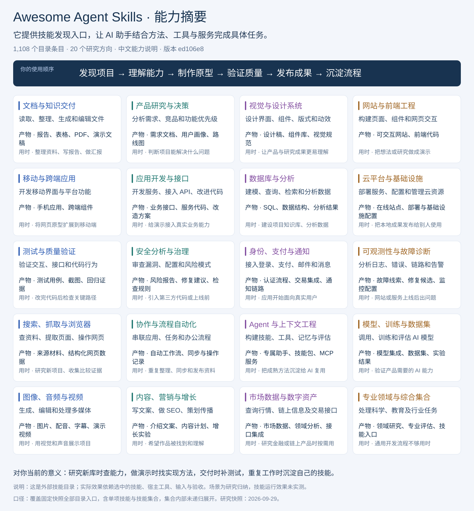
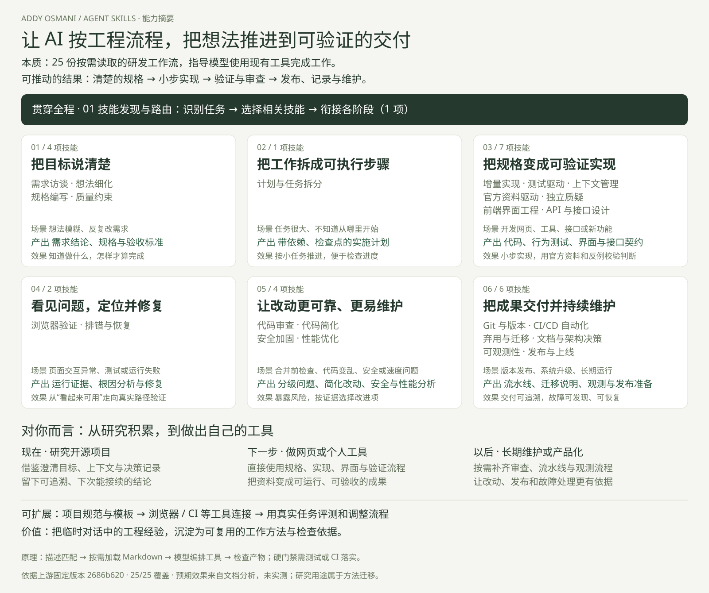
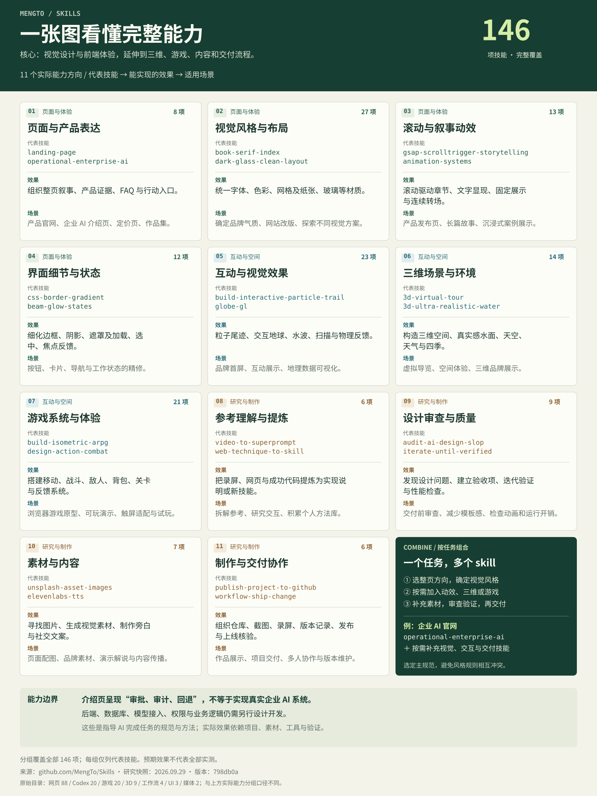
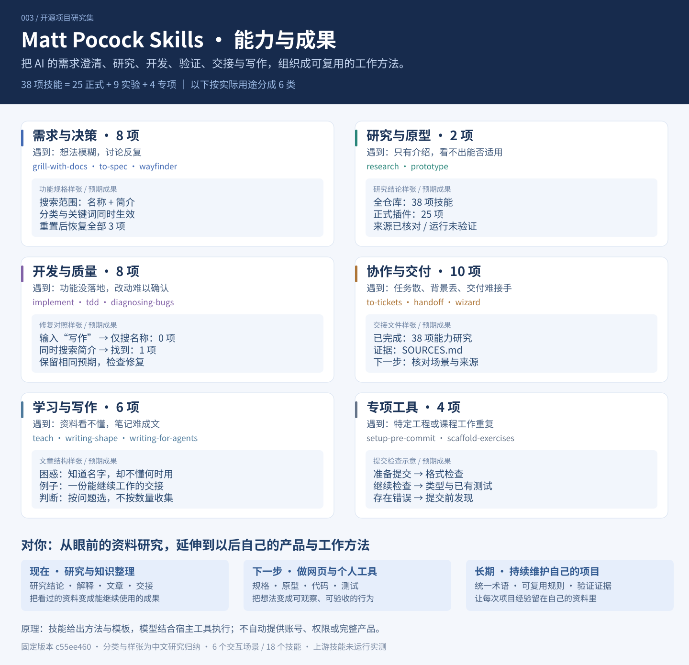
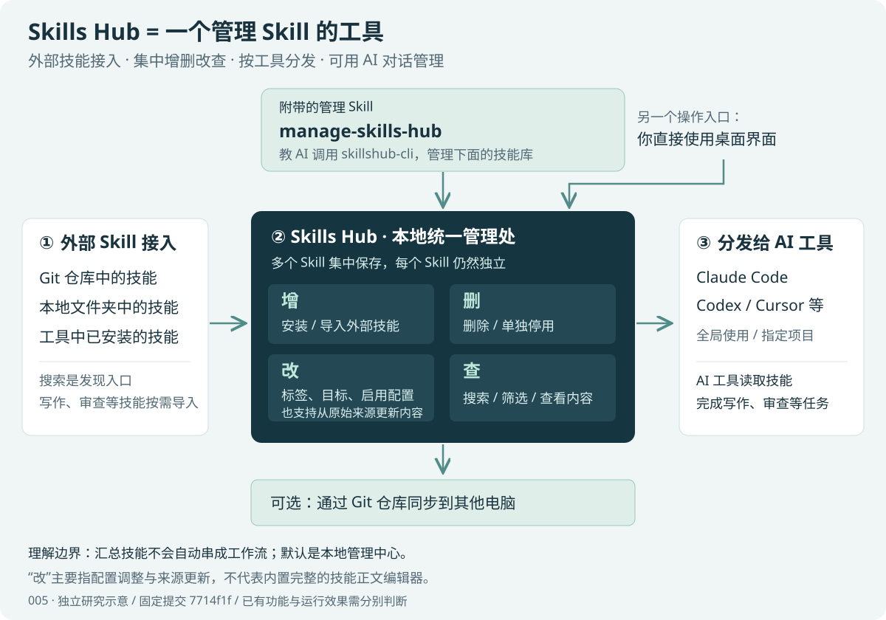
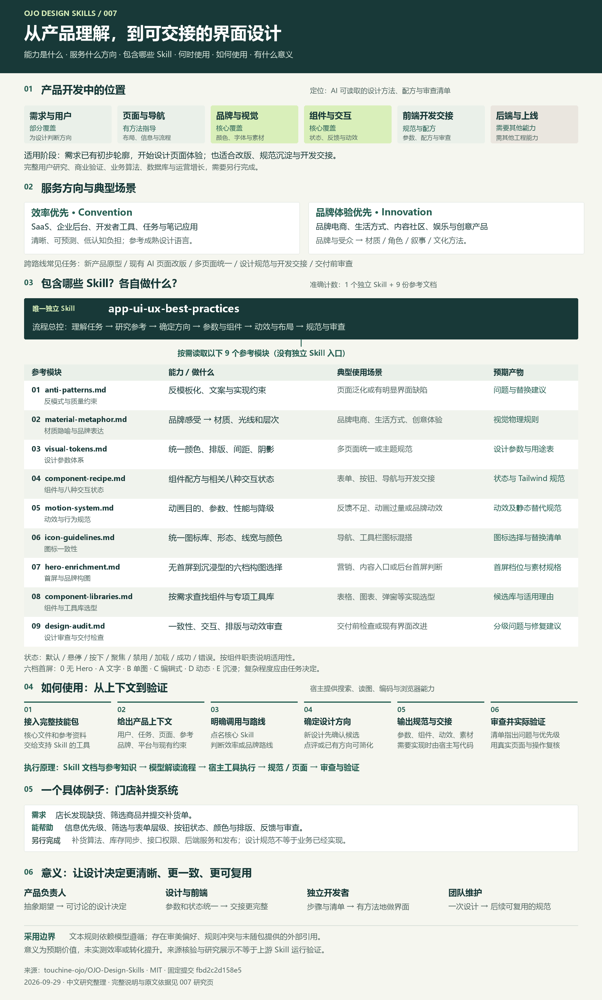

# GitHub 项目研究集

记录近期遇到的优秀开源项目：理解设计思路，验证核心能力，沉淀可复用的经验，并按需制作 Web 演示。

这里是研究总入口。每个子项目都有固定编号、独立研究文档和图片目录；本页保留摘要与索引，详细过程放在对应子项目中。

## 项目索引

按编号升序排列。编号代表收录顺序，不代表排名；已分配编号保持不变，归档后也不复用。

| 编号 | 研究项目 | 摘要 / 关注点 | 进度 | Web 演示 |
| :--- | :--- | :--- | :--- | :--- |
| 001 | [Awesome Agent Skills](projects/001-awesome-agent-skills/README.md) | 技能与技能集合目录：20 类能力、预期产物和 5 个个人场景；1,108 项中文简介 | 已完成 | [能力摘要](https://yydshly.github.io/0929_codex_project/001-awesome-agent-skills/) |
| 002 | [Agent Skills](projects/002-agent-skills/README.md) | 25 项研发流程：能力、产物、场景、扩展与个人价值；摘要图及全量图 | 已完成 | [能力摘要](https://yydshly.github.io/0929_codex_project/002-agent-skills/) |
| 003 | [Matt Pocock Skills](projects/003-mattpocock-skills/README.md) | AI 工程与协作方法：38 项技能、6 类成果摘要图、6 个交互场景与当前到长期的个人价值 | 已完成 | [能力摘要与场景](https://yydshly.github.io/0929_codex_project/003-mattpocock-skills/) |
| 004 | [MengTo/Skills](projects/004-mengto-skills/README.md) | 146 项视觉与前端能力：11 类能力图、6 种实景、5 个个人场景，区分整页指导与真实产品开发 | 已完成 | [能力摘要与实景](https://yydshly.github.io/0929_codex_project/004-mengto-skills/) |
| 005 | [Skills Hub](projects/005-skills-hub/README.md) | Skill 管理工具：外部技能接入与增删改查，附带管理 Skill；涵盖场景、原理、用法、扩展和个人价值 | 已完成 | [能力摘要](https://yydshly.github.io/0929_codex_project/005-skills-hub/) |
| 007 | [OJO Design Skills](projects/007-ojo-design-skills/README.md) | 产品界面设计：1 个 Skill + 9 份参考，输出页面方向、视觉与交互规范；含能力效果速查、5 个个人场景和既有摘要图 | 已完成 | [能力与使用价值](https://yydshly.github.io/0929_codex_project/007-ojo-design-skills/) |

## 项目图览

### 001 · Awesome Agent Skills

这是一个外部技能与技能集合的发现目录。下图直接展示 20 类能力、预期产物和使用时机；结合具体技能与工具，可以用于研究资料、交付文档、制作网页及自动化重复工作。



[完整研究](projects/001-awesome-agent-skills/README.md) · [能力摘要网页](https://yydshly.github.io/0929_codex_project/001-awesome-agent-skills/) · [下载摘要图](projects/001-awesome-agent-skills/assets/capability-summary.svg)

图示为固定版本目录的中文研究归纳；目录包含技能集合，1,108 是入口数，实际技能效果尚未逐项实测。

### 002 · Agent Skills

这是 Addy Osmani 的软件研发流程技能库：25 项工作流指导 AI 澄清需求、规划、实现、验证、审查和发布，产出规格、代码、测试及发布准备材料。摘要图直接展示全部技能类别的能力、场景和预期效果。



对你：现在借鉴它组织开源研究的目标、上下文和决策记录；做网页或个人工具时直接采用开发验证流程；长期维护时补齐流水线、观测与发布。价值是让临时对话沉淀为可复用的工程方法。研究场景属于方法迁移，效果未实测。

[完整研究](projects/002-agent-skills/README.md) · [在线能力摘要](https://yydshly.github.io/0929_codex_project/002-agent-skills/) · [25 项全量图](https://yydshly.github.io/0929_codex_project/002-agent-skills/full-map.html)

### 004 · MengTo/Skills

以视觉设计与前端体验为核心的 146 项技能：指导整页表达、风格布局、动效细节、三维与游戏原型，并支持参考拆解、素材、审查和交付。提供完整能力图、六种实际构造效果，以及面向开源研究、产品官网和长期方法积累的使用建议。



对你：先用于开源研究展示页与个人工具介绍页；有参考时拆解交互，需要空间或玩法时再选择三维与游戏能力。长期把成功实现和验收经验积累为自己的制作方法。企业 AI 页面能说明审批、审计与回退，实际后台能力仍需另行开发。

[在线能力摘要](https://yydshly.github.io/0929_codex_project/004-mengto-skills/) · [直接看六种实际效果](https://yydshly.github.io/0929_codex_project/004-mengto-skills/#real-effects) · [可切换风格实景](https://yydshly.github.io/0929_codex_project/004-mengto-skills/styles-lab.html) · [放大能力图](https://yydshly.github.io/0929_codex_project/004-mengto-skills/map.html) · [完整研究](projects/004-mengto-skills/README.md)

数量依据固定版本 798db0a。六种风格为本项目按技能规范实际构造，其余能力按原文归纳，未全部实测。

### 003 · Matt Pocock Skills

把需求澄清、研究、开发验证、协作交接和学习写作组织成可复用的 AI 工作方法。38 项技能按六类用途说明，能留下规格、研究结论、原型、代码与测试、交接材料和文章；摘要图直接展示成果样张。



对你：现在用来核对开源资料、解释能力、整理分享与跨会话续做；以后制作网页和个人工具时增加需求、原型、实施与验证；长期沉淀术语、规则、决策和检查证据。无需把所有技能都纳入日常工作。

[在线能力摘要](https://yydshly.github.io/0929_codex_project/003-mattpocock-skills/) · [直接看场景](https://yydshly.github.io/0929_codex_project/003-mattpocock-skills/#scenarios) · [放大摘要图](https://yydshly.github.io/0929_codex_project/003-mattpocock-skills/capability-summary.svg) · [完整研究](projects/003-mattpocock-skills/README.md)

固定版本 c55ee460；成果样张与小组件为本项目制作，上游技能未运行实测，效率收益未量化。

### 005 · Skills Hub

一个管理 Skill 的桌面工具：支持外部 Skill 接入、集中增删改查，并分发给 AI 工具使用；附带 manage-skills-hub 管理 Skill。研究说明使用场景、底层原理、上手方法、扩展方向，以及如何把筛选后的技能用于自己的研究工作。



[完整研究](projects/005-skills-hub/README.md) · [在线能力汇总](https://yydshly.github.io/0929_codex_project/005-skills-hub/) · [下载汇总图](projects/005-skills-hub/assets/capability-summary.svg)

图示为本研究整理的能力关系，不是上游应用运行证据。

### 007 · OJO Design Skills

面向产品界面设计的 AI 技能包：一个核心 Skill 串联九份参考资料，从初步产品需求形成页面方向、颜色与排版参数、组件状态、动效规范和审查建议。配合宿主的编码与测试工具，可进一步落地为可运行的前端页面。



对你：现在用于开源研究网页的信息层级与视觉统一；以后用于个人工具、业务后台、产品官网与改版检查，长期积累可复用的设计规则。页面包含全部能力与效果速查、五个个人场景、六步用法、原理和边界。摘要图沿用已确认的总览图。

[完整研究](projects/007-ojo-design-skills/README.md) · [在线能力摘要](https://yydshly.github.io/0929_codex_project/007-ojo-design-skills/) · [可缩放摘要图](https://yydshly.github.io/0929_codex_project/007-ojo-design-skills/map.html)

固定版本文档研究；未安装或运行上游 Skill。产物与价值是预期效果，不代表实测效率或转化收益。

## 仓库结构

```text
.
├── README.md                  # 总览、顺序索引与项目图览
├── projects/                  # 研究子项目：001-name、002-name……
├── templates/project/         # 新子项目模板
│   ├── README.md              # 摘要、来源、运行方式、截图与结论
│   ├── RESEARCH.md            # 研究问题、验证过程与记录
│   ├── assets/                # 封面、截图、结构图
│   └── web/                   # 可选的 Web 演示源码
├── docs/                      # 收录规范与部署约定
└── site/                      # 统一发布的静态站点目录
```

## 开始研究

1. 按[收录规范](docs/PROJECT_GUIDE.md)分配下一个编号并复制[子项目模板](templates/project/README.md)。
2. 记录原仓库地址、研究版本、研究问题与验证结果，添加必要的截图。
3. 更新本页的项目索引与图览；需要在线展示时，按[Web 部署约定](docs/DEPLOYMENT.md)接入演示。

研究进度统一使用：`待研究` → `研究中` → `已完成`；暂时停止维护的项目标记为 `已归档`。在线演示是否可用单独记录。

## 来源与使用

本仓库主要保存研究笔记和自主编写的示例。引用代码、图片或文档时，应在子项目中注明来源，并保留原项目要求的许可证与版权声明。总仓库暂未选择统一开源许可证。
