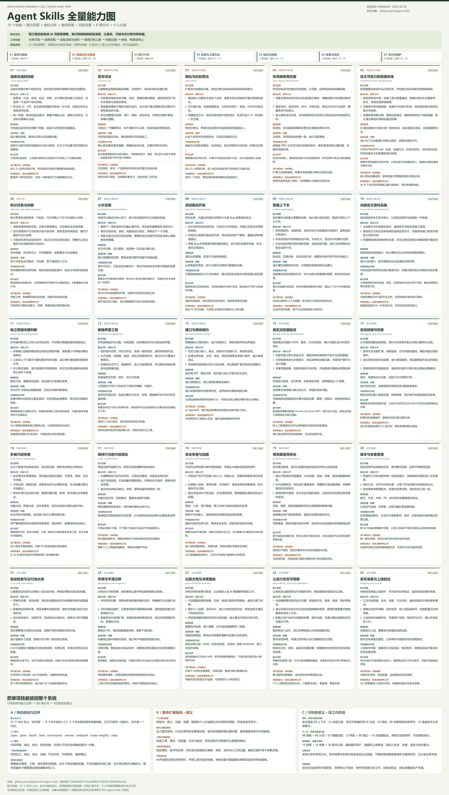

# Agent Skills · 一张完整全量图

覆盖固定提交 `2686b620fc1fed2e8f60c704839c766b8594c6b6` 的全部 25 项技能。图中所有分析均展开，不需要逐卡点击。

## 查看与保存

- [可放大、拖动和定位的全量图网页](web/full-map.html)
- [高清 PNG 原图：4000 × 7074](assets/agent-skills-full-map.png)
- [SVG 矢量原图：可无损放大](assets/agent-skills-full-map.svg)



## 单张图中的内容

- 上方：整体目标、工作机制、7 个阶段和对应技能编号。
- 中间：25 个技能按编号从左到右、从上到下排列。
- 每项：能力范围、3 条具体工作分析、使用场景、预期效果、交付物、能力边界、扩展建议和对你的意义。
- 下方：库的 25 项技能、9 个命令、4 个角色与 7 类共享材料的分工，以及整体扩展路线和个人价值。

“当前可借鉴 / 开发时直接 / 维护上线时”为基于当前研究工作的相关性判断，不代表技能必须按该阶段使用。图中的目的效果均为预期收益，尚未通过上游技能实测量化；扩展方向和个人意义明确标为本次分析。

## 数据与生成

- 基本能力与场景：`skills-catalog.json`。
- 详细工作与交付物：`capability-details.json`。
- 新增的预期效果、逐项扩展与个人意义：`full-map-insights.json`。
- `web/build-full-map.py` 使用 Pillow 测量中文文本换行并生成单张 SVG 与布局数据；环境需要 Microsoft YaHei 字体。
- `web/render-full-map.cjs` 使用 sharp 渲染原尺寸 PNG 与预览。可通过参数指定已安装的 sharp 包路径。
- `web/build.ps1` 将浏览网页和已有图像同步到静态发布目录。

```powershell
python projects/002-agent-skills/web/build-full-map.py
node projects/002-agent-skills/web/render-full-map.cjs <已安装的sharp包路径>
pwsh -File projects/002-agent-skills/web/build.ps1
```

本次交付包含可直接使用的生成文件，不需要先执行生成程序。在线阅读：[完整全量图](https://yydshly.github.io/0929_codex_project/002-agent-skills/full-map.html)。

[研究入口](README.md) · [固定版本来源记录](SOURCES.md)
