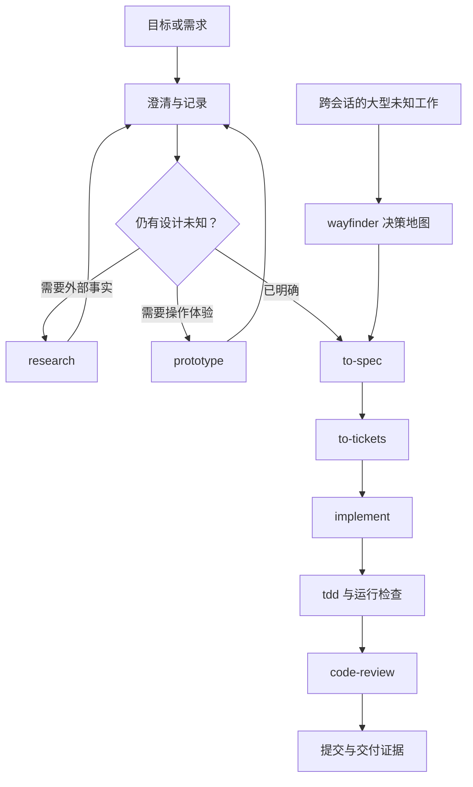

# 整体能力与技术原理研究

[返回子项目](README.md) · [技能清单](SKILLS.md) · [来源记录](SOURCES.md)

## 1. 研究范围与结论性质

本文研究固定提交 `c55ee46073ed923f86ce59a5eb3b6d895095d1b7`，回答能力、场景、技能构成、预期效果和个人价值五个问题，同时分析原理与采用限制。

证据分三层：

| 层次 | 本次如何处理 |
| --- | --- |
| 源码事实 | 读取具体技能、配置和目录，给出固定版本来源 |
| 工作流推导 | 根据指令说明所需输入、步骤、产出与适用条件 |
| 个人建议 | 结合当前开源项目研究集提出采用顺序，不当作作者承诺 |

本次没有运行技能，也没有做有技能/无技能对照实验。因此“改善”“减少”指设计目标或合理预期，不能理解为已经测量的生产效果。

## 2. 这是什么类型的项目

这是一个 Agent Skills 集合。每个技能用 `SKILL.md` 定义名称、触发说明和工作指令，按需带参考资料、配置或脚本。仓库把作者的工程方法拆成可以单独采用、互相组合的模块。

从定位上，它处于“向模型发出任务”与“模型调用工具执行”之间，负责说明过程和完成标准。模型推理、文件读写、浏览器、终端、任务平台访问及子代理能力来自宿主环境。项目中的少量脚本承担向导、钩子或维护功能，不能据此把整个库理解为独立的自动开发平台。

依据：[README](https://github.com/mattpocock/skills/blob/c55ee46073ed923f86ce59a5eb3b6d895095d1b7/README.md)、[插件清单](https://github.com/mattpocock/skills/blob/c55ee46073ed923f86ce59a5eb3b6d895095d1b7/.claude-plugin/plugin.json)、[package.json](https://github.com/mattpocock/skills/blob/c55ee46073ed923f86ce59a5eb3b6d895095d1b7/package.json)。

## 3. 能力全景

| 能力层 | 核心技能 | 解决的主要问题 | 典型产物 |
| --- | --- | --- | --- |
| 入口与配置 | ask-matt、setup-matt-pocock-skills | 不知道怎么选流程、项目约定不明确 | 路线建议、配置文档 |
| 需求与语言 | grill-me、grilling、grill-with-docs、domain-modeling | 目标模糊、同一个词含义不同 | 共识、词汇表、ADR |
| 外部信息 | research、to-questionnaire | 事实在外部资料或其他人手中 | 有来源的研究、问卷 |
| 探索与规划 | prototype、wayfinder | 对方案缺少直观验证、未知决策太多 | 原型、决策地图 |
| 规格与任务 | to-spec、to-tickets、triage | 聊天内容难执行、外部请求混乱 | 规格、任务依赖、简报 |
| 实现与诊断 | implement、tdd、diagnosing-bugs | 代码没有可验证反馈、修复靠试错 | 实现、测试、复现证据 |
| 设计与审查 | codebase-design、improve-codebase-architecture、code-review | 修改成本高、实现偏离需求 | 接口建议、HTML 报告、双维审查 |
| 交接与人工操作 | handoff、resolving-merge-conflicts、wizard | 上下文难转移、冲突或人工配置卡住 | 交接、完成的合并、交互向导 |
| 学习与表达 | teach、wait-what、writing-for-agents | 学习不连续、解释难懂、指令过长 | 课程、重述、精简规则 |
| 实验扩展 | 9 个 in-progress 技能 | 写作、自动化规格、并发实施、复盘 | 素材、文章、规格、PR 或建议 |
| 专项辅助 | 4 个 misc 技能 | 特定 Git、测试、课程和提交检查需求 | 钩子、迁移、目录与配置 |

逐项的作用、限制、示例和来源见 [38 个技能详解](SKILLS.md)。

## 4. 工作机制

### 4.1 发现、加载与执行

典型过程为：

```text
用户目标
  → 宿主识别技能名称/描述，或接收用户指定
  → 读取 SKILL.md
  → 根据任务分支读取参考文件
  → 模型使用现有工具执行
  → 检查文件、测试、运行结果或用户决定
  → 形成产物，并进入下一步
```

这里的“读取技能”是向模型补充上下文，不是重新训练模型。Markdown 的命令式语句影响模型行为，不能像编译器一样保证每一步必然执行。测试、类型检查及外部验证提供更确定的反馈，但也只能覆盖实际检查过的范围。

Codex 官方文档说明，其先展示技能名称与描述，选用后加载完整内容及资源；可显式指定或根据描述匹配。[OpenAI 技能机制](https://learn.chatgpt.com/docs/build-skills)

### 4.2 两类调用方式

正式 25 个技能中，14 个设置为用户指定，11 个允许模型按任务匹配。实验 9 个中，8 个用户指定，1 个可自动匹配；专项 4 个均未设置禁止自动调用。全仓库合计 22 个用户指定、16 个可自动匹配。

作者把主要流程入口留给用户控制，把研究、测试、设计词汇等可复用方法交给模型按需调用。对 Codex，多个目录还提供 `agents/openai.yaml`，其中显式技能使用 `allow_implicit_invocation: false`。

这说明源码考虑了宿主适配，但不代表所有命令、子代理 API 和后台能力都已经跨工具实测。作者在技能机制文档中谈到的“描述不加载、零上下文成本”也是其宿主机制假设，不应泛化为所有 AI 工具的保证。

依据：[技能编写机制](https://github.com/mattpocock/skills/blob/c55ee46073ed923f86ce59a5eb3b6d895095d1b7/skills/productivity/writing-for-agents/SKILL-MECHANICS.md)、[Codex 适配示例](https://github.com/mattpocock/skills/blob/c55ee46073ed923f86ce59a5eb3b6d895095d1b7/skills/engineering/implement/agents/openai.yaml)。

### 4.3 小技能组合与人的阶段选择

`grill-with-docs` 的正文直接组合 `grilling` 和 `domain-modeling`；`implement` 组合 `tdd` 与 `code-review`。其价值在于共享方法只维护一处。

作者建议的“需求澄清 → 规格 → 任务 → 实现”是由用户推进的工作路线。不能看到图中的箭头，就认定一个命令会自动运行所有步骤。尤其 `ask-matt` 是给出选择建议的入口。



这是研究者整理的概念流程，不是该库提供的可执行调度图。依据：[ask-matt](https://github.com/mattpocock/skills/blob/c55ee46073ed923f86ce59a5eb3b6d895095d1b7/skills/engineering/ask-matt/SKILL.md)。

### 4.4 把长期信息放到可读取的文件

| 信息 | 本库的承载方式 | 避免混入的内容 |
| --- | --- | --- |
| 业务词及含义 | CONTEXT.md | 实施计划、所有聊天记录 |
| 难以逆转的重要取舍 | ADR | 每个微小决定 |
| 要完成的功能与边界 | 规格 | 所有探索过程 |
| 单次可以交付的工作 | 任务文件或 Issue | 尚无法明确的大量猜测 |
| 大型工作中的决策 | wayfinder 地图与决策任务 | 重复粘贴全部结论 |
| 转移中的会话上下文 | handoff 临时文件 | 已在正式文档里保存的大段内容 |

这是“通过文件再读取来延续工作”，不意味着模型从此自动永久记住项目。文件要可发现、可访问、保持更新，才有作用。[domain-modeling](https://github.com/mattpocock/skills/blob/c55ee46073ed923f86ce59a5eb3b6d895095d1b7/skills/engineering/domain-modeling/SKILL.md)、[handoff](https://github.com/mattpocock/skills/blob/c55ee46073ed923f86ce59a5eb3b6d895095d1b7/skills/productivity/handoff/SKILL.md)。

### 4.5 反馈让流程有约束

本库最有价值的部分之一，是要求“有证据地完成”：

- 测试先失败，才证明它可能捕获目标行为的缺失。
- 错误先能够复现，修复后要对原始场景再验证。
- 任务必须能单独演示或验证。
- 审查分别核对代码规范和原始需求。
- 实验模块检查要求亲眼观察“通过 → 违规失败 → 修复后通过”。

反馈越接近用户真实问题，越有机会降低虚假的完成感。但“测试全绿”不等于业务必然正确；测试遗漏、错误预期或错误审查范围仍会使结果失真。

依据：[tdd](https://github.com/mattpocock/skills/blob/c55ee46073ed923f86ce59a5eb3b6d895095d1b7/skills/engineering/tdd/SKILL.md)、[diagnosing-bugs](https://github.com/mattpocock/skills/blob/c55ee46073ed923f86ce59a5eb3b6d895095d1b7/skills/engineering/diagnosing-bugs/SKILL.md)。

## 5. 可以实现的效果与不能直接推导的效果

| 可以作为具体交付物检查 | 不能仅凭安装推导 |
| --- | --- |
| 有明确边界的需求规格 | 所有需求都被理解正确 |
| 有依赖与验收条件的任务 | 所有任务会自动按时完成 |
| 真实执行的失败/通过记录 | 产品没有任何错误 |
| 有链接的研究文档 | 引用来源必然正确或未过时 |
| 双维审查报告 | 实现与审查完全独立、没有共同盲点 |
| 可运行原型与选择理由 | 原型已经具备生产质量 |
| 会话交接文件 | 自动、无损的永久记忆 |
| 交互式人工向导 | 自动取得服务权限或完成全部部署 |
| 学习课件与学习记录 | 学习效果达到某个比例 |

对时间、费用和质量的收益应以同类任务试用结果判断。本次没有可靠依据给出“提升百分之多少”“节省多少 Token”或“替代多少岗位”的数字。

## 6. 使用成本与方法偏好

这套方法把许多决定显式交给人，并要求较多记录与反馈。因此复杂项目可能少返工，但单次简单任务也可能更慢。成本来自多轮回答、额外文档、运行测试、子代理调用、读取来源以及维护规则。

作者偏好深模块、公开接口测试、较少的测试接口和较强的追问。在现有项目已有成熟约定时，应比较这些偏好是否适配，而非用技能替换全部团队经验。其“模块”的定义也是内部一致的词汇约定，不是所有工程文献唯一的定义。

## 7. 源码核对中的差异与衔接问题

| 发现 | 证据与含义 | 建议 |
| --- | --- | --- |
| TDD 概述与正文有差异 | README 使用 red-green-refactor；tdd 正文要求红到绿循环，并把重构交给审查阶段 | 解释具体行为时以技能正文为准 |
| 规格技能仍有确认步骤 | to-spec 写着不访谈，但要求确认测试接口；README 另提及模块讨论 | 区分“不重开全面访谈”和“不问任何问题” |
| retro 成熟度标注不一致 | in-progress README 称 STUB；正文已有四步流程和详细建议分类 | 标为实验、成熟度说明冲突，等待实测 |
| Git 审查范围存在衔接风险 | implement 在提交前运行 code-review；后者固定读取 base...HEAD | 若新修改未提交，可能漏审；调用时明确工作区、暂存区或最终提交范围 |
| 审查固定点可能无差异 | 若在当前分支首个新提交之前，仅比较同一 HEAD 的历史，可能为空 | 审查开始前列出实际覆盖的文件和提交 |
| 原型位置建议不完全一致 | ask-matt 描述跨目录交接；prototype 正文要求贴近所验证模块 | 结合宿主隔离方式，明确目录和保存分支 |
| 课程分享范围要核实 | teach 既描述单课 HTML 自包含，也要求引用共享 assets | 验证分发时所有引用文件都可用 |
| 任务平台支持层次不同 | setup 有 GitHub/GitLab/本地模板，其他平台按自由文本记录流程 | 不把 Linear/Jira 写成开箱即用的已连接工具 |
| 平台专用辅助并非通用 | claude-handoff 用 Claude CLI；Git 钩子面向 Claude；wizard 为 Bash | 在 Codex/Windows 上逐项适配 |
| 文档经验值不是服务规格 | ask-matt/wayfinder 提到上下文经验容量 | 按实际模型与宿主限制安排任务 |

上述均为静态阅读得到的发现或风险推导，不是本次运行触发的故障。对应证据可在 [SOURCES.md](SOURCES.md) 追溯。

## 8. 适用与不适用边界

特别适合：长生命周期项目、需求复杂且易歧义、跨会话实施、具备测试基础、多人反馈多、想持续改善 AI 协作流程。

适度采用：个人研究、文章写作、学习计划、一次性原型。挑选有帮助的技能即可，不必建立完整任务平台。

不宜整套照搬：几分钟的小改动、没有可复现环境却期待自动修复、希望完全无人决策的产品开发、把实验技能直接用于无法回退的重要流程。

## 9. 研究结论

这套库的主要资产是流程设计：把“问清楚、做小步、保留依据、验证结果、交接上下文”写成可以重复调用的规则。对于当前研究集，最值得采用的是来源可追溯、产物有标准、结论可延续；对于未来软件开发，再加入测试和审查。

下一步是否安装，应该由真实痛点和一次可比较的小任务决定。完整采用方案见 [USER_VALUE.md](USER_VALUE.md) 与 [ADOPTION.md](ADOPTION.md)。
