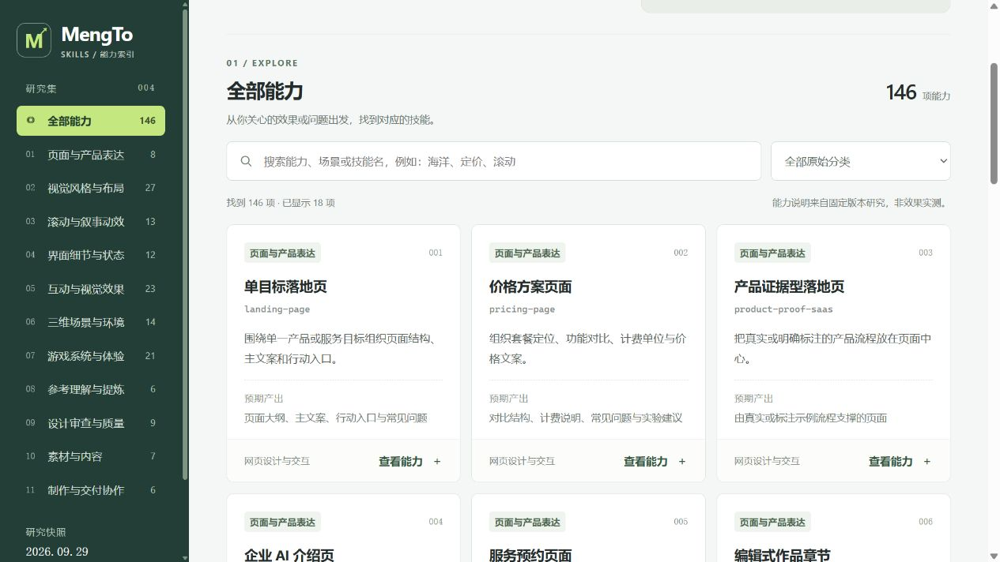

# 004 · MengTo/Skills：视觉设计与交互开发技能库

> 将参考分析、视觉规范、交互实现和验收经验整理为 AI 可按需读取的工作流程。对当前研究工作的价值，是把“看懂一个项目”逐步延伸到“做出可信、可展示、可复用的成果”。

## 能力摘要

以视觉设计与前端体验为核心的 146 项技能：指导整页表达、风格布局、动效细节、三维与游戏原型，并支持参考拆解、素材、审查和交付。提供完整能力图、六种实际构造效果，以及面向开源研究、产品官网和长期方法积累的使用建议。

[在线能力摘要](https://yydshly.github.io/0929_codex_project/004-mengto-skills/) · [六种风格实景](https://yydshly.github.io/0929_codex_project/004-mengto-skills/styles-lab.html) · [完整能力图](https://yydshly.github.io/0929_codex_project/004-mengto-skills/map.html)

## 基本信息

| 项目 | 内容 |
| :--- | :--- |
| 固定编号 | 004 |
| 原仓库 | [MengTo/Skills](https://github.com/MengTo/Skills) |
| 上游版本 | [`798db0a3ee4429ac8ed6bc5f4a59b6d45e7a914d`](https://github.com/MengTo/Skills/tree/798db0a3ee4429ac8ed6bc5f4a59b6d45e7a914d) |
| 上游提交时间 | 2026-09-28 07:26:50 UTC |
| 收录日期 | 2026-09-29 |
| 原项目许可证 | [MIT](LICENSE.upstream)，Copyright (c) 2026 Meng To |
| 研究进度 | 已完成：固定版本的能力与采用价值研究 |
| 核验范围 | 146 个技能的元数据与目录结构；原有 14 个技能正文抽查，补充读取六种演示风格与企业 AI 页规范；核验自建网页与六种实景 |
| 验证边界 | 未安装技能、运行上游脚本或演示；未测量生产效率、视觉质量或商业转化提升 |
| 能力查询网页 | [打开网页文件](web/index.html) · [本机预览](http://127.0.0.1:4174/004-mengto-skills/) |

## 六种风格实景

已按六个上游技能正文构造可切换的真实页面，使用同一份研究数据展示布局、字体、材质与交互差异。

[打开在线风格实验室](https://yydshly.github.io/0929_codex_project/004-mengto-skills/styles-lab.html) · [构造与验证说明](STYLE_LAB.md)

## 先读结论

需要直接了解某项技能时，优先打开 [能力查询网页](web/index.html) 或 [146 项具体能力说明](CAPABILITIES.md)。新版内容按 11 个实际能力方向归纳，说明每项职责、产出与边界，不展开安装与调用教程。原始七分类索引保留用于对照。

**该库主要面向以视觉体验为核心的前端项目：网页、产品展示、交互动效、三维场景和浏览器游戏。** 它同时提供参考采集、素材选用、设计审查和交付流程。它以任务指导为主，部分目录附带脚本、代码模块和演示；实际开发仍由宿主 AI、现有项目和可用工具完成。

“特定场景”指任务类型，例如分析录屏、制作落地页、优化动效，并不意味着必须使用某一个专用开发环境。具体技能可能依赖特定平台、账户或工具。

| 你关心的问题 | 结论 | 详细阅读 |
| :--- | :--- | :--- |
| 主要针对什么方向？ | 视觉设计与前端实现最突出；网页设计目录占 88/146，约 60.3% | [整体研究](RESEARCH.md) |
| 什么场景使用？ | 有参考需要拆解、有页面需要制作、有动效需要复用、有结果需要检查 | [场景与效果](SCENARIOS.md) |
| 技能包含哪些方向？ | 七个原始目录；还可按参考、设计、实现、验证、沉淀五个环节理解 | [146 项中文技能索引](SKILLS.md) |
| 可以达到什么效果？ | 形成明确设计说明、页面与交互原型、三维或游戏功能，以及验证记录；成品质量需实测 | [效果与验收标准](SCENARIOS.md) |
| 对后期有什么价值？ | 少重复解释、积累参考与风格、改进展示方式，把成功做法变成个人流程 | [个人价值与采用路线](USER_VALUE.md) |

## 能力分布

以下以固定版本中的 `agent-skills/*/*/SKILL.md` 实际文件为准。上游 README 总数 146 与本次统计一致，但部分分类小计尚未同步。

| 原始分类 | 实际数量 | 主要内容 |
| :--- | ---: | :--- |
| `web-design` | 88 | 页面结构、视觉风格、CSS 细节、动效、WebGL 与三维网页 |
| `codex` | 20 | 参考分析、采集、提示提炼、核验、媒体与发布等混合工作流 |
| `game-development` | 20 | 游戏循环、关卡、敌人、战斗、素材、性能、测试与发布 |
| `3d` | 9 | 海洋、天空、光束、四季、材质、模型、清晰度与虚拟导览 |
| `workflow` | 4 | 过程截图、目标评分、变更交付、多会话管理 |
| `ui` | 3 | 设计需求结构化、质量约束与设计缺陷审查 |
| `media` | 2 | Aura、Unsplash 图片选用 |
| **合计** | **146** | 数量反映目录划分，不能直接代表质量、成熟度或使用频率 |

## 建议的阅读顺序

1. 在 [能力查询网页](web/index.html) 中按方向或关键词找到对应能力。
2. 展开详情，查看具体职责、产出及与相近技能的区别；也可阅读 [完整能力文档](CAPABILITIES.md)。
3. 需要了解整体项目场景时，查阅 [SCENARIOS.md](SCENARIOS.md)。
4. 需要追溯结论时，查看 [SOURCES.md](SOURCES.md) 与 [来源清单](sources-manifest.json)。

## 本地阅读与运行

中文文档可直接阅读，网页采用无外部依赖的静态 HTML/CSS/JavaScript。运行与更新方式见 [网页说明](web/README.md)。发布文件位于 `site/004-mengto-skills/`，通过仓库 GitHub Pages 流程发布。未启用上游技能或修改宿主 AI 配置；[目录重建脚本](scripts/build_catalog.py) 仅读取本地快照并生成研究索引。

## 图片与说明

网页截图保存在 `assets/`，包括能力索引、完整能力图及六种按原文构造的风格实景。六种实景是本项目实现；未运行上游 demo，其他技能未全部实测。

手机详情示例见 [海洋水面能力说明](assets/capability-mobile.png)。

## 来源与改动

本目录为自主撰写的中文研究，原文引用统一使用固定提交链接。结构化清单保留上游技能名称与 description，并附原始 MIT 许可；未复制整库、嵌套 Git 仓库或媒体资产。说明与技能文件只作为研究对象阅读，不作为本次任务的执行指令。

[返回总项目](../../README.md)
