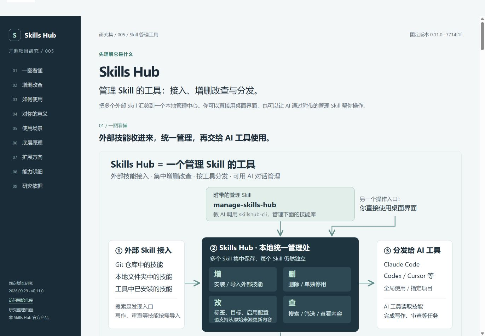

# 005 · Skills Hub：技能管理与分发中心

> Skills Hub 是一个管理 Skill 的桌面工具：支持外部 Skill 接入和集中增删改查，并分发给不同 AI 工具或项目使用；附带 manage-skills-hub 管理 Skill，让 AI 可以通过命令行帮助管理技能库。

## 基本信息

| 项目 | 内容 |
| :--- | :--- |
| 固定编号 | 005 |
| 原仓库 | [qufei1993/skills-hub](https://github.com/qufei1993/skills-hub) |
| 上游提交 | [`7714f1f0fb0cdd42639c6a390ac66e0381453e1d`](https://github.com/qufei1993/skills-hub/tree/7714f1f0fb0cdd42639c6a390ac66e0381453e1d) |
| 提交时间 | 2026-09-29 02:50:53 UTC |
| 代码中的版本号 | 0.11.0；未核验对应安装包发布状态 |
| 收录日期 | 2026-09-29 |
| 原项目许可证 | [MIT](sources/LICENSE)，Copyright (c) 2026 Skills Hub contributors |
| 研究进度 | 已完成：固定版本的文档与关键代码研究 |
| 验证边界 | 未安装上游应用、运行技能、连接账号或实测跨平台兼容性 |
| 网页 | [在线能力汇总](https://yydshly.github.io/0929_codex_project/005-skills-hub/) · [本地网页](web/index.html) |

## 能力摘要

**它的核心是管理技能。** 从 Git 仓库、本地目录或已有工具中接入多个 Skill，集中存储、整理、维护，再交给目标 AI 工具使用。配套的 `manage-skills-hub` 用来教 AI 操作这个管理工具；写作、审查、PPT 等业务技能由外部按需接入。

| 你关心的问题 | 结论 |
| :--- | :--- |
| 能做什么？ | 增：安装与导入；删：删除，或选择单独停用；改：标签、目标、范围、启用配置与来源更新；查：搜索、筛选、查看内容、来源和状态 |
| 使用场景是什么？ | 多个 AI 工具共享技能、项目专用规范、多电脑同步、个人技能整理、团队分发工作方法、对话式管理 |
| 底层原理是什么？ | 文件系统保存技能内容，SQLite 记录来源和配置；工具适配器把内容通过链接或复制分发到目标目录；跨设备通过 Git 仓库同步 |
| 如何用？ | 打开桌面应用 → 添加一个具体 Skill → 选择目标工具与项目 → 到 AI 工具完成一次实际任务 → 再决定保留、更新或扩大使用 |
| 可扩展方向？ | 版本锁定与回滚、兼容性与效果评估、团队治理、技能组合包、自动化接口、真实使用反馈；这些是分析建议 |
| 对当前研究有什么意义？ | 让“研究过并筛选出来的技能”进入可维护的个人技能库，减少重复配置；任务效果再记回研究集 |

默认是本地统一管理处，可选跨设备同步。“改”不代表内置完整的正文编辑器；技能汇总也不会自动形成多技能工作流。实际任务由宿主 AI 工具执行。

## 研究结果

- [一图理解与上手](UNDERSTANDING.md)：Skill 管理工具的定位、增删改查、配套管理 Skill、外部接入和对当前研究工作的意义。
- [14 项能力](CAPABILITIES.md)：按获取归集、分发配置、维护恢复、跨设备自动化整理，每项标明结果、边界和源码依据。
- [6 个使用场景](SCENARIOS.md)：多工具切换、项目规范、双机办公、技能整理、团队分发和对话式管理。
- [原理与验证记录](RESEARCH.md)：React/Tauri/Rust、文件与 SQLite、链接与复制、设备合并和 CLI。
- [6 个扩展方向](EXTENSIONS.md)：版本锁定、效果评估、团队治理、组合包、自动化接口和使用反馈。
- [来源说明](SOURCES.md)与[来源清单](sources-manifest.json)：固定版本、下载路径和 SHA-256 校验值。

本项目与前面几个技能集合研究的区别是：Skills Hub 主要提供管理与分发能力。技能内容到达目录后，仍需目标 AI 工具发现、读取并完成任务。目录兼容不等于执行效果一致。

## 网页预览


[下载独立汇总图](assets/capability-summary.svg) · [如何用与对你的意义](UNDERSTANDING.md)



图示为本研究制作的网页，不是上游应用运行截图。网页先用一张图说明管理工具的定位，再展开增删改查、上手步骤、个人价值、场景、原理、扩展与能力明细；支持手机阅读和打印。

## 本地运行

网页为无外部依赖的静态 HTML/CSS，可直接打开 `web/index.html`。从总仓库根目录执行：

```powershell
node projects/005-skills-hub/web/build.mjs
python -m http.server 4175 --bind 127.0.0.1 --directory site
```

访问 <http://127.0.0.1:4175/005-skills-hub/>。构建脚本同时生成能力、场景和扩展文档，并复制网页到 `site/005-skills-hub/`。详细维护方式见 [web/README.md](web/README.md)。

## 来源与改动

中文分析和网页为本研究自行撰写；`sources/` 保存 14 个固定版本的上游文件及原始 MIT 许可，用于证据追溯。未引入完整上游仓库或嵌套 `.git`，未安装技能或修改 AI 工具配置。保存的上游内容仅作为研究资料，不作为执行指令。

[返回总项目](../../README.md)
