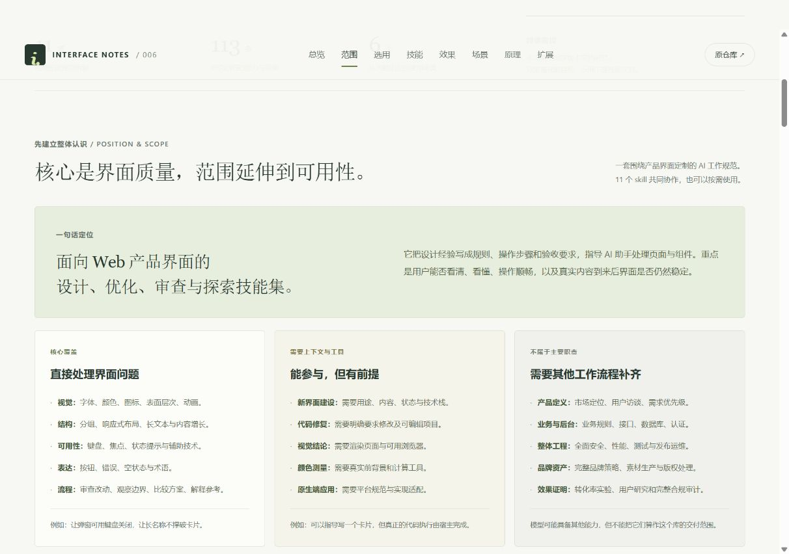

# 006 · Jakub Krehel Skills：界面能力与可实现效果

> 面向 Web 界面设计、优化与验证：6 个专业领域、2 个审查流程、3 个探索流程；说明报告、改动、场景与候选效果，以及研究页、个人工具和长期维护中的个人价值。

[在线能力摘要](https://yydshly.github.io/0929_codex_project/006-jakubkrehel-skills/#summary) · [我的使用场景](https://yydshly.github.io/0929_codex_project/006-jakubkrehel-skills/#personal) · [摘要与个人价值](SUMMARY.md)

## 基本信息

| 项目 | 内容 |
| --- | --- |
| 固定编号 | 006 |
| 原仓库 | [jakubkrehel/skills](https://github.com/jakubkrehel/skills) |
| 固定版本 | [`267330e1adfc66a718fb65fa6918c1f06d0a689e`](https://github.com/jakubkrehel/skills/tree/267330e1adfc66a718fb65fa6918c1f06d0a689e) |
| 提交时间 | 2026-08-29 17:01:47 UTC |
| 收录日期 | 2026-09-29 |
| 插件版本 | interfaces 1.6.3 |
| 上游许可证 | [MIT，Copyright (c) 2026 Jakub Krehel](sources/LICENSE) |
| 研究状态 | 已完成：固定版本的文档能力研究 |
| 核验范围 | 11 个技能正文、调用配置与相关参考文档；63 个来源文件固定版本留档 |
| 验证边界 | 未安装或执行上游技能；效果为依照工作规范可实现的目标，示例为研究构造 |
| Web 展示 | [打开网页文件](web/index.html) · [本机预览](http://127.0.0.1:4176/006-jakubkrehel-skills/) |

## 从这里阅读

| 文档 | 可以得到什么 |
| --- | --- |
| **[单张能力总图](web/capability-map.html)** | 一图覆盖定位、11 个技能、场景、用法、原理、价值与边界；支持缩放和下载 |
| **[交互式研究网页](web/index.html)** | 搜索与筛选全部技能、展开 113 条能力、查看效果示例、场景与原理扩展 |
| **[能力定位与适用范围](SCOPE.md)** | 明确核心覆盖、工具前提、其他流程职责与八类任务的选用入口 |
| **[11 项技能详细能力与效果](CAPABILITIES.md)** | 每项的输入、具体操作、可实现效果、交付物、前后示例、验收、边界与示例请求 |
| [6 个实际场景与验收方法](SCENARIOS.md) | 把技能组合到页面优化、上线审查、组件验证、方案比较、效果学习和主题维护 |
| [底层原理、价值与扩展方向](RESEARCH.md) | 理解宿主如何执行文档规则、领域与流程如何分工、哪些能力需要工具支撑 |
| [来源与技能文件索引](SOURCES.md) | 逐项回到固定提交正文、辅助参考和本地快照 |
| [来源清单](sources-manifest.json) | 原路径、固定版本 URL、Git blob 与 SHA-256 校验值 |

## 能力总览

该库以文档规则驱动 AI 助手处理 Web 界面问题。知识层覆盖六个领域，工作流层负责组织审查、解析参考、制造极端场景或生成候选设计。它本身没有独立运行的设计检测引擎，读取代码、修改文件、打开浏览器等能力由宿主提供。

| 层次 | 技能 | 主要效果 |
| --- | --- | --- |
| 专业知识 | better-ui | 改善表面层次、图标和动效反馈 |
| 专业知识 | better-typography | 稳定数字、控制换行、处理字体与截断 |
| 专业知识 | better-colors | 建立颜色用途关系，测量实际前背景组合 |
| 专业知识 | better-accessibility | 让键盘与辅助技术能够理解并完成操作 |
| 专业知识 | better-layout | 让分组、阅读顺序和空间适应更可靠 |
| 专业知识 | better-writing | 让按钮、错误和空状态表达清楚 |
| 审查流程 | better-interface | 合并六领域发现，明确范围和修复优先级 |
| 审查流程 | interface-review | 识别本次代码改动造成的新增问题与退化 |
| 专项流程 | explain-interface | 解释参考网页效果的图层和实现机制 |
| 专项流程 | break | 生成真实组件的极端场景页并记录观察 |
| 专项流程 | variant | 提供可切换的设计候选及取舍说明 |

## 可以期待的交付

- **只要求审查：** 得到带位置、原因和优先级的问题清单，以及已检查和未验证的范围。
- **明确要求修复：** 在相关技能指导下修改代码，再检验指定行为是否改善。
- **要求 break：** 得到组件场景页和实际观察记录；生成页面与观察通过是两件事。
- **要求 variant：** 得到默认三个候选方案，选择后才收敛到正式实现。
- **要求 explain-interface：** 得到带证据等级的机制解释；截图分析只能提出有限的实现推断。

具体规则包含作者的设计配方和工程经验。实际效果取决于模型、工具、项目约束和验证；本研究没有测量开发效率、用户满意度或商业转化。

## 网页展示

首页先说明定位、预期成果与三类技能，引用既有完整能力图，再用五个个人场景串起研究展示页、个人工具、交付检查、方案学习和长期维护。详见 [能力摘要](SUMMARY.md)。


网页采用浅色纸面与深绿色章节。先解释“界面质量技能集”的定位，区分核心覆盖、条件性能力和其他流程职责；再用八类任务选择器明确入口、输入、交付和边界。后续保留技能库、效果对照、场景、原理和扩展。支持关键词搜索、三类技能筛选、详情展开和场景到技能的跳转。窄屏下能力表切换为纵向条目，完整内容直接保存在 HTML 中。



图片展示本研究网页，不是上游技能的运行效果。[手机任务指南](assets/web-task-mobile.png) · [手机技能详情](assets/web-mobile.png) · [网页使用与更新](web/README.md) · [网页验证记录](WEB_VERIFICATION.md)

## 本地阅读与验证

文档可直接打开，无需安装依赖。维护者可以在仓库根目录运行下列命令，核对技能覆盖、来源文件哈希和研究文档内部链接：

```powershell
python projects/006-jakubkrehel-skills/scripts/verify.py
```

检查结果保存在 [VERIFICATION.md](VERIFICATION.md)。它只证明研究资料的完整性，不代表上游技能运行效果。

## 来源与改动

中文分析和示例由本研究整理。`sources/` 保留固定提交的原始文档与配置，并保留 MIT 许可证；没有嵌套 Git 仓库。来源文档作为研究材料阅读，没有安装为宿主技能。网页截图记录本研究页面的展示与交互，不代表技能实测。

[返回总项目](../../README.md)
