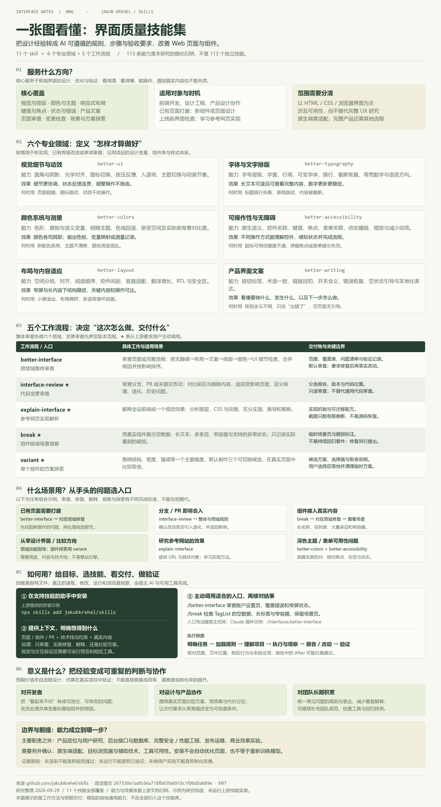

# 能力摘要与个人使用价值

这个库是一组面向 Web 页面与组件的界面设计、优化和验证技能。它把设计经验写成 AI 可以遵循的规则、工作步骤和验收要求，既能指导新实现，也能检查并改善已有页面。主要效果是内容更清楚、布局更稳定、操作更可达、反馈更明确、视觉和主题更一致。

[在线摘要](https://yydshly.github.io/0929_codex_project/006-jakubkrehel-skills/#summary) · [个人场景](https://yydshly.github.io/0929_codex_project/006-jakubkrehel-skills/#personal) · [放大总图](https://yydshly.github.io/0929_codex_project/006-jakubkrehel-skills/capability-map.html)

## 三类技能与效果

| 类型 | 技能 | 能力与预期效果 |
| --- | --- | --- |
| 专业领域 | better-ui | 统一视觉细节与动效反馈，使对齐、状态与节奏更协调 |
| 专业领域 | better-typography | 改善字体层级、换行与数字排版，让内容更易读、变化更稳定 |
| 专业领域 | better-colors | 梳理色阶、主题和语义变量，测量真实对比度，形成一致的颜色系统 |
| 专业领域 | better-accessibility | 检查语义、键盘、焦点与表单关联，使不同操作方式能够完成任务 |
| 专业领域 | better-layout | 处理空间分组、窄屏、长内容和多语言，保持结构与关键操作可达 |
| 专业领域 | better-writing | 改善控件标签、错误恢复和空状态，解释发生了什么及下一步 |
| 审查流程 | better-interface | 跨领域审查页面或流程，给出按影响排序的问题、根因与验证记录 |
| 审查流程 | interface-review | 审查改动的界面影响，区分新增、退化、历史问题，提供版本依据 |
| 探索流程 | break | 展示真实组件的极端内容和状态，输出场景页与已观察的破损标注 |
| 探索流程 | variant | 围绕单个部件的一个主要维度，默认提供三个可运行、可切换候选 |
| 探索流程 | explain-interface | 解释参考网页的图层、布局和动画，提供机制说明与可迁移配方 |

共 6 个专业领域、2 个审查流程、3 个探索流程；后两类也称 5 个工作流程。113 条是本研究的细化归纳，不是 113 个独立技能。

## 对你什么时候有用

| 你的场景 | 选择 | 交付与意义 |
| --- | --- | --- |
| 现在整理开源研究并制作展示网页 | better-interface + 布局、排版、文案 | 从阅读路径发现问题，修复长表格、小屏和模糊说明；让研究更容易被理解 |
| 后续制作个人表单、列表、设置页或仪表盘 | 无障碍、文案、颜色、UI | 改善错误恢复、反馈、键盘路径及主题一致性；让能运行的工具更好操作 |
| 发布、重构、改主题或导入真实内容前 | break + interface-review | 观察极端状态并审查退化；更早发现破损，留下可复用的验收样例 |
| 拿不准部件方向，或希望学习参考效果 | variant / explain-interface | 分别交付候选或机制解释；用真实页面比较取舍，积累实现方法 |
| 长期维护越来越多的研究页和工具 | better-interface + 项目领域规范 | 把有效判断积累到项目规范；减少反复解释并保持一致性 |

建议先从一个已有研究页开始：请求整体审查，选择最影响阅读或操作的问题，明确要求修复，再检查桌面、手机和相关状态。无需每次调用全部技能。

## 如何用与边界

上游给出的安装示例为 `npx skills add jakubkrehel/skills`。安装到支持技能的宿主后，提供项目、页面范围、真实数据、约束以及交付目标；入口写法随宿主而异。`interface-review`、`break`、`variant`、`explain-interface` 要求主动调用。

审查通常交付报告；要求实施修复后才修改代码。break 的场景观察不等于持续自动回归；variant 需要选择与收敛；explain-interface 的解释不等于恢复原作者源码。技能本身主要是文档，执行依赖模型与工具。

对你的核心意义是把“美化一下”变成有范围、有成果、有验证的任务。需求研究、后台、数据、安全、部署与业务效果评估仍需要对应能力。长期规范、工具集成和自动回归属于扩展建议。

依据固定提交 `267330e1adfc66a718fb65fa6918c1f06d0a689e`。摘要效果为文档归纳，未安装或运行上游技能实测，未证明效率或商业指标提升。[详细能力](CAPABILITIES.md) · [范围](SCOPE.md) · [回到项目](README.md)
