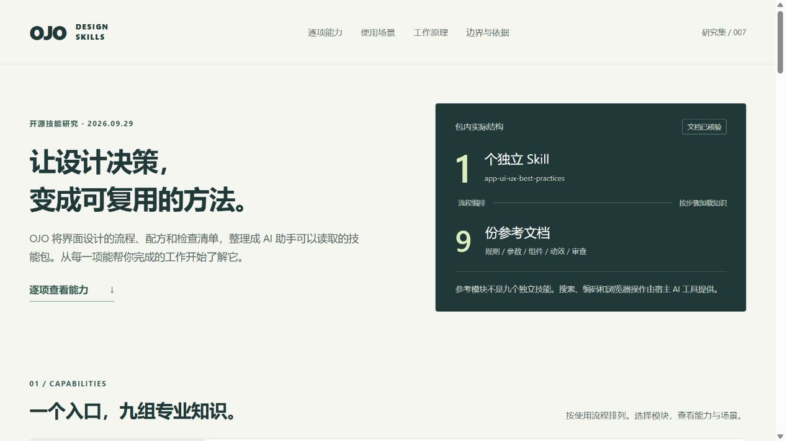

# 007 · OJO Design Skills：能力与使用场景

> OJO 是面向产品界面设计的 AI 技能包：一个核心 Skill 组织九份参考资料，把初步需求转成页面方向、视觉参数、组件状态、动效规范和审查建议。适合研究展示页、个人工具与后台、品牌官网及现有页面改版；配合宿主编码与测试能力，可进一步落地为可运行的前端页面。

对你：现在用于开源研究展示页的信息层级与视觉统一；以后制作个人工具、后台或产品介绍页时，获得页面方向、组件反馈与设计规范；改版时输出问题清单，长期积累可复用的个人设计方法。预期效果需通过真实页面验证。

## 基本信息

| 项目 | 内容 |
| --- | --- |
| 固定编号 | 007 |
| 原仓库 | [touchine-ojo/OJO-Design-Skills](https://github.com/touchine-ojo/OJO-Design-Skills) |
| 固定提交 | [`fbd2c2d158e5ebda8930f4bc63ed635a8500d31f`](https://github.com/touchine-ojo/OJO-Design-Skills/tree/fbd2c2d158e5ebda8930f4bc63ed635a8500d31f) |
| 提交时间 | 2026-07-29T10:20:08Z |
| 研究日期 | 2026-09-29 |
| 许可证 | [MIT · Copyright (c) 2026 touchine-ojo](sources/LICENSE) |
| 研究状态 | 已完成：固定版本文档与脚本阅读分析 |
| 能力结构 | 1 个独立 Skill + 9 份参考文档；不计外部引用为内置技能 |
| 验证边界 | 未安装或运行上游 Skill；研究网页及资料完整性单独验证 |
| Web 展示 | [在线能力摘要](https://yydshly.github.io/0929_codex_project/007-ojo-design-skills/) · [本地副本](web/index.html) |

## 阅读入口

- [能力摘要与个人使用建议](SUMMARY.md)：各项能力和产物、五个个人场景、采用时机与价值。
- [产品开发定位与完整使用指南](GUIDE.md)：覆盖范围、如何用、具体例子与预期价值。
- [一图能力总览](web/map.html)：可缩放浏览；[PNG](assets/capability-summary.png) / [SVG 矢量版](assets/capability-summary.svg)。
- [核心 Skill 与九个模块详细分析](CAPABILITIES.md)：能力、场景、输入、产出、示例与边界。
- [六个具体使用场景](SCENARIOS.md)：后台、品牌订阅、阅读工具、活动页、改版和开发交接。
- [底层原理、核验发现与扩展](RESEARCH.md)：文本规则如何被宿主执行，以及规则冲突和缺失依赖。
- [固定版本来源](SOURCES.md)与[来源清单](sources-manifest.json)。
- [验证记录](VERIFICATION.md)。

## 能力索引

| 类型 | 模块 | 主要能力 |
| --- | --- | --- |
| 独立 Skill | `app-ui-ux-best-practices` | 从产品需求出发，选择设计路线，把视觉方向逐步落实为可供开发使用的规范。 |
| 参考文档 | `anti-patterns.md` | 提醒 AI 避免未经思考的配色、布局、文案和素材套路，并检查实现中容易出错的地方。 |
| 参考文档 | `material-metaphor.md` | 把品牌感受映射到材质和环境，进一步推导表面、光线、边缘、层次与运动。 |
| 参考文档 | `visual-tokens.md` | 定义应有哪些颜色、字体、间距与阴影变量，让各页面能使用同一套视觉基础。 |
| 参考文档 | `component-recipe.md` | 把设计意图翻译为组件样式和状态规则，避免页面只有静态外观。 |
| 参考文档 | `motion-system.md` | 先说明为什么需要动画，再确定运动参数、性能要求和减少动态效果时的替代方案。 |
| 参考文档 | `icon-guidelines.md` | 统一图标的来源、形态、线宽、尺寸和状态颜色，避免界面像不同素材的拼接。 |
| 参考文档 | `hero-enrichment.md` | 先判断是否需要展示型首屏，再选择文字、图片、编辑式构图或动态内容。 |
| 参考文档 | `component-libraries.md` | 按用途整理界面、动效、图标和专项组件库，帮助寻找符合项目需求的实现基础。 |
| 参考文档 | `design-audit.md` | 按清单查找设计与交互问题，说明严重程度、影响位置和修复方向。 |

## 展示说明

网页包含能力与效果摘要、全部十项速查、五个个人场景、产品开发覆盖、一图总览、详细能力、六个产品场景、两条路线、六步指南、案例与边界。大图沿用本次已确认的摘要图，可按适合宽度、100%、150% 缩放，支持 PNG 与 SVG 下载。所有示例请求和预期效果为研究构造。


图示回答能力、方向、技能组成、场景、用法和意义，并明确产品开发覆盖边界。



截图来自本研究展示页，不是上游 Skill 执行结果。

## 本地运行与维护

在工作区根目录执行：

```powershell
python projects/007-ojo-design-skills/scripts/build.py
python projects/007-ojo-design-skills/scripts/verify.py
python -m http.server 8767 --bind 127.0.0.1 --directory site
```

打开 `http://127.0.0.1:8767/007-ojo-design-skills/`，也可直接打开 `web/index.html`。展示页没有第三方运行依赖；资料已在本地，浏览不需要联网，原文链接需要网络。重新生成总览图使用 Python、Pillow 和 Windows 微软雅黑字体；更换环境时可在绘图脚本中调整字体路径。

`data.json` 保存模块和场景分析，`overview.json` 保存定位、使用指南与总览内容；`scripts/publication_sections.py` 保存能力摘要与个人采用建议。默认构建复用已经确认的 PNG / SVG，仅生成文档、页面并同步到 `site/007-ojo-design-skills/`；显式加 `--regenerate-map` 才重新绘图。默认构建与验证只使用 Python 标准库，适合 GitHub Pages CI。`sources/` 是固定版本研究快照，不是本地技能安装目录。

## 采用判断

适合辅助界面方向探索、规范沉淀与设计审查。实际执行依赖宿主工具；采用前应处理规则冲突和缺失引用，结合现有设计系统及真实页面验证。没有证据支持“安装后必然更好看”或“必然提高转化”。

[返回研究总入口](../../README.md)
