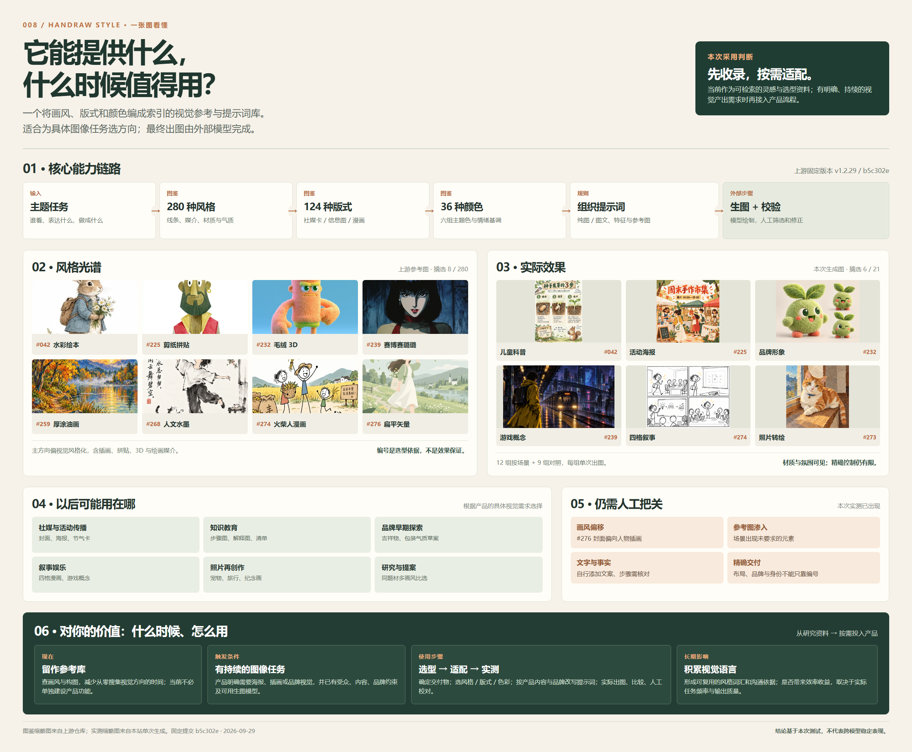


# 008 · Handraw Style：手绘生图提示词库

> 用编号选择画风、版式和配色，将主题整理成供生图模型使用的提示词。

## 基本信息

| 项目 | 内容 |
| --- | --- |
| 固定编号 | 008 |
| 原仓库 | [yang0/handraw-style](https://github.com/yang0/handraw-style) |
| 上游标识 | 固定提交 [`b5c302e`](https://github.com/yang0/handraw-style/tree/b5c302e7164f287230ed80bde2f69f35aac39914)；`version.json` 为 1.2.29；资料查阅于 2026-09-29 |
| 许可证 | [MIT，Copyright (c) 2026 yang0](https://github.com/yang0/handraw-style/blob/master/LICENSE) |
| 研究状态 | 已镜像并校验 440 张编号预览；完成 12 组按场景出图、9 组代表性对照出图及 4 组上游 CLI 实际运行；未端到端运行上游 Skill |
| 展示 | [线上能力总览](https://yydshly.github.io/0929_codex_project/008-handraw-style/) · [线上摘要图](https://yydshly.github.io/0929_codex_project/008-handraw-style/capability-map.png) · [440 张全量图鉴](../../site/008-handraw-style/gallery.html) · [按场景的 12 组实测](../../site/008-handraw-style/scenarios.html) · [九组对照实测](../../site/008-handraw-style/trials.html) · [工具运行证据](../../site/008-handraw-style/workflow.html) |

## 一句话理解

这是一个**提示词与视觉参考资源库**。主题决定画什么，风格编号决定视觉语言，版式编号决定内容怎么排列，颜色编号决定整体色调。Skill 根据模型能力选择仅用名称、补充特征或附加风格参考图；最终画面由外部生图模型完成。

## 本次使用判断

对当前研究项目，它更适合作为**可检索的视觉选型资料**，直接做成产品功能的收益有限。仓库整理了参考图、编号和提示词组织规则，但不负责稳定出图；本次 21 张单次实测中可见画风偏移、额外文字、参考图内容渗入及精确布局偏差。

因此先保留图鉴与样例。以后具体产品需要持续制作海报、科普图、品牌插画等内容时，再按任务选风格、版式和颜色，结合品牌与所用模型试生成，并对文字、事实、主体和排版做人工校验。这是基于本项目实测的采用建议，不是对所有团队或生图模型的普遍结论。

[打开能力、效果与使用决策一图](../../site/008-handraw-style/capability-map.png)（2400 像素宽，可放大保存）。图中明确区分上游风格缩略图与本次实际生成结果；可编辑的页面源文件为 [`web/capability-map-source.html`](web/capability-map-source.html)。



## 规模与能力

| 组成 | 上游资料所述规模 | 解决的问题 |
| --- | ---: | --- |
| 手绘风格 | 280，均有编号预览图；个别文字仍出现 279 | 统一描述线条、媒介、质感、人物和色彩语言 |
| 排版图型 | 124：社媒卡 21、信息图 35、漫画分镜 68 | 定义图文位置、阅读顺序和分镜节奏 |
| 主题色 | 36，分 6 组 | 用主色或组合色统领氛围 |
| 输出模式 | 纯图、图文；选排版时自动进入图文模式 | 决定画中文字是否参与构图 |
| 模型适配 | 名称、正向视觉特征、参考图分层 | 提高风格传递的可操作性；效果取决于实际生图模型 |
| 工具 | 本地画廊、提示词脚本、索引构建与校验脚本 | 检索、拼装与维护资料 |

详细拆解见 [CAPABILITIES.md](CAPABILITIES.md)。[RESEARCH.md](RESEARCH.md) 记录证据、数据流与版本差异；[VERIFICATION.md](VERIFICATION.md) 记录展示页验证。

## 可以完成哪些效果

| 任务 | 输入示例 | 预期产物 |
| --- | --- | --- |
| 单张插画 | `018号风格，主题：窗台晒太阳的猫` | 风格提示词，可交给生图模型生成极简幽默插画；CLI 的英文段需检查中文内容是否仍未翻译 |
| 社媒图文卡 | `SC-001 + 268 + C-26，主题：秋分` | 上文下图、水墨漫画、柿子橙色调的组合提示词 |
| 知识信息图 | `IG-003，主题：新手手冲咖啡三步` | 多行左文右图的信息组织要求 |
| 四格条漫 | `SB-002，主题：忘带伞的一天` | 起承转合四格分镜结构 |
| 照片转手绘 | `SC-021，上传照片，指定风格` | 照片与重绘的双拼构图要求；需要生图模型真正执行 |
| 海报 | `主题：秋分，图文模式` | 主题、场景、受众、色调和画风等结构化海报提示词 |

上表说明库可组织的请求和目标画面。本站另有[完整上游原图图鉴](../../site/008-handraw-style/gallery.html)、[十二组按场景实测](SCENARIOS.md)、[九组对照实测](TRIALS.md)和[上游工具运行证据](../../site/008-handraw-style/workflow.html)。图鉴素材、脚本输出与本次生成产物分别标注，便于核对“资源库里有什么”“工具实际写出什么”和“给模型后画出什么”。

## 浏览与本地运行

请直接打开[站点副本](../../site/008-handraw-style/index.html)；`web/` 是源文件，需要先构建才有完整图片与目录数据。总览页先呈现本次使用判断，再展示六类能力、实际原图、九组对照实测、六个场景和覆盖全部编号的确定性提示词拼装预览。新场景页有 12 个实际样例，按用途筛选并逐项列出可见偏差，也提示何时才值得用于具体产品。图鉴支持搜索、分类筛选和逐张查看原图。也可以从仓库根目录运行：



[查看桌面首屏](assets/showcase-desktop-first-screen.png) · [查看图鉴桌面首屏](assets/gallery-desktop-first-screen.png) · [查看图鉴手机首屏](assets/gallery-mobile-first-screen.png)。截图展示本站页面；里面的图片分别标明上游样张或本次生成。

```powershell
node projects/008-handraw-style/web/build.mjs
node projects/008-handraw-style/web/verify.mjs
python -m http.server 8765 --bind 127.0.0.1 --directory site
```

随后访问 `http://127.0.0.1:8765/008-handraw-style/`。站点无需外部运行依赖；原仓库链接需联网。

## 来源与使用边界

本站收录固定提交下的 280 张风格图、124 张版式图和 36 张色彩图，并保留相关元数据及版式提示词供检索与拼装；同步脚本校验 Git 对象哈希，发布副本逐项核对图片。上游许可与归属见 [SOURCES.md](SOURCES.md)。实测方法、观察和局限见 [TRIALS.md](TRIALS.md)。

[返回总项目](../../README.md)
