

  <strong>中文</strong> | <a href="LAYOUTS_en.md">English</a>

# 排版图型完整图鉴（124 种）

> 这里收录了本库全部 **124 种排版图型**（社媒卡、信息图、漫画分镜）的图片预览与排版提示词。在 AI 生图时直接指定图型编号（如 `SC-001`、`IG-003`、`SB-002`），即可精确控制画面的构图版式与排版层次。

> 💡 **排版图型架构机制**：
> - **确定性静态排版（纯文本直接拼接型）**：包括 `SC-001`~`SC-020`、`IG` 系列与 `SB` 系列等绝大多数图型，拓扑单一固定，模板直接拼接画风与主题；
> - **高维动态解析型排版（Skill 级动态决策型）**：以 `SC-021`（自适应双拼照片转译）为代表，属于高维视觉语法系统，由 AI 助手充当设计总监先进行构图决策（越界破框/微缩浮岛/记忆图谱等）与背景净化编译，输出单义强约束提示词。

## 目录导航

- [1. 社媒卡（21 种）](#social-cards)
- [2. 信息图（35 种）](#infographics)
- [3. 漫画分镜（68 种）](#comic-storyboards)

---

## 1. 社媒卡（21 种）

适合小红书、朋友圈、公众号配图及观点金句卡片。结构包含上下图文、文案主导、双格对照等。

| 效果预览 | 效果预览 | 效果预览 |
| :---: | :---: | :---: |
|  **SC-001** · 上文下图社媒卡 

查看排版提示词
 小红书社媒卡。排版采用上文下图结构：上方集中放置主题文字和简短补充文案，下方放置完整主图或场景图。上下内容保持清晰的阅读顺序，图文关系自然，整体构图简洁。
 |  **SC-002** · 文案主导底部辅助图卡 

查看排版提示词
 小红书社媒卡。排版：视觉主体是文字，底部简单图案起辅助作用，图文之间有较大空间。纯色背景，较多留白空间，构图简单。
 |  **SC-003** · 上下双格图文卡 

查看排版提示词
 小红书社媒卡。排版：无独立标题，根据主题创作。上下带框两宫格，每一格都是上面一行字，下面配图，图文无明显分界，纯色背景，较多留白空间，角色高度概括，构图简单。
 |
|  **SC-004** · 上下双格图文分区卡 

查看排版提示词
 小红书社媒卡。排版：无独立标题，根据主题创作。上下带框两宫格，每一格都有一个图区和一个文字区，文字区可以在图的上方、左侧或右侧，文字区显示简单文案不做过多扩写，纯色背景，较多留白空间，角色高度概括，构图简单。
 |  **SC-005** · 气泡文字思考IP卡 

查看排版提示词
 小红书社媒卡。排版：无独立标题，视觉重点是使用主题的气泡文字，左下或右下放置一个思考状 IP 形象，构图简单，大面积留白。
 |  **SC-006** · 三层标题辅助图卡 

查看排版提示词
 小红书社媒卡。排版分为三层：上层放置主标题，中层放置一张尺寸较小、起辅助作用的简单图形，下层放置副标题。使用纯色背景，保留较多留白空间，整体构图简单。
 |
|  **SC-007** · 引号关键词文字卡 

查看排版提示词
 小红书文字型社媒卡。排版：左上放置一个醒目的双引号，中间呈现主题文案并将关键词重点化，右下放置一条下划线；句末可以添加与文字大小适配的 emoji。保持文字主导的简洁构图。
 |  **SC-008** · 图上文下留白卡 

查看排版提示词
 小红书社媒卡。排版采用图上文下结构，上方是高度概括的角色或场景图，下方是主题文案；图文之间不设置明显界线，让视觉自然衔接。使用纯色背景，保留较多留白空间，整体构图简单。
 |  **SC-009** · 居中文字右下辅助图卡 

查看排版提示词
 小红书文字型社媒卡。排版：主题文字作为视觉主体，居中显示；右下角放置一个简单的小图作为辅助，不抢夺文字的视觉重点。整体构图简洁。
 |
|  **SC-010** · 上下双格标题列表卡 

查看排版提示词
 小红书社媒卡。排版：无独立标题，根据主题创作上下带框的两宫格。每一格包含一行标题、约两三行的简短 list 文字和一张简单配图；文字保持简洁，不做过多扩写，图文之间不设置明显分界。使用纯色背景，保留较多留白空间，角色高度概括，整体构图简单。
 |  **SC-011** · 中心主图多场景信息卡 

查看排版提示词
 小红书社媒卡。排版：设置一个主标题，画面中央放置一个主图，周围安排 3–5 个与主体形象一致的简单信息图，并添加 2–3 个对主体的简短标注。使用纯色背景，保留较多留白空间，角色高度概括，整体构图简单。
 |  **SC-012** · 中心标题上下图标卡 

查看排版提示词
 小红书社媒卡。排版：标题垂直居中显示，标题上方整齐安排两行图标，标题下方也整齐安排两行图标，形成围绕中心标题的上下对称结构。保持图标排列清晰、构图简单。
 |
|  **SC-014** · 留白驱动主视觉信息卡 

查看排版提示词
 小红书社媒卡。整体保留大面积留白。顶部设置 1–2 行醒目的短标题，与主体区域形成清晰层级；中下部设置一个占据主要面积的大型主视觉，主视觉可居中、偏左或偏右，不固定位置，并通过主体自身的轮廓、姿态和占位关系自然形成若干留白区域。将 4–6 个尺寸较小的信息单元穿插在这些留白区域中，每个单元由一个小视觉元素与极短文字组成，位置服从主视觉留下的空间，不平均环绕主体，不形成规则左右分栏。小信息单元应明显小于主视觉并贴合主体轮廓的空隙，可上下错落、疏密变化，不能使用统一卡片框、规则宫格、表格或明显分割线。底部可保留一句很短的总结文字作为收尾。整体强调主视觉优先、留白驱动、信息穿插，画面完整而非模块拼接。
 |  **SC-015** · 上下双区递进短句卡 

查看排版提示词
 小红书社媒卡。整体采用上下两段式结构，将画面分成两个面积接近的独立内容区域，中间保留清晰间距或细分隔关系。两个区域使用统一的视觉语言和相近的内部结构，形成对照、前后、转折或递进关系。每个区域设置一个醒目的核心短句作为第一视觉层级，并安排一个尺寸明显较大的单一主视觉，与核心文字形成左右或斜向的非对称平衡；主视觉位置可根据留白和整体重心调整。核心文字与主视觉之外的剩余留白中，放置 2–4 行简短补充文字，不形成独立卡片或规则列表。上下两个区域保持相似的视觉重量和阅读节奏，但不要求完全镜像复制，可通过标题位置、主视觉方向或留白分布产生轻微变化；第二个区域可加入很短的过渡词、转折词或关系提示。整体强调“上下双区＋大短句＋单一主视觉＋少量补充说明”，避免复杂信息图、密集文字、规则宫格和过多装饰，保持大面积留白、层级清楚、手机端快速阅读。
 |  **SC-016** · 极简大字小图点缀卡 

查看排版提示词
 小红书社媒卡。整体采用极简的大留白结构，以一组大字号短文案作为绝对视觉主体。主文案放置在画面上半部或中上部，占据主要横向宽度，可使用 2–3 行自然换行；文字整体偏左排列，但不紧贴边缘，形成稳定的大块文字区域。主文案字号明显大于其他元素，行距相对紧凑，个别关键词可通过颜色、字重、底纹或轻微标记进行局部强调，但不要让多个词同时抢夺注意力。主文案下方保留较大的空白距离，在中央或略偏一侧放置一个尺寸很小的视觉点缀，作为第二视觉停顿，不承担主要信息。画面四角可以加入极少量微型辅助信息，例如日期、页码、符号或装饰点，字号和视觉重量都非常低。整体不设置卡片框、分栏、信息列表或复杂图文组合，背景保持简洁，强调大文字、少元素、大留白、弱装饰，形成轻盈安静、适合快速阅读的社媒封面感。
 |
|  **SC-017** · 自由标注留白信息卡 

查看排版提示词
 小红书社媒卡。排版：设置一个主标题，标签文字以自由、自然的方式分布在画面中，对画面里的角色、物件或场景元素做出简短注解，让文字参与整体构图。保留大面积留白，角色高度概括，减少装饰和复杂分区，保持构图简洁。
 |  **SC-018** · 中心主视觉环绕信息卡 

查看排版提示词
 小红书社媒卡。排版采用中心主视觉环绕式结构：顶部设置两级短标题，其中主标题醒目。画面中央放置一个占比最大的主体人物或物体，作为绝对视觉中心；主体四周分散安排 3–6 个尺寸较小的独立插图，每个小图旁仅配一个极短标签或事项名称。小图采用自由、不规则的环绕分布，左右和下方错落排布，保持视觉平衡而非整齐网格。背景保留大面积留白，主图、小图、文字之间保持明显间距，形成“一大主体＋多个小信息点”的层级关系。
 |  **SC-019** · 中央人物细线标注卡 

查看排版提示词
 小红书社媒卡。排版采用“顶部标题＋中央大人物＋左右零散标签”的三级结构。画面顶部放置一句醒目的短标题，字号最大，居中或略偏左。画面中央放置一个完整人物作为绝对视觉主体，人物占画面高度约 60%–75%，从中上部延伸到底部，保持完整轮廓。人物左右两侧分散安排 3–5 个极短标签，每个标签仅一行或短词组，并用简短细线、斜线或引导线指向人物附近对应位置。标签上下错落、自由分布，左右保持视觉平衡，不做成规则列表。人物与文字之间保留充足间距，不遮挡人物主体。背景大面积留白，不增加复杂图块、卡片框、表格或多余装饰，确保手机端一眼可读。
 |
|  **SC-020** · 一大一组非对称信息卡 

查看排版提示词
 小红书社媒卡。整体采用“一大一组”的非对称结构。顶部设置 1–2 行醒目的短标题，形成独立标题区域，并与下方主体保持明显间距。中部设置一个占据主要面积的大型主视觉，整体偏向画面一侧；在相对另一侧集中安排 4–6 个尺寸明显更小的信息单元，形成连续、紧凑的次级信息组。主视觉可以位于左侧或右侧，信息组随之镜像调整，不固定具体方向。小信息单元不环绕主视觉四周，也不分散到画面两侧，可上下错落、两列穿插或疏密变化；每个单元由一个小视觉元素与极短文字组成。主视觉区域约占中部内容面积的 55%–70%，信息组约占 25%–40%，两者通过留白自然分隔，不使用分栏线、统一卡片框、表格或规则宫格。底部可保留一行很短的总结文字。整体强调“一个大视觉块＋一个集中小信息簇”，版面非对称但稳定，避免中心辐射、四周环绕、平均分布或满画面散点排版。
 |  **SC-021** · 自适应双拼照片转译社媒卡 

查看排版提示词
 小红书社媒卡。排版：自适应双拼照片艺术转译型。支持纯文本主题直出（由生图模型一体化生成）与上传照片垫图转绘。拼接时严禁修改或拉伸原图比例；完整画布由两块等大区域精准拼接：若为竖版原图采用左右 1:1 双拼横向并排，画布保持原图高度不变，总宽度精确为原图宽度的两倍（原图占左 50%，艺术转译区占右 50%）；若为横版原图/默认画幅采用上下 1:1 双拼纵向堆叠，画布保持原图宽度不变，总高度精确为原图高度的两倍（原图占上 50%，艺术转译区占下 50%）。由生图模型自主完成“真实摄影呈现 × 同一主体艺术风格转译”的前后虚实对照：  【真实摄影区（横版默认上方 / 竖版左侧）】： 由生图模型根据主题生成超写实、高质感的单反摄影真实照片（若用户上传了参考图则以其为准）。严格保持原图原始宽高比例与构图完整性，严禁拉伸变形或裁切。保持摄影真实景深、自然光线、真实皮肤/毛发质感与现场抓拍氛围，不做插画化重绘，作为风格转译前的真实摄影基准。  【艺术转译区（横版默认下方 / 竖版右侧）—— 彻底去写实与单义构图转译】： 1. 彻底去写实化与画风从零重绘（坚决杜绝照片套滤镜）： 艺术转译侧必须与摄影侧形成极具冲击力的跨媒介反差！坚决不要在原照片的写实五官与光影体积上直接套滤镜或贴材质。必须“只提取摄影区人物的五官标志特征、姿态神态与场景大轮廓”，在画风上完全按所选风格从零重绘为纯粹的 2D 手绘/艺术插画，让所选风格的笔触、线条、专属配色与质感辨识度最大化释放。  2. 坚决彻底剔除原片环境杂质（留白是第一原则，严禁照抄全景背景）： 严禁把摄影区的杂乱场景（如整面石墙、地面小路、大片树丛天空等）机械复制到转译区！转译侧画面四周边缘必须保留充足、干净的 40%–80% 负空间/呼吸留白底色（暖象牙白、米白棉麻纸纹），主体与文字向内部收拢，绝不贴边、绝不爆框。  3. 单一明确的构图转译语法与轮替机制（严格 Round-Robin 轮替，严禁千篇一律与多选平铺）： 若用户未显式指定构图，AI 提示词生成器（Prompter Agent）在每次生成时必须按顺序在以下五大核心玩法中进行严格轮替（Round-Robin 轮替抽卡，严禁连续输出同一玩法），并为选定的唯一玩法生成单义、排他的执行指令： - 【玩法一：越界破框型】：在纯白底色中设置单枚低饱和几何色块/容器，主体大部分在色块内，但关键部位（头部/手部/枝叶）自然突破色块边缘伸出，形成空间穿透感； - 【玩法二：微缩浮岛型】：主体大幅微缩为占画面 10%–25% 的精致纸面小景，仅由一抹清淡色带或基座承托，四周呈现大片静谧空旷留白； - 【玩法三：记忆图谱平铺型】：打破单一场景，居中放置主体，并在留白中错落平铺 3–6 枚原图记忆特征贴纸（带 NO. 编号），间距透光； - 【玩法四：经典悬浮落地型】：主体尺度适中（占 40%–55%），居中或微偏心站立，底部仅用一条极简地面摩擦线提示空间； - 【玩法五：正负形咬合型】：主体高度提炼为几何剪影，与背景正负形相互转换咬合。  4. 编辑式微排版（文字优雅嵌入负空间）： 在空白负空间中巧妙排布 1–2 组与主题相关的精致微排版（手绘艺术标题、英文短句、编号标签或随笔小文案），字迹纤细克制。  整体要求：拼接时严禁修改原图比例；加上艺术转译区后，整张图片宽度精确为原图宽度的两倍（左右双拼）或高度精确为原图高度的两倍（上下双拼）；双拼两区在中线处平齐无缝拼接，无多余边框；艺术转译侧四周确保留出充足负空间与呼吸边距；由生图模型自主完成“极致真实摄影 × 极致纯正手绘艺术”对比鲜明、四周留白舒展的高级艺术画报。
 |  **SC-022** · 姓名四款签名设计展示卡 

查看排版提示词
 【中文姓名】：{例如：唐伯虎} 【姓名拼音】：{例如：TANG BOHU} 【顶部背景色】：{例如：深钴蓝} 【画幅比例】：9:16  将输入的【中文姓名】制作成一张“姓名 → 四种签名方案”的竖版设计稿。  ## 一、整体排版  画面比例为 9:16。  上方约占画面 40%，用于展示原始姓名。  下方约占画面 60%，用于展示同一个姓名的四种不同签名方案。  ---  ## 二、顶部姓名区  顶部使用【顶部背景色】。  顶部中央放置小字：  NAME TO SIGNATURE  画面中部展示【中文姓名】。  姓名必须使用普通印刷字体，不使用手写、连笔、签名字体或艺术变形，用于明确表示原始输入姓名。  中文姓名下方显示：  【姓名拼音】  姓名拼音使用大写英文字母。  顶部区域不添加其他文案、Logo、编号或图形。  ---  ## 三、底部签名区  底部划分为 2×2 四个区域。  使用细虚线进行横向和纵向分隔，不需要外边框。  四格分别展示同一个【中文姓名】的四种签名设计：  左上：飘逸 右上：锋势 左下：回环 右下：极简  每格只包含：  1. 一个大尺寸签名 2. 下方一个小字号风格名称  四个签名都必须来源于同一个【中文姓名】，但不能只是把完整姓名换四种相似写法。  允许对姓名进行：  省笔、合笔、连笔、共享笔画、压缩、拉长、缩写、拆解、重组、符号化。  不要求每一个中文字都完整可辨。  重点是保留姓名的部分结构特征，同时形成四种明显不同的签名骨架。  ---  ## 四、四种签名笔势  ### 1. 飘逸  整体横向展开。  姓名高度压缩，多个字之间可以连续连写、共享笔画。  以连续曲线为主，笔势流畅。  可以使用一至两条跨度较大的长线，将整个签名串联起来。  允许出现较长的横向拖尾。  整体结构强调：  长线、曲线、连续、舒展、流动。  减少过多尖角和短促折线。  ---  ### 2. 锋势  整体具有明显向右推进的趋势。  大量使用：  斜线、尖角、高竖笔、快速切线、短促折笔。  姓名可以高度压缩，只保留主要骨架。  整体允许明显右倾。  主笔可以形成较强的上挑、下切、斜向穿插关系。  减少大面积圆形和柔软回环。  整体结构强调：  斜向、锐角、切线、速度、力量。  ---  ### 3. 回环  以一个或多个大型回环结构作为签名主体。  可以使用：  开放圆环、椭圆曲线、大型 S 曲线、连续回转线、包围结构。  将姓名压缩后的主要笔画嵌入回环内部，或让姓名笔画穿过回环。  最后一笔可以突破主体，形成较长收尾。  回环不能过于规则，应保留自然手写产生的不对称。  整体结构强调：  回旋、包围、穿插、连续曲线、大尺度手势。  ---  ### 4. 极简  不完整书写整个姓名。  从【中文姓名】中提取约 4–6 个最有识别价值的主要笔画，例如：  长横、主竖、折笔、斜线、撇捺、点笔。  重新组合成一个简化的个人签名标记。  允许大幅度省略原姓名结构。  整体笔画数量明显少于其他三款。  避免添加与姓名无关的装饰图形。  整体结构强调：  少笔画、大留白、强骨架、符号化。  ---  ## 五、四款差异控制  四种方案必须在以下方面产生明显区别：  - 笔画数量 - 横向或斜向趋势 - 曲线与直线比例 - 是否存在大型回环 - 是否完整保留姓名 - 重心位置 - 连笔方式 - 收尾方向 - 整体轮廓  四款不能只是修改同一个签名的尾笔。  应形成四种不同结构：  飘逸：长曲线 + 连续连写 锋势：斜线 + 尖角 + 强方向性 回环：大型曲线 + 包围结构 极简：少量核心笔画 + 高度符号化  最终只需要保留姓名、拼音、四个签名和四个风格名称，不添加其他内容。
 |

---

## 2. 信息图（35 种）

适合知识科普、对比清单、流程步骤及数据架构展示。结构包含金字塔层级、中心主图标注、多行多列对比等。

| 效果预览 | 效果预览 | 效果预览 |
| :---: | :---: | :---: |
|  **IG-001** · 标题金字塔图标信息图 

查看排版提示词
 小红书信息图。排版：顶部设置明确标题，主体采用层级递进的金字塔示意图，每一层包含多个带标签的图标，使用分层结构清晰表达信息关系。
 |  **IG-002** · 中心主图标注信息图 

查看排版提示词
 小红书信息图。排版：主图放在画面中央，周围环绕多个带线标签的注释，连接线分别指向主图的具体部位，对主体结构或细节进行清晰标注说明。
 |  **IG-003** · 多行左文右图信息图 

查看排版提示词
 小红书信息图。高泛用性多层/多行图文并列结构。排版：顶部设置醒目的主标题区（可包含主标题、副标题、日期/标签或分类标语）；主体由多行（通常 3–5 层）垂直等距对齐的横向模块组成，每一行采用左侧文字信息（时间点/小标题/标签与要点说明）、右侧对应配图（场景插图/实物/产品图）的并列结构，各行保持整齐统一的水平对齐；底部可配置总结提示、实用贴士备忘或简短结语。该版式通用于各类横向分层条目展示，包括但不限于每日行程路线安排、图鉴速览、分类清单、步骤流程、多维度对照或对比等场景。
 |
|  **IG-004** · 双列多行对比信息图 

查看排版提示词
 小红书信息图。排版：顶部设置主标题，主体分为左右两列进行对比，每列内部包含多行对应内容；保持两列结构清晰、行项相互对齐，突出不同对象之间的逐项比较关系。
 |  **IG-005** · 大主视觉下方图鉴信息图 

查看排版提示词
 小红书信息图。整体采用“顶部超大标题＋中部大型结构主视觉＋下部图鉴式分类单元”的纵向结构。顶部设置一行醒目的大标题，字号明显大于其他文字，横向展开，占据独立标题区，并与下方内容保持清晰间距。画面中部放置一个尺寸很大的完整主视觉，占据画面主要宽度，作为整张卡片的核心；主视觉内部可根据自身结构划分若干区域，并直接嵌入简短标签，使文字与主视觉形成一体化标注，不拆成多个独立卡片。画面下部排列多个尺寸较小的独立视觉单元，采用规则但不过分拥挤的多列布局，每个单元由“小视觉＋下方短标签”组成，尺寸尽量统一，横向和纵向间距稳定，形成图鉴、目录或分类展示的扫描节奏。小单元数量可以较多，但必须明显小于中部主视觉，不使用复杂卡片框，依靠留白、对齐和重复结构建立秩序。整体阅读顺序为顶部标题→中部整体结构→下部细分类单元，避免左右分栏、复杂装饰和不规则拼贴。
 |  **IG-006** · 多层标题图标对比信息图 

查看排版提示词
 小红书信息图。排版：设置一个主标题，主体由多个层级组成，每一层左侧放置该层标题，右侧整齐排列多个带文字标签的图标，用于呈现不同层级之间的对比关系。使用纯色背景，保留较多留白空间，整体构图简单。
 |
|  **IG-007** · 粗体标题标签小图卡 

查看排版提示词
 小红书信息图。排版：粗体标题，多行带标签小图，底部一行字，纯色背景，无框，较多留白空间。
 | 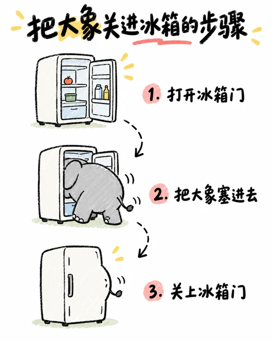 **IG-008** · 多路径流程步骤图 

查看排版提示词
 小红书信息图。排版：设置一个主标题，主体采用流程步骤图结构，步骤路径可以是横向、纵向、S 形或其他清晰的路径式布局。每一步只包含一个小图和一句简短说明，步骤之间通过方向、顺序或适度引导关系连接。保留大面积留白，避免复杂装饰和过多文字。
 |  **IG-009** · 时间轴节点信息图 

查看排版提示词
 小红书信息图。排版：设置一个主标题，主体采用时间轴型结构，用一条清晰的主轴串联多个节点。时间轴可以横向或纵向展开，每个节点包含一个小图、一个时间信息和一句简短说明。保持节点顺序清楚、层级明确，并保留大面积留白，避免复杂装饰和过多文字。
 |
|  **IG-010** · 阶段等级进阶信息图 

查看排版提示词
 小红书信息图。排版：阶段进阶型，重点展示由低到高的等级变化和阶段提升，不以时间先后为组织依据。顶部设置简短醒目的主标题，主体可采用阶梯、上升箭头或清晰的层级结构，使进阶方向一目了然。各阶段配简洁小图、等级名称和简短说明，层级关系清楚，文字从简。保留大面积留白和舒适的阶段间距，构图简洁。
 |  **IG-011** · 前后变化对比信息图 

查看排版提示词
 小红书信息图。排版：Before / After 型，前后变化是绝对视觉重点。将画面组织为前后两个主要区域，可以左右排列，也可以上下排列；两部分之间只放箭头、日期或极少量说明，用来表达变化方向。Before 与 After 各自呈现完整、可直接比较的主视觉，标签和文字保持简洁。保留大面积留白，避免复杂装饰和过多辅助信息。
 |  **IG-012** · 分层结构型信息图 

查看排版提示词
 小红书信息图。排版：分层结构型，围绕天然存在的层级关系组织信息，可以表现为上中下、内中外、表层深层或由基础到核心的多层结构。设置清晰的主标题，主体通过层层嵌套、上下分层或由下至上的结构展示不同层级；每一层配简洁名称、短句或小图，保持层级顺序和阅读关系明确。保留大面积留白，避免复杂装饰、过密文字和无关模块。
 |
|  **IG-013** · 漏斗转化型信息图 

查看排版提示词
 小红书信息图。排版：漏斗型，上宽下窄，通过逐层收窄的结构展示从广泛进入、筛选、转化、淘汰到聚焦沉淀的过程。设置清晰的主标题，漏斗各层配简洁的阶段名称、短句或小图，突出人数、对象或范围逐步减少而重点逐步集中的关系。层级顺序应清楚，保留大面积留白，避免复杂装饰和过多文字。
 | 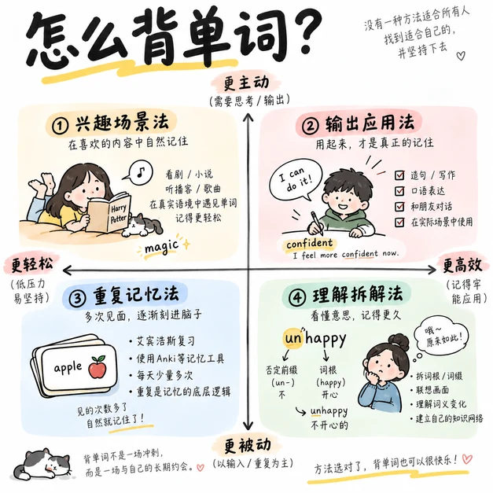 **IG-014** · 四象限矩阵信息图 

查看排版提示词
 小红书信息图。排版：矩阵型，以两条相互垂直的轴将内容划分为四个象限，优先采用清晰易读的 2×2 结构。设置一个主标题，并明确标注横轴、纵轴及其两端含义；每个象限放置一个主题单元，可包含简短标题、小图和少量说明。四个区域保持对齐、间距均衡和比较关系明确，保留大面积留白，避免复杂装饰和过多文字。
 |  **IG-015** · 坐标散点型信息图 

查看排版提示词
 小红书信息图。排版：坐标散点型，在一个清晰的坐标空间中散布多个不同对象，通过它们在横轴和纵轴上的位置表达分类、倾向或关系。设置一个主标题，明确标注横轴、纵轴及两端含义；每个对象由简洁的小图、名称和少量说明组成，位置分布应有辨识度并便于比较。保留坐标区域周围的大面积留白，避免复杂装饰和过多文字。
 |
|  **IG-016** · 分类树状型信息图 

查看排版提示词
 小红书信息图。排版：分类树 / 树状型，从一个核心大类或根节点开始，向下分成若干主要小类，再继续分解为更细的子类或末端节点。设置清晰的主标题，根节点位于顶部或中心上方，各级节点通过连线体现所属关系和分支路径。每个节点使用简短名称或极少说明，层级深度、分支顺序和阅读路径必须清楚。保留适度留白，避免过度装饰和无关信息。
 |  **IG-017** · 思维导图型信息图 

查看排版提示词
 小红书信息图。排版：思维导图型，中心主题作为核心节点，向外延伸多条分支；每条分支包含若干短标签或小图标，清楚表达从中心到子主题的层级关系。避免规则表格和过密文字，使用自然弯曲的连线、适度留白和简洁角色概括形成清晰阅读路径。
 |  **IG-018** · 关系网络型信息图 

查看排版提示词
 小红书信息图。排版：关系网络型，多个对象分布在画面中，用不同颜色或粗细的连线表达合作、影响、依赖或关联关系。可以只有弱中心，不要求所有节点平均分布；节点名称保持简短，整体留白充足，避免复杂表格和密集说明。
 |
|  **IG-019** · 循环闭环型信息图 

查看排版提示词
 小红书信息图。排版：循环闭环型，多个阶段围成圆形或环形路径，用连续箭头串联，强调持续循环、反馈和迭代，而不是开始到结束的单向流程。中心保留标题或核心结论，节点配小图和短句，留白清楚，避免拥挤。
 |  **IG-020** · 路径地图型信息图 

查看排版提示词
 小红书信息图。排版：路径地图型，一条弯曲、蜿蜒或游戏地图式路线贯穿画面，沿途安排多个编号节点、地点或阶段。每个节点配一个小视觉和一句短说明，用箭头、虚线或路标表达探索方向；不必是真实地图，重点是路径和节点关系，保留大面积留白。
 |  **IG-021** · 真实地图标注型信息图 

查看排版提示词
 小红书信息图。排版：真实地图与标注型，以真实地图轮廓、街区、水系或区域关系作为主视觉，在地图上放置地点标记、极短说明和少量小图标。标注需避开主体遮挡，层级清楚，图例简洁，避免把地图做成密集列表。
 |
|  **IG-022** · 数字大字型信息图 

查看排版提示词
 小红书信息图。排版：数字大字型，以一个或多个超大数字作为绝对视觉主体，周围只放极短解释、单位或对象名称。数字要占据主要面积并形成强烈冲击，其他元素弱化，背景大面积留白，不加入复杂图表。
 |  **IG-023** · 排行榜型信息图 

查看排版提示词
 小红书信息图。排版：排行榜型，按1、2、3、4、5的明确顺序排列对象。每个对象配一个小图、名称和一项核心数据，可采用纵向排行、奖台或错落分层结构。重点突出名次差异和第一视觉对象，避免退化成普通无序清单。
 |  **IG-024** · 比例构成型信息图 

查看排版提示词
 小红书信息图。排版：比例构成型，使用圆环图、饼图、100人图标或色块面积表达整体中各部分所占比例。设置清晰图例和少量百分比标注，主图最大，说明简短，颜色区分明确，留白充足，避免堆叠过多指标。
 |
|  **IG-025** · 尺度比较型信息图 

查看排版提示词
 小红书信息图。排版：尺度比较型，让多个对象按真实或相对大小从小到大排列，视觉尺寸本身直接传递比较信息。对象高度概括，配极短名称或阶段标签，用基线、箭头或少量刻度强化递进关系，保持构图简单和大面积留白。
 |  **IG-026** · 拆解爆炸图型信息图 

查看排版提示词
 小红书信息图。排版：拆解爆炸图型，一个完整物体作为主体，多个零件或组件从主体中分离并围绕主体展开，用引导线说明每个组件的名称、用途或组成关系。重点表现“由什么组成”，不要做成普通标注图；角色高度概括，构图简单，大量留白。
 |  **IG-027** · 剖面截面型信息图 

查看排版提示词
 小红书信息图。排版：剖面 / 截面型，把一个整体建筑或物体切开，直接展示内部空间、楼层和功能分区。剖面主视觉占据主要面积，旁侧配置少量楼层标签或极短说明，切口和内部结构必须完整可读，角色高度概括，保留大量留白。
 |
|  **IG-028** · 连续场景信息图 

查看排版提示词
 小红书信息图。排版：连续场景型，整张图是一幅连贯的空间或时间场景，多个信息节点自然藏在道路、人物、建筑和道具中。不要拆成卡片或规则网格；用场景关系串联信息，角色高度概括，构图简洁，保留大片天空、地面或背景留白。
 |  **IG-029** · 人物群像标签型信息图 

查看排版提示词
 小红书信息图。排版：人物群像 + 标签型，多个角色自由站位，不必形成规则宫格。每个角色配一个短标签或极短说明，角色之间保持清楚间距和视觉平衡，可用姿态、道具和大小差异表达区别。角色高度概括，背景大面积留白，避免复杂装饰。
 |  **IG-030** · 一大多小知识图谱型信息图 

查看排版提示词
 小红书信息图。排版：一大多小知识图谱型，设置一个占据主要面积的大型核心图，作为画面最重要的视觉主体；在核心图周围分布若干尺寸明显更小的视觉单元，每个单元配一个极短标签、名称或说明。小单元围绕核心主题形成知识关联，但不要求规则网格或完全平均分布；通过留白、位置和适度连接表达整体关系。角色高度概括，构图简单，保留大量留白。
 |
|  **IG-031** · 百科全书式信息卡 

查看排版提示词
 小红书信息图。排版：百科全书式信息卡。采用“顶部主标本展示区 + 中部非对称多模块信息区 + 底部资料来源区”的三段式结构。顶部以主视觉实物/标本为核心，搭配标题、学名/副标题、分类标签与少量基础信息。中部通过细线网格、坐标系统和黄金分割组织6–10个信息模块，混合小标题、短文、图解、对比、数据条、地图、时间轴等形式，整体图文混排、秩序清晰、留白充足。底部设置弱化的编号、注释或来源说明区，整体呈现标本馆档案与现代博物馆导览牌融合的理性设计感。
 |  **IG-032** · 手绘编辑式知识信息图 

查看排版提示词
 小红书信息图。排版：手绘编辑式知识信息图。采用“顶部超大标题 + 中部大型核心主视觉 + 周边多个带数字编号的知识点模块 + 底部总结区”的构图。核心主视觉明显大于其他元素，作为全图视觉中心；周围自然环绕分布4–8个知识点模块，每个模块带有清晰醒目的数字序号（如01、02、03、04）建立列表感与阅读动线。每个编号模块包含短标题、简短说明和一个小型视觉解释（如小场景插图、图标、对比、流程、思维泡泡或微型漫画）。模块围绕核心视觉灵活排布，非僵硬规则宫格，允许箭头、标签、对话气泡与手写注释穿插连接。底部设置一句话总结、关键词提炼或checklist清单区收束全图。整体呈现杂志编辑插画、知识信息图与轻漫画叙事融合的生动手绘质感。角色高度概括，构图简洁，较多留白。
 |  **IG-033** · 讲义式高密分析信息图 

查看排版提示词
 小红书信息图。排版：讲义式高密分析信息图。一页高信息密度的讲义式分析排版，整体呈现“先总览、再分解、再总结”的清晰结构。顶部设置主标题栏与核心要点/速览区；中部为主体分析区，由多个带编号的独立分析卡片模块组成，各模块包含要点小标题、项目符号清单、公式框与局部图解说明，并穿插表格容器、步骤流程区与思维导图/流程连接区，通过不同大小的内容区形成丰富的视觉节奏；底部设置通栏重点结论区与易错提醒/避坑说明区，辅以边缘补充说明区与角落批注小框。版面遵循从上到下、从左到右的严谨阅读顺序，分区明确、容器边框分明，不做海报式单一视觉中心布局，不做机械均分网格，不添加知识点以外的纯装饰性图像元素。
 |
|  **IG-034** · 编辑式等距轴测全景地图信息图 

查看排版提示词
 小红书信息图。排版：编辑式等距轴测全景地图信息图。采用纵向长幅构图，以一个连续展开的等距轴测微缩世界作为画面主体。主视觉像一座沿纵向自然生长的小型城市、主题乐园或幻想产业园，由多个大小差异明显、造型各异的独立场景节点组成。整个轴测世界集中在画面中央区域，但不要铺满画布，四周保留大量纯净背景和呼吸空间。场景节点不要按照规则网格排列，也不要切成等大的流程模块。建筑、设施、商店、工厂、交通工具、特殊装置等以不规则方式错落组合，通过道路、车辆、传送结构、空间方向或视觉动线产生联系。构图强调“一张完整世界地图”，而不是“多个步骤依次排开的流程图”。可以存在流程关系，但流程隐藏在空间叙事之中，不使用明显的大箭头串联所有节点。核心节点可以明显放大，次要节点缩小，局部甚至可以出现非常夸张的大型标志物、广告牌、纪念碑式装置、特殊建筑或巨型物件，以制造视觉节奏和幽默感。文字信息不要覆盖整个画面。标题、编号、简短说明、小型图例和局部注释主要放在画面外围留白区域，与附近场景进行弱连接。避免大量白色信息卡、统一尺寸说明框、规则章节标题和密集参数表。整体采用极简的二维轴测线稿插画语言：辅助色A细线轮廓、辅助色B建筑主体、主色背景及少量主色填色，基本限制在三色体系。无渐变、无真实材质、无复杂光影。建筑与设备保持高度概括、图标化和卡通化，不追求工程结构准确度；加入大量非常小的人物、动物、车辆和幽默互动细节，使整个世界具有“主题乐园地图 / 杂志插画地图 / 品牌世界观海报”的感觉。重点：大留白、中央连续轴测世界、不规则节点、大小强对比、外围零散注释、趣味叙事。避免：满版工业园、规则分区、标准流程卡、密集文字框、大量流程箭头、写实工厂、工程制图感、所有节点尺寸一致。
 |  **IG-035** · 微缩箱庭式等距轴测浮岛 

查看排版提示词
 排版：微缩箱庭式等距轴测浮岛场景。构图采用经典的 2.5D 等距轴测俯视透视（30度等角投影，无广角近大远小畸变），将整个场景浓缩在一座悬浮于纯净背景中央的独立微缩地块基座（浮岛/立体切面沙盘）之上。空间呈现立体纵向三层结构：底层为不规则切面岩基、悬垂须根、悬空碎石或垂落的瀑布水滴；中层为主地表活动区，地形高低错落，微缩建筑、小径阶梯、微缩植被与互动小景观紧凑聚集；顶层为高耸构造、升腾烟雾或微风流云。微缩箱庭居中构图，四周保留大面积干净开阔的负空间与呼吸感，使悬浮岛屿的立体剪影与轮廓分明醒目。场景元素高度浓缩于箱庭地块之上，呈现精致盆景、微缩移轴模型与箱庭沙盘探索感。画面保持场景纯粹性，无强行分割的大型文本卡片框或遮挡性UI容器；若有文字说明，以极简轻量标签或悬浮标题散布于外围留白处。重点：2.5D等距轴测透视、悬浮微缩浮岛基座、纵深垂直分层、中心微缩箱庭聚合、四周充足留白。避免：铺满全画布的平铺背景、强烈单点灭点透视畸变、平面平视无立体感、大面积遮挡画面的UI卡片。
 |  |

---

## 3. 漫画分镜（68 种）

适合多格叙事、剧情转折、条漫分镜及动态视觉表现。结构包含规则四格、起承转合、大格冲击、对角切割等专业分镜。

| 效果预览 | 效果预览 | 效果预览 |
| :---: | :---: | :---: |
|  **SB-001** · 规则网格 

查看排版提示词
 漫画分镜。排版：规则网格，所有面板大小接近、排列整齐，阅读顺序最稳定，适合日常和对白故事。让该分镜机制决定页面结构、阅读顺序、主次画格和镜头节奏；输出一张完整单页漫画页面，画格共同讲述连续情节，角色外观在各格保持一致。
 |  **SB-002** · 四格起承转合 

查看排版提示词
 漫画分镜。排版：四格起承转合，四个等格依次承担铺垫、发展、转折和包袱，适合短笑话。让该分镜机制决定页面结构、阅读顺序、主次画格和镜头节奏；输出一张完整单页漫画页面，画格共同讲述连续情节，角色外观在各格保持一致。
 |  **SB-003** · 大格 + 小格 

查看排版提示词
 漫画分镜。排版：大格 + 小格，一个主画面占据大面积，其余小格补充过程、反应或细节。让该分镜机制决定页面结构、阅读顺序、主次画格和镜头节奏；输出一张完整单页漫画页面，画格共同讲述连续情节，角色外观在各格保持一致。
 |
| 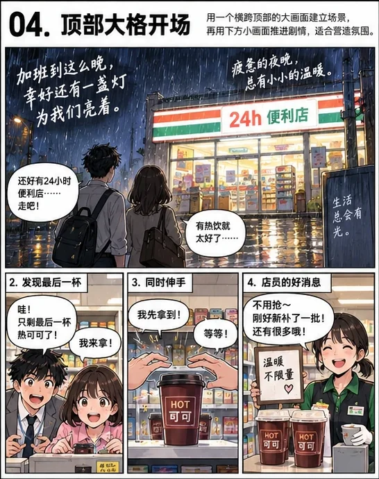 **SB-004** · 顶部大格开场 

查看排版提示词
 漫画分镜。排版：顶部大格开场，用横跨页面的大面板建立场景和人物关系，下面再进入连续叙事。让该分镜机制决定页面结构、阅读顺序、主次画格和镜头节奏；输出一张完整单页漫画页面，画格共同讲述连续情节，角色外观在各格保持一致。
 |  **SB-005** · 底部大格收尾 

查看排版提示词
 漫画分镜。排版：底部大格收尾，前面用小格推进，最后用大面板完成高潮、反转或情绪落点。让该分镜机制决定页面结构、阅读顺序、主次画格和镜头节奏；输出一张完整单页漫画页面，画格共同讲述连续情节，角色外观在各格保持一致。
 |  **SB-006** · 中央大格爆发 

查看排版提示词
 漫画分镜。排版：中央大格爆发，页面中心设置最大面板，用于动作高潮或视觉核心。让该分镜机制决定页面结构、阅读顺序、主次画格和镜头节奏；输出一张完整单页漫画页面，画格共同讲述连续情节，角色外观在各格保持一致。
 |
| 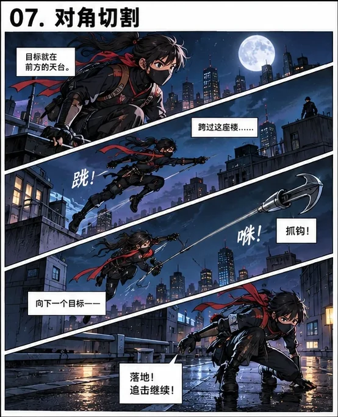 **SB-007** · 对角切割 

查看排版提示词
 漫画分镜。排版：对角切割，面板沿斜线分割页面，适合速度、冲突、追逐和对峙。让该分镜机制决定页面结构、阅读顺序、主次画格和镜头节奏；输出一张完整单页漫画页面，画格共同讲述连续情节，角色外观在各格保持一致。
 | 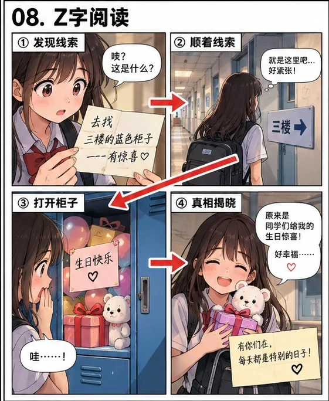 **SB-008** · Z 字阅读 

查看排版提示词
 漫画分镜。排版：Z 字阅读，视觉焦点沿左上→右上→左下→右下流动，阅读路径清晰。让该分镜机制决定页面结构、阅读顺序、主次画格和镜头节奏；输出一张完整单页漫画页面，画格共同讲述连续情节，角色外观在各格保持一致。
 |  **SB-009** · S 型阅读 

查看排版提示词
 漫画分镜。排版：S 型阅读，人物与构图沿柔和曲线移动，适合轻快、浪漫或旅行叙事。让该分镜机制决定页面结构、阅读顺序、主次画格和镜头节奏；输出一张完整单页漫画页面，画格共同讲述连续情节，角色外观在各格保持一致。
 |
| 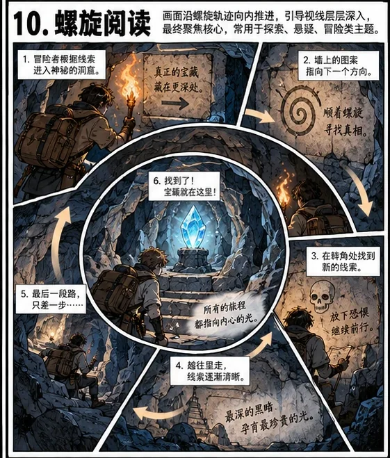 **SB-010** · 螺旋阅读 

查看排版提示词
 漫画分镜。排版：螺旋阅读，面板和视线围绕中心旋转，逐步逼近核心事件。让该分镜机制决定页面结构、阅读顺序、主次画格和镜头节奏；输出一张完整单页漫画页面，画格共同讲述连续情节，角色外观在各格保持一致。
 |  **SB-011** · 放射型分镜 

查看排版提示词
 漫画分镜。排版：放射型分镜，多个面板向中心聚拢，适合爆发、揭示和强焦点事件。让该分镜机制决定页面结构、阅读顺序、主次画格和镜头节奏；输出一张完整单页漫画页面，画格共同讲述连续情节，角色外观在各格保持一致。
 |  **SB-012** · 碎片面板 

查看排版提示词
 漫画分镜。排版：碎片面板，画面像玻璃碎片般分割，适合混乱、战斗、记忆和心理冲击。让该分镜机制决定页面结构、阅读顺序、主次画格和镜头节奏；输出一张完整单页漫画页面，画格共同讲述连续情节，角色外观在各格保持一致。
 |
|  **SB-013** · 破框构图 

查看排版提示词
 漫画分镜。排版：破框构图，人物、动作或特效越过面板边界，增强力量、速度和空间突破感。让该分镜机制决定页面结构、阅读顺序、主次画格和镜头节奏；输出一张完整单页漫画页面，画格共同讲述连续情节，角色外观在各格保持一致。
 |  **SB-014** · 跨格人物 

查看排版提示词
 漫画分镜。排版：跨格人物，同一人物身体横跨多个面板，使连续动作更流畅。让该分镜机制决定页面结构、阅读顺序、主次画格和镜头节奏；输出一张完整单页漫画页面，画格共同讲述连续情节，角色外观在各格保持一致。
 |  **SB-015** · 跨格背景 

查看排版提示词
 漫画分镜。排版：跨格背景，多个面板共享同一背景，人物在不同格中代表不同时间点。让该分镜机制决定页面结构、阅读顺序、主次画格和镜头节奏；输出一张完整单页漫画页面，画格共同讲述连续情节，角色外观在各格保持一致。
 |
|  **SB-016** · 一镜到底 

查看排版提示词
 漫画分镜。排版：一镜到底，整页实际上是同一完整空间，人物在画面不同位置连续出现。让该分镜机制决定页面结构、阅读顺序、主次画格和镜头节奏；输出一张完整单页漫画页面，画格共同讲述连续情节，角色外观在各格保持一致。
 | 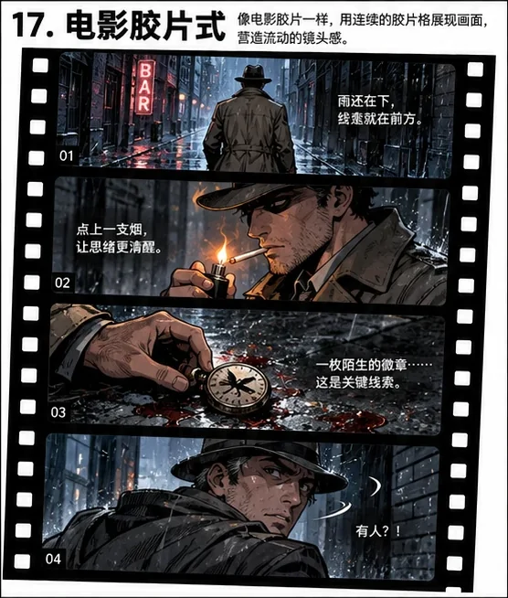 **SB-017** · 电影胶片式 

查看排版提示词
 漫画分镜。排版：电影胶片式，面板像胶片帧连续排列，强调时间推进和电影感。让该分镜机制决定页面结构、阅读顺序、主次画格和镜头节奏；输出一张完整单页漫画页面，画格共同讲述连续情节，角色外观在各格保持一致。
 |  **SB-018** · 宽银幕横格 

查看排版提示词
 漫画分镜。排版：宽银幕横格，大量使用横向宽格，适合动作、风景和电影式场面。让该分镜机制决定页面结构、阅读顺序、主次画格和镜头节奏；输出一张完整单页漫画页面，画格共同讲述连续情节，角色外观在各格保持一致。
 |
|  **SB-019** · 竖向长格 

查看排版提示词
 漫画分镜。排版：竖向长格，使用细长垂直面板，强调坠落、高楼、人物全身或纵向运动。让该分镜机制决定页面结构、阅读顺序、主次画格和镜头节奏；输出一张完整单页漫画页面，画格共同讲述连续情节，角色外观在各格保持一致。
 | 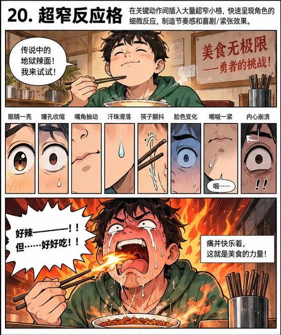 **SB-020** · 超窄反应格 

查看排版提示词
 漫画分镜。排版：超窄反应格，用极窄小格快速插入眼睛、嘴、手或表情反应，提升节奏。让该分镜机制决定页面结构、阅读顺序、主次画格和镜头节奏；输出一张完整单页漫画页面，画格共同讲述连续情节，角色外观在各格保持一致。
 | 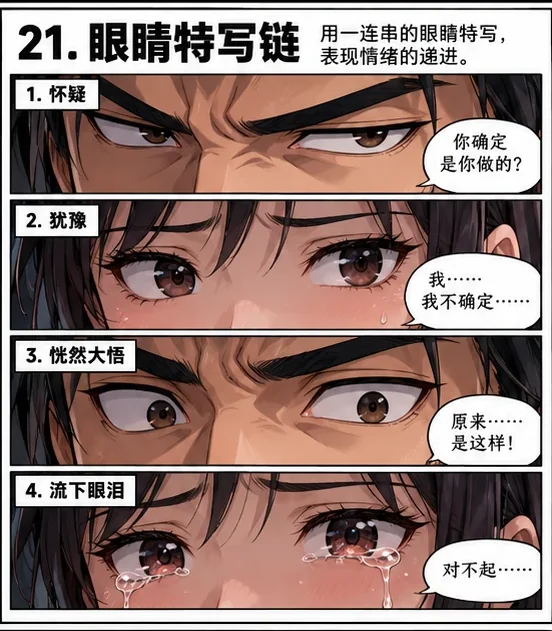 **SB-021** · 眼睛特写链 

查看排版提示词
 漫画分镜。排版：眼睛特写链，连续多个眼神特写形成对峙、犹豫或情绪升级。让该分镜机制决定页面结构、阅读顺序、主次画格和镜头节奏；输出一张完整单页漫画页面，画格共同讲述连续情节，角色外观在各格保持一致。
 |
|  **SB-022** · 手部动作链 

查看排版提示词
 漫画分镜。排版：手部动作链，连续用手、按钮、物品等局部特写推进关键动作。让该分镜机制决定页面结构、阅读顺序、主次画格和镜头节奏；输出一张完整单页漫画页面，画格共同讲述连续情节，角色外观在各格保持一致。
 |  **SB-023** · 由远到近 

查看排版提示词
 漫画分镜。排版：由远到近，远景→中景→近景→特写逐步逼近，让情绪和紧张感累积。让该分镜机制决定页面结构、阅读顺序、主次画格和镜头节奏；输出一张完整单页漫画页面，画格共同讲述连续情节，角色外观在各格保持一致。
 | 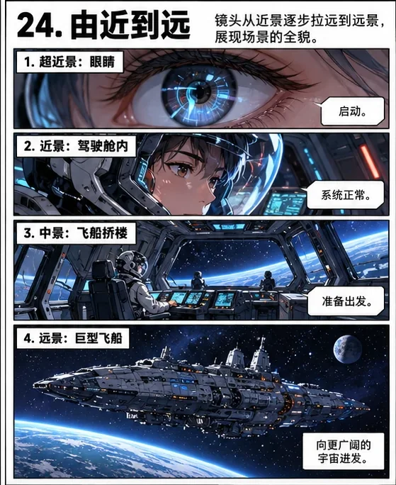 **SB-024** · 由近到远 

查看排版提示词
 漫画分镜。排版：由近到远，从极近特写逐渐拉远，用于揭晓环境真相或制造反差。让该分镜机制决定页面结构、阅读顺序、主次画格和镜头节奏；输出一张完整单页漫画页面，画格共同讲述连续情节，角色外观在各格保持一致。
 |
|  **SB-025** · 正反打 

查看排版提示词
 漫画分镜。排版：正反打，两个角色交替面对镜头出现，适合对话、争执和心理博弈。让该分镜机制决定页面结构、阅读顺序、主次画格和镜头节奏；输出一张完整单页漫画页面，画格共同讲述连续情节，角色外观在各格保持一致。
 | 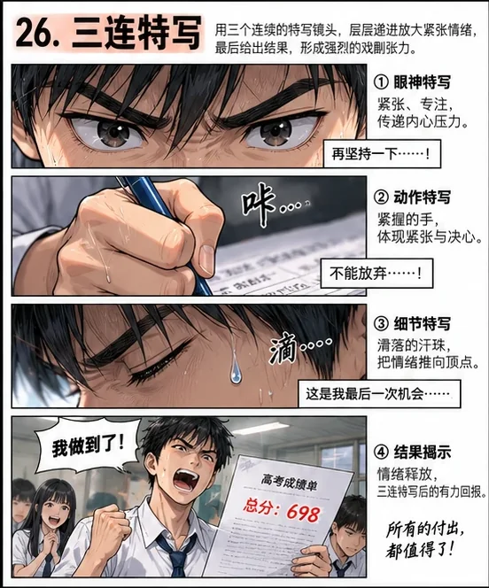 **SB-026** · 三连特写 

查看排版提示词
 漫画分镜。排版：三连特写，连续三个关键细节快速切换，例如眼睛→手指→按钮。让该分镜机制决定页面结构、阅读顺序、主次画格和镜头节奏；输出一张完整单页漫画页面，画格共同讲述连续情节，角色外观在各格保持一致。
 | 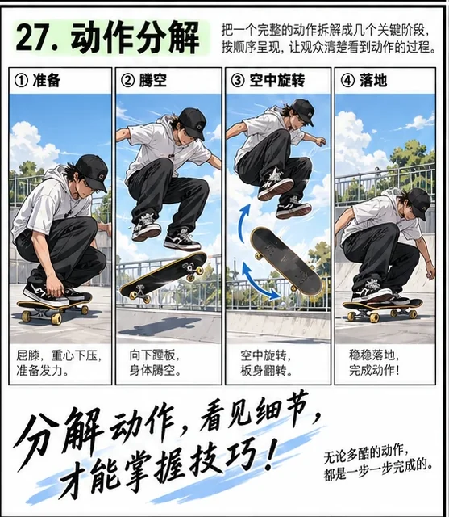 **SB-027** · 动作分解 

查看排版提示词
 漫画分镜。排版：动作分解，把一个动作拆成起势、过程、接触、结果几个面板。让该分镜机制决定页面结构、阅读顺序、主次画格和镜头节奏；输出一张完整单页漫画页面，画格共同讲述连续情节，角色外观在各格保持一致。
 |
|  **SB-028** · 连续动作残影 

查看排版提示词
 漫画分镜。排版：连续动作残影，同一人物在单个或多个格子中重复出现，表现高速运动轨迹。让该分镜机制决定页面结构、阅读顺序、主次画格和镜头节奏；输出一张完整单页漫画页面，画格共同讲述连续情节，角色外观在各格保持一致。
 |  **SB-029** · 静止重复 

查看排版提示词
 漫画分镜。排版：静止重复，连续几格几乎不变，只改变极小细节，适合尴尬、冷笑话和停顿。让该分镜机制决定页面结构、阅读顺序、主次画格和镜头节奏；输出一张完整单页漫画页面，画格共同讲述连续情节，角色外观在各格保持一致。
 |  **SB-030** · 节奏骤停 

查看排版提示词
 漫画分镜。排版：节奏骤停，前面高速密集，突然切到大片留白或静态大格，制造反高潮。让该分镜机制决定页面结构、阅读顺序、主次画格和镜头节奏；输出一张完整单页漫画页面，画格共同讲述连续情节，角色外观在各格保持一致。
 |
|  **SB-031** · 爆发后留白 

查看排版提示词
 漫画分镜。排版：爆发后留白，强烈动作之后用空白和小人物收尾，放大荒诞或情绪余韵。让该分镜机制决定页面结构、阅读顺序、主次画格和镜头节奏；输出一张完整单页漫画页面，画格共同讲述连续情节，角色外观在各格保持一致。
 |  **SB-032** · 上下镜像 

查看排版提示词
 漫画分镜。排版：上下镜像，上下两部分构图相似但内容反转，用于前后对比。让该分镜机制决定页面结构、阅读顺序、主次画格和镜头节奏；输出一张完整单页漫画页面，画格共同讲述连续情节，角色外观在各格保持一致。
 |  **SB-033** · 左右对峙 

查看排版提示词
 漫画分镜。排版：左右对峙，左右两方人物或势力分别占据页面两侧，中间形成视觉冲突。让该分镜机制决定页面结构、阅读顺序、主次画格和镜头节奏；输出一张完整单页漫画页面，画格共同讲述连续情节，角色外观在各格保持一致。
 |
|  **SB-034** · 双线并行 

查看排版提示词
 漫画分镜。排版：双线并行，页面同时推进两组人物或两个地点，最终在同一点汇合。让该分镜机制决定页面结构、阅读顺序、主次画格和镜头节奏；输出一张完整单页漫画页面，画格共同讲述连续情节，角色外观在各格保持一致。
 |  **SB-035** · 交叉剪辑 

查看排版提示词
 漫画分镜。排版：交叉剪辑，A事件与B事件交替出现，通过快速切换制造紧张或误会。让该分镜机制决定页面结构、阅读顺序、主次画格和镜头节奏；输出一张完整单页漫画页面，画格共同讲述连续情节，角色外观在各格保持一致。
 | 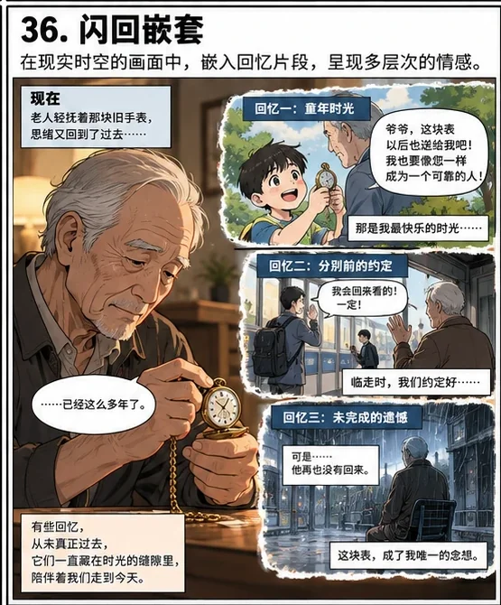 **SB-036** · 闪回嵌套 

查看排版提示词
 漫画分镜。排版：闪回嵌套，主面板内嵌小格表现记忆、回忆或过去片段。让该分镜机制决定页面结构、阅读顺序、主次画格和镜头节奏；输出一张完整单页漫画页面，画格共同讲述连续情节，角色外观在各格保持一致。
 |
| 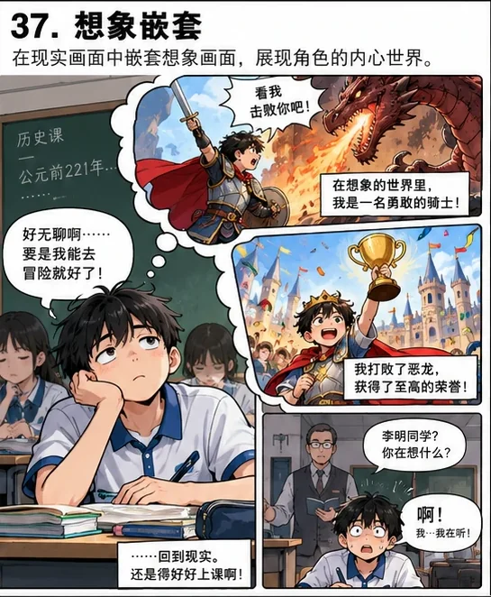 **SB-037** · 想象嵌套 

查看排版提示词
 漫画分镜。排版：想象嵌套，现实画面中插入角色脑内幻想格，适合喜剧和主观叙事。让该分镜机制决定页面结构、阅读顺序、主次画格和镜头节奏；输出一张完整单页漫画页面，画格共同讲述连续情节，角色外观在各格保持一致。
 | 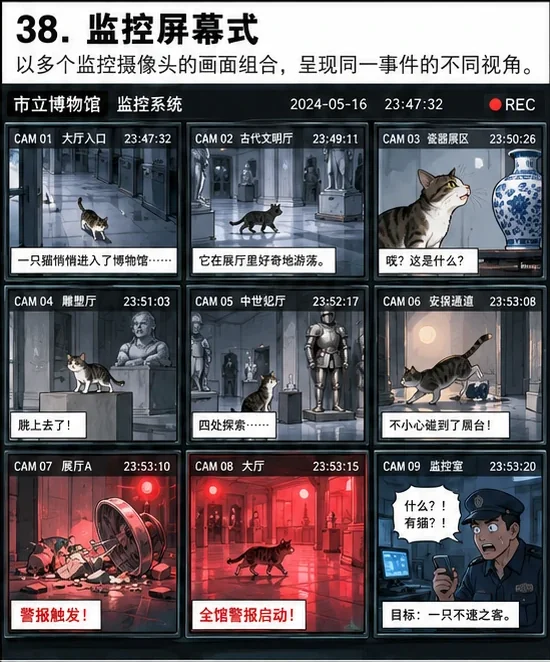 **SB-038** · 监控屏幕式 

查看排版提示词
 漫画分镜。排版：监控屏幕式，页面由多个监控视角组成，适合悬疑、职场和观察型叙事。让该分镜机制决定页面结构、阅读顺序、主次画格和镜头节奏；输出一张完整单页漫画页面，画格共同讲述连续情节，角色外观在各格保持一致。
 |  **SB-039** · 手机聊天式 

查看排版提示词
 漫画分镜。排版：手机聊天式，现实场景与手机聊天界面交替或叠加，适合现代社交故事。让该分镜机制决定页面结构、阅读顺序、主次画格和镜头节奏；输出一张完整单页漫画页面，画格共同讲述连续情节，角色外观在各格保持一致。
 |
|  **SB-040** · 档案拼贴式 

查看排版提示词
 漫画分镜。排版：档案拼贴式，照片、便签、文件、地图、漫画格混排，适合调查和设定展示。让该分镜机制决定页面结构、阅读顺序、主次画格和镜头节奏；输出一张完整单页漫画页面，画格共同讲述连续情节，角色外观在各格保持一致。
 |  **SB-041** · 杂志编辑式 

查看排版提示词
 漫画分镜。排版：杂志编辑式，大标题、人物、说明文字和漫画格共同参与页面构成。让该分镜机制决定页面结构、阅读顺序、主次画格和镜头节奏；输出一张完整单页漫画页面，画格共同讲述连续情节，角色外观在各格保持一致。
 |  **SB-042** · 信息图漫画 

查看排版提示词
 漫画分镜。排版：信息图漫画，漫画分镜与图表、箭头、数据标签结合，适合知识或说明型故事。让该分镜机制决定页面结构、阅读顺序、主次画格和镜头节奏；输出一张完整单页漫画页面，画格共同讲述连续情节，角色外观在各格保持一致。
 |
| 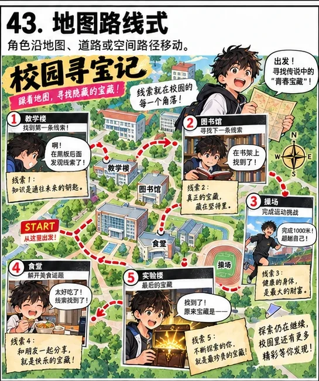 **SB-043** · 地图路线式 

查看排版提示词
 漫画分镜。排版：地图路线式，角色沿地图、道路或空间路径移动，读者顺着路线完成阅读。让该分镜机制决定页面结构、阅读顺序、主次画格和镜头节奏；输出一张完整单页漫画页面，画格共同讲述连续情节，角色外观在各格保持一致。
 |  **SB-044** · 时间轴式 

查看排版提示词
 漫画分镜。排版：时间轴式，按照早→中→晚或过去→现在→未来沿页面顺序推进。让该分镜机制决定页面结构、阅读顺序、主次画格和镜头节奏；输出一张完整单页漫画页面，画格共同讲述连续情节，角色外观在各格保持一致。
 |  **SB-045** · 时钟式 

查看排版提示词
 漫画分镜。排版：时钟式，面板围绕钟表、圆盘或时间刻度组织，适合一天或倒计时主题。让该分镜机制决定页面结构、阅读顺序、主次画格和镜头节奏；输出一张完整单页漫画页面，画格共同讲述连续情节，角色外观在各格保持一致。
 |
| 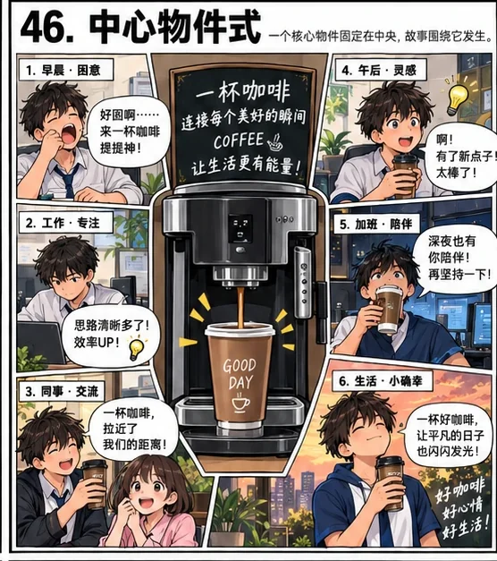 **SB-046** · 中心物件式 

查看排版提示词
 漫画分镜。排版：中心物件式，咖啡机、手机、门、车辆等核心物件固定在中央，故事围绕它发生。让该分镜机制决定页面结构、阅读顺序、主次画格和镜头节奏；输出一张完整单页漫画页面，画格共同讲述连续情节，角色外观在各格保持一致。
 |  **SB-047** · 中心人物式 

查看排版提示词
 漫画分镜。排版：中心人物式，主角固定在页面视觉中心，其他事件和人物围绕其展开。让该分镜机制决定页面结构、阅读顺序、主次画格和镜头节奏；输出一张完整单页漫画页面，画格共同讲述连续情节，角色外观在各格保持一致。
 | 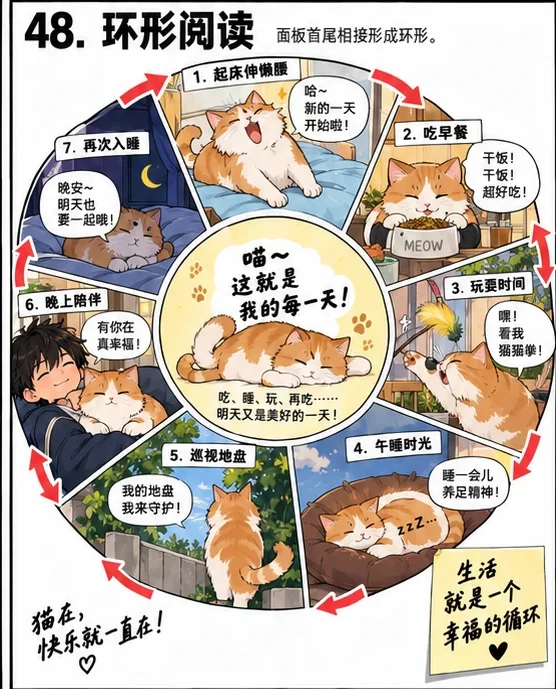 **SB-048** · 环形阅读 

查看排版提示词
 漫画分镜。排版：环形阅读，面板首尾相接形成环形，适合循环故事或宿命结构。让该分镜机制决定页面结构、阅读顺序、主次画格和镜头节奏；输出一张完整单页漫画页面，画格共同讲述连续情节，角色外观在各格保持一致。
 |
| 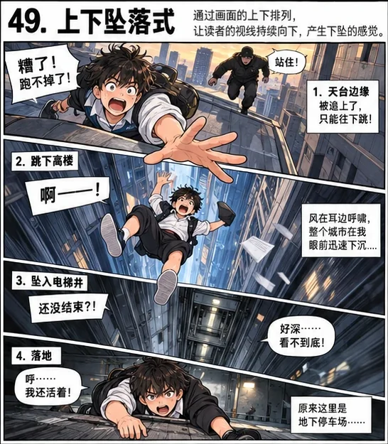 **SB-049** · 上下坠落式 

查看排版提示词
 漫画分镜。排版：上下坠落式，阅读路径持续向下，强调坠落、追逐、楼层变化或失控感。让该分镜机制决定页面结构、阅读顺序、主次画格和镜头节奏；输出一张完整单页漫画页面，画格共同讲述连续情节，角色外观在各格保持一致。
 |  **SB-050** · 阶梯式 

查看排版提示词
 漫画分镜。排版：阶梯式，面板像楼梯一样逐级排列，视觉上强化推进和升级。让该分镜机制决定页面结构、阅读顺序、主次画格和镜头节奏；输出一张完整单页漫画页面，画格共同讲述连续情节，角色外观在各格保持一致。
 |  **SB-051** · 波浪式 

查看排版提示词
 漫画分镜。排版：波浪式，面板边界和阅读路径呈波浪起伏，适合音乐、梦境和轻松故事。让该分镜机制决定页面结构、阅读顺序、主次画格和镜头节奏；输出一张完整单页漫画页面，画格共同讲述连续情节，角色外观在各格保持一致。
 |
| 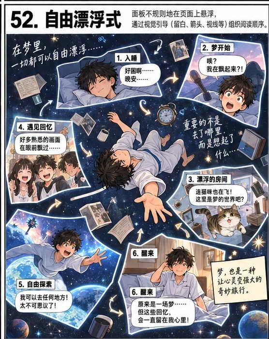 **SB-052** · 自由漂浮式 

查看排版提示词
 漫画分镜。排版：自由漂浮式，面板不规则悬浮在页面上，通过人物视线和文字引导阅读。让该分镜机制决定页面结构、阅读顺序、主次画格和镜头节奏；输出一张完整单页漫画页面，画格共同讲述连续情节，角色外观在各格保持一致。
 |  **SB-053** · 无边框分镜 

查看排版提示词
 漫画分镜。排版：无边框分镜，取消传统面板边框，让人物、背景和留白直接构成阅读区域。让该分镜机制决定页面结构、阅读顺序、主次画格和镜头节奏；输出一张完整单页漫画页面，画格共同讲述连续情节，角色外观在各格保持一致。
 |  **SB-054** · 白场分镜 

查看排版提示词
 漫画分镜。排版：白场分镜，大量空白分隔人物和对白，强调安静、尴尬、诗意或高级感。让该分镜机制决定页面结构、阅读顺序、主次画格和镜头节奏；输出一张完整单页漫画页面，画格共同讲述连续情节，角色外观在各格保持一致。
 |
| 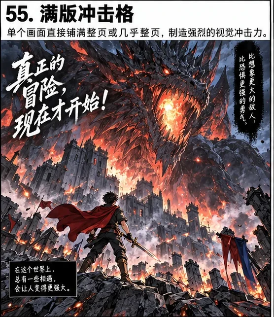 **SB-055** · 满版冲击格 

查看排版提示词
 漫画分镜。排版：满版冲击格，单个画面直接铺满整页或几乎整页，用于高潮或视觉记忆点。让该分镜机制决定页面结构、阅读顺序、主次画格和镜头节奏；输出一张完整单页漫画页面，画格共同讲述连续情节，角色外观在各格保持一致。
 |  **SB-056** · 跨页式单页模拟 

查看排版提示词
 漫画分镜。排版：跨页式单页模拟，用中央缝或对称布局模拟双页展开效果，制造大场面感。让该分镜机制决定页面结构、阅读顺序、主次画格和镜头节奏；输出一张完整单页漫画页面，画格共同讲述连续情节，角色外观在各格保持一致。
 |  **SB-057** · 海报式漫画 

查看排版提示词
 漫画分镜。排版：海报式漫画，以一个强主视觉为核心，周围嵌入若干小格补足故事。让该分镜机制决定页面结构、阅读顺序、主次画格和镜头节奏；输出一张完整单页漫画页面，画格共同讲述连续情节，角色外观在各格保持一致。
 |
| 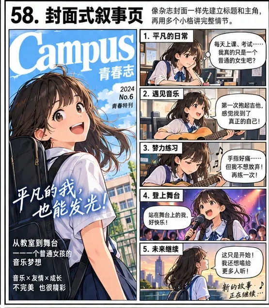 **SB-058** · 封面式叙事页 

查看排版提示词
 漫画分镜。排版：封面式叙事页，像杂志封面一样先建立标题和主角，再用多个小格讲完整情节。让该分镜机制决定页面结构、阅读顺序、主次画格和镜头节奏；输出一张完整单页漫画页面，画格共同讲述连续情节，角色外观在各格保持一致。
 | 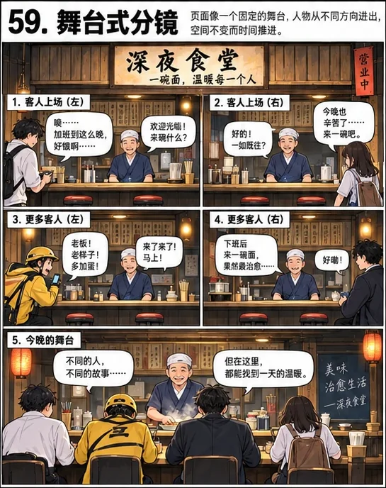 **SB-059** · 舞台式分镜 

查看排版提示词
 漫画分镜。排版：舞台式分镜，页面像固定舞台，人物从不同方向进出，空间不变而时间推进。让该分镜机制决定页面结构、阅读顺序、主次画格和镜头节奏；输出一张完整单页漫画页面，画格共同讲述连续情节，角色外观在各格保持一致。
 |  **SB-060** · 横卷式分镜 

查看排版提示词
 漫画分镜。排版：横卷式分镜，仿长卷或横向连续场景，人物在同一环境中多次出现。让该分镜机制决定页面结构、阅读顺序、主次画格和镜头节奏；输出一张完整单页漫画页面，画格共同讲述连续情节，角色外观在各格保持一致。
 |
|  **SB-061** · 竖卷式分镜 

查看排版提示词
 漫画分镜。排版：竖卷式分镜，仿纵向长卷，人物和事件沿上下空间持续展开。让该分镜机制决定页面结构、阅读顺序、主次画格和镜头节奏；输出一张完整单页漫画页面，画格共同讲述连续情节，角色外观在各格保持一致。
 | 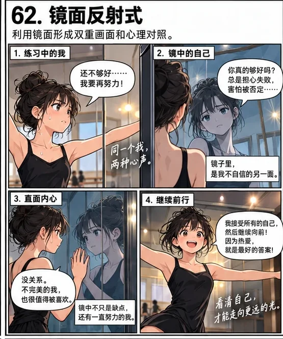 **SB-062** · 镜面反射式 

查看排版提示词
 漫画分镜。排版：镜面反射式，利用左右、上下或真实镜面形成双重画面和心理对照。让该分镜机制决定页面结构、阅读顺序、主次画格和镜头节奏；输出一张完整单页漫画页面，画格共同讲述连续情节，角色外观在各格保持一致。
 |  **SB-063** · 窗口式分镜 

查看排版提示词
 漫画分镜。排版：窗口式分镜，以窗户、门框、屏幕等现实结构天然形成画框和面板。让该分镜机制决定页面结构、阅读顺序、主次画格和镜头节奏；输出一张完整单页漫画页面，画格共同讲述连续情节，角色外观在各格保持一致。
 |
|  **SB-064** · 物件遮挡式 

查看排版提示词
 漫画分镜。排版：物件遮挡式，前景物件作为天然分隔线，把页面切成多个叙事区域。让该分镜机制决定页面结构、阅读顺序、主次画格和镜头节奏；输出一张完整单页漫画页面，画格共同讲述连续情节，角色外观在各格保持一致。
 |  **SB-065** · 文字主导式 

查看排版提示词
 漫画分镜。排版：文字主导式，巨大标题或音效字本身成为页面骨架，人物与面板围绕文字布局。让该分镜机制决定页面结构、阅读顺序、主次画格和镜头节奏；输出一张完整单页漫画页面，画格共同讲述连续情节，角色外观在各格保持一致。
 |  **SB-066** · 音效主导式 

查看排版提示词
 漫画分镜。排版：音效主导式，巨大拟声词穿过多个面板，统一动作节奏和视觉方向。让该分镜机制决定页面结构、阅读顺序、主次画格和镜头节奏；输出一张完整单页漫画页面，画格共同讲述连续情节，角色外观在各格保持一致。
 |
|  **SB-067** · 色块主导式 

查看排版提示词
 漫画分镜。排版：色块主导式，不同色块充当面板边界或情绪区域，比传统黑框更设计化。让该分镜机制决定页面结构、阅读顺序、主次画格和镜头节奏；输出一张完整单页漫画页面，画格共同讲述连续情节，角色外观在各格保持一致。
 | 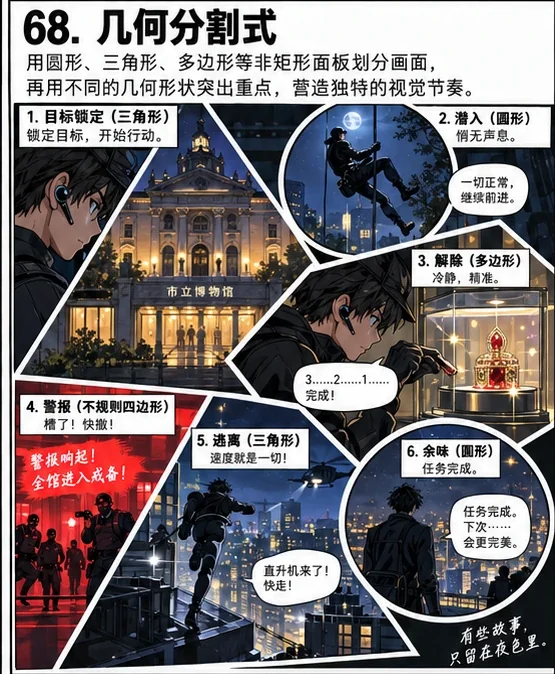 **SB-068** · 几何分割式 

查看排版提示词
 漫画分镜。排版：几何分割式，使用圆形、三角形、多边形等非矩形面板构成页面。让该分镜机制决定页面结构、阅读顺序、主次画格和镜头节奏；输出一张完整单页漫画页面，画格共同讲述连续情节，角色外观在各格保持一致。
 |  |

---
