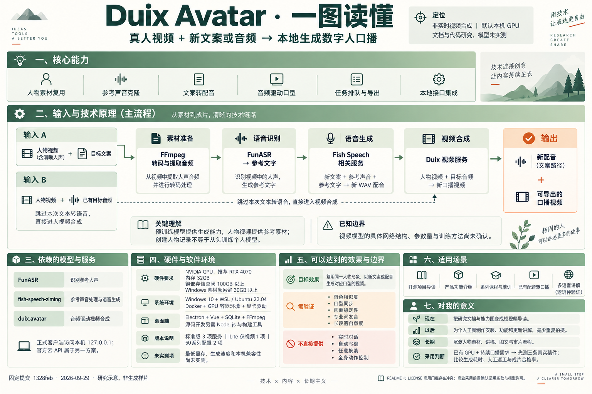

# 009 · Duix Avatar：本地数字人口播合成

> 将真人视频与新文案或新音频组合，生成同一人物讲新内容的视频；核心是模型推理服务与素材、任务管理的组合。

## 能力、效果、场景与个人价值摘要

Duix Avatar 是一个以本地模型服务为基础的数字人口播制作工具。输入人物视频和新文案或目标音频，输出同一人物讲新内容的口播视频；默认文案路径先生成相似音色的配音，再进行音频驱动的视频合成。

适合项目导读、产品功能介绍、课程培训、版本更新以及已有配音转视频。对你而言，最直接的用途是把现有开源研究、能力图和网页转成一分钟讲解；以后在个人产品和系列教程需要固定人物持续出镜时再复用它。价值是减少重复拍摄、增加视频表达渠道，实际收益要扣除 GPU、环境维护和质量返工成本。

已有官方 README 收录的社区演示，但视频实际标注 HeyGem 旧版，不能证明当前版本的口型、音色或速度。详见[效果与演示证据](EFFECTS.md)。尚未在本机运行模型，也没有自己的生成样片。

[在线能力与价值汇总](https://yydshly.github.io/0929_codex_project/009-duix-avatar/) · [放大摘要图](https://yydshly.github.io/0929_codex_project/009-duix-avatar/map.html)

## 基本信息

| 项目 | 内容 |
| --- | --- |
| 固定编号 | 009 |
| 原仓库 | [duixcom/Duix-Avatar](https://github.com/duixcom/Duix-Avatar) |
| 研究版本 | [`1328feb5871448c8fa3d0e45b3bbc87e7c1d458a`](https://github.com/duixcom/Duix-Avatar/tree/1328feb5871448c8fa3d0e45b3bbc87e7c1d458a)，提交时间 2026-04-21；package.json 版本 1.0.6 |
| 收录日期 | 2026-09-29 |
| 许可证 | DUIX.COM Community License；README 与根 LICENSE 商用门槛有冲突，详见 [来源与许可](SOURCES.md) |
| 研究进度 | 已完成本次文档与代码研究；未部署模型、未做生成实测 |
| Web 演示 | [能力展示页](../../site/009-duix-avatar/index.html)（本地完成，未公开发布） |

## 先理解它解决什么问题

[放大阅读总览图](../../site/009-duix-avatar/map.html) · [下载原图](assets/capability-summary.png)。图片由内置生图工具根据本项目研究制作，是知识汇总，不是 Duix 生成样片。

假设你已经录过一段带有人声的个人介绍。以后希望由同一个人物讲解新项目，可以提供新文案，由语音服务生成配音，再让视频服务合成对应口型。也可以直接提供目标音频。

**人物视频＋目标文案 → 新配音＋人物视频 → 新口播视频。**

**人物视频＋目标音频 → 新口播视频。**

输入视频是参考素材，预训练模型提供生成能力。应用中的“模特”“声音模型”记录不必然等于为这个人训练了独立神经网络。项目定位是非实时视频合成，实时互动数字人需要另外的系统。

## 五个研究问题与结论

| 问题 | 本次结论 | 详细说明 |
| --- | --- | --- |
| 有哪些能力？ | 人物素材管理、参考声音处理、文本转语音、音频驱动视频、任务排队与导出；效果尚未实测 | [能力与边界](CAPABILITIES.md) |
| 依赖什么？ | NVIDIA GPU、Docker 及 GPU 运行环境、语音和视频服务；桌面端为 Electron/Vue；源码开发与安装包使用的依赖不同 | [依赖清单](DEPENDENCIES.md) |
| 底层是什么？ | 语音模型、视频推理服务、FFmpeg 与普通应用逻辑组成流水线；具体视频网络结构未确认 | [底层原理](ARCHITECTURE.md) |
| 适合哪里？ | 固定人物的项目介绍、教程、培训和重复口播；不能直接满足实时客服或任意动作场景 | [使用场景](SCENARIOS.md) |
| 对我有什么意义？ | 为现有开源研究增加视频表达渠道；是否值得部署取决于出镜需求、产量、硬件与返工成本 | [个人价值分析](VALUE.md) |

## 本地模型还是远端模型

正式客户端默认调用本机 `127.0.0.1` 的语音和视频服务；基础 Windows/Linux Compose 配置在本机启动三个容器。模型环境需要先下载，之后可按项目设计在本地推理。官方另有云端 API 产品，不能将其能力、效果与这个仓库混为一谈。

“本地”指运行位置。你也可以另行改造为自有 GPU 服务器部署，但需要同步修改地址、共享文件路径和任务管理；仅替换请求地址并不足够。开发模式已经写入特定局域网地址和测试素材，直接启动开发界面不等于接通自己的本地服务。

依据：[配置](https://github.com/duixcom/Duix-Avatar/blob/1328feb5871448c8fa3d0e45b3bbc87e7c1d458a/src/main/config/config.js)、[视频代码](https://github.com/duixcom/Duix-Avatar/blob/1328feb5871448c8fa3d0e45b3bbc87e7c1d458a/src/main/service/video.js)。

## 当前应如何使用这份研究

先打开[网页能力展示](../../site/009-duix-avatar/index.html)，可切换两条生成路径、三种部署方案和四个场景。页面同时展示六项能力、个人价值、许可差异与来源；人物图是流程示意，并非生成样片。构建方式见 [web/README.md](web/README.md)。

先读本页，再按目标查看依赖或个人价值分析。若决定实际验证，按 [研究记录中的样片方案](RESEARCH.md)测量口型、音色、生成耗时与人工返工。

本子项目保存研究文档与网页展示，不包含运行中的 Duix 应用、模型权重或已生成样片；无需安装依赖即可阅读。没有将上游宣传效果记录为实测结论。完整证据及版本边界见 [RESEARCH.md](RESEARCH.md) 和 [SOURCES.md](SOURCES.md)，页面检查见 [网页验收记录](WEB-VERIFICATION.md)。

[返回总项目](../../README.md)
