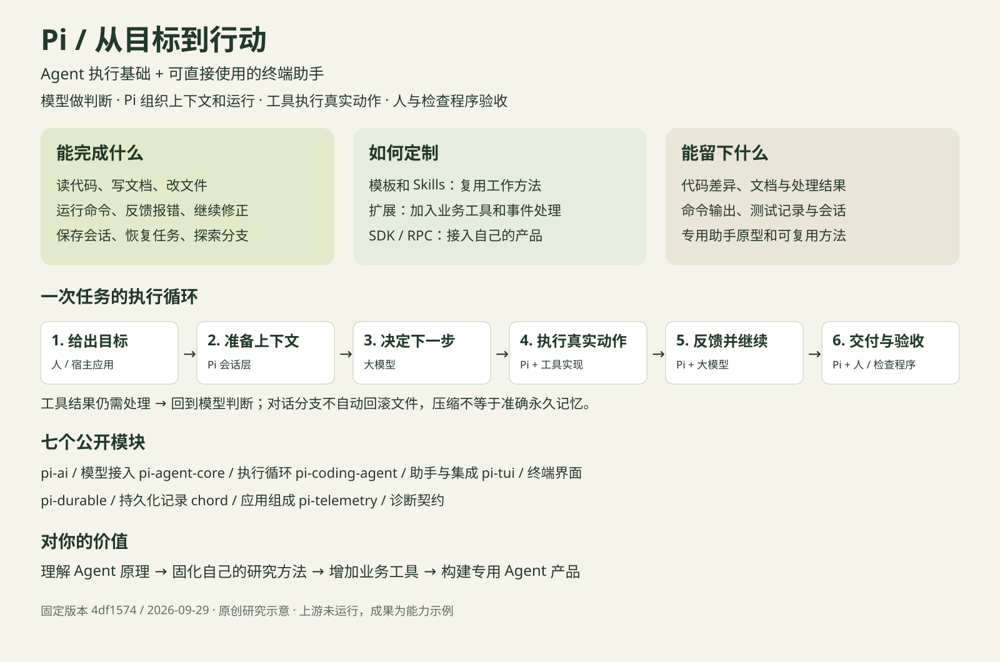

# 010 · Pi Agent Harness：能力、原理与个人价值

> Pi 是可扩展的 Agent 执行基础，也自带终端助手。它把模型判断连接到文件、命令和真实工具，让一个目标经过多轮操作形成可检查的成果。

[本地交互展示](../../site/010-pi/index.html) · [研究记录](RESEARCH.md) · [能力总览图](assets/overview.svg) · [上游固定版本](https://github.com/earendil-works/pi/tree/4df1574339bfbd1a9750ff485bb618da397ba135/)

## 与主研究 QM 的关系

QM 是本次主研究项目，Pi 是执行基础的关联对照。[打开 QM 研究](../012-qm/README.md)；QM 可选用 Pi，并增加空间、权限、共享资源和后台工作环境。

## 基本信息

- 研究日期：2026-09-29。
- 固定提交：`4df1574339bfbd1a9750ff485bb618da397ba135`；coding-agent 包内版本 `0.87.1`。
- 原仓库：https://github.com/earendil-works/pi （旧入口 badlogic/pi-mono 重定向至此）。
- 上游许可：MIT；[许可副本](sources/LICENSE)。
- 已完成固定版本文档和工具定义核查、中文研究与静态交互展示。上游 Pi 未安装运行，模型与任务效果未实测。
- 静态研究展示通过本仓库 GitHub Pages 发布。

## 1. 能力是什么，可以实现什么功能

| 能力 | 层次 | 输入 | 执行方式 | 可交付成果 | 必要条件与边界 | 来源 |
| --- | --- | --- | --- | --- | --- | --- |
| 读懂代码和资料 | 内置基础 | 项目目录、文件和问题 | 读取文件，结合模型分析内容；通过命令或可选搜索工具定位依据。 | 代码解释、研究笔记、问题位置与证据。 | 网页检索和内部数据访问需要另配工具或可用命令。 | [依据](https://github.com/earendil-works/pi/blob/4df1574339bfbd1a9750ff485bb618da397ba135/packages/coding-agent/docs/how-pi-works.md) |
| 修改代码与文档 | 内置基础 | 修改目标、约束和待编辑文件 | 调用读写与编辑工具，把模型提出的改动落实到文件。 | 代码修改、Markdown 文档、配置文件。 | 写入成功不能证明业务逻辑正确，仍须检查。 | [依据](https://github.com/earendil-works/pi/blob/4df1574339bfbd1a9750ff485bb618da397ba135/packages/coding-agent/src/core/tools/index.ts) |
| 运行命令并验证 | 内置基础 | 测试命令、项目依赖和执行环境 | 运行命令，把输出或报错交回模型，支持继续修正。 | 测试输出、构建结果、数据处理文件。 | 运行权限来自启动 Pi 的进程；依赖需准备。 | [依据](https://github.com/earendil-works/pi/blob/4df1574339bfbd1a9750ff485bb618da397ba135/packages/coding-agent/src/core/tools/index.ts) |
| 持续完成多步骤任务 | 内置基础 | 目标、上下文与验收标准 | 多轮进行模型判断、工具执行、结果反馈，并接收中途指导。 | 由多个操作形成的一次交付，以及可查看的执行记录。 | 没有预先保证成功的流程；模型和工具都可能出错。 | [依据](https://github.com/earendil-works/pi/blob/4df1574339bfbd1a9750ff485bb618da397ba135/packages/agent/README.md) |
| 恢复会话与探索分支 | 内置基础 | 之前的任务记录或一个分支点 | 恢复历史、返回树节点、分叉或复制当前分支。 | 可继续的会话、不同方案的独立讨论路径。 | 对话分支不自动撤销文件修改；代码版本另用 Git 管理。 | [依据](https://github.com/earendil-works/pi/blob/4df1574339bfbd1a9750ff485bb618da397ba135/packages/coding-agent/docs/sessions.md) |
| 管理长任务上下文 | 内置基础 | 历史消息、项目说明与当前任务 | 组合当前分支和资源，按需加载技能，压缩较早的历史。 | 更集中、可继续使用的模型上下文。 | 压缩是有损摘要；会话保存不等于永久准确记忆。 | [依据](https://github.com/earendil-works/pi/blob/4df1574339bfbd1a9750ff485bb618da397ba135/packages/coding-agent/docs/how-pi-works.md) |
| 切换和接入模型 | 内置基础 | 供应商配置、认证和可用模型 | 统一模型消息、流式输出及工具调用接口。 | 可在统一 Agent 工作流程中使用的模型能力。 | 模型仍由外部服务或已配置的本地端点提供。 | [依据](https://github.com/earendil-works/pi/blob/4df1574339bfbd1a9750ff485bb618da397ba135/packages/ai/README.md) |
| 复用自己的工作方法 | 资源定制 | 研究规范、写作要求或重复任务 | 用模板复用输入，用 Skills 按需加载方法，用主题调整终端外观。 | 可反复使用的研究、开发或写作流程。 | 技能说明不能代替缺失的工具、账号或业务接口。 | [依据](https://github.com/earendil-works/pi/blob/4df1574339bfbd1a9750ff485bb618da397ba135/packages/coding-agent/docs/quickstart.md) |
| 接入外部与自定义工具 | 接入与扩展 | MCP 服务配置，或业务 API、权限和工具实现 | 通过内置 MCP 接入服务工具；也可用扩展注册自定义工具、命令和事件。 | 知识库查询、检查器、业务操作等专用能力。 | 现成 MCP 服务需配置和授权；没有对应服务时仍需开发。 | [依据](https://github.com/earendil-works/pi/blob/4df1574339bfbd1a9750ff485bb618da397ba135/packages/coding-agent/docs/mcp.md) |
| 做自己的 Agent 产品 | 应用集成 | 产品界面、任务模型和业务规则 | 用 SDK 嵌入进程，或用 RPC 控制 Pi 进程；JSON 模式输出结构化事件。 | 自建研究助手、任务服务或网页工作台的执行基础。 | 登录、多用户隔离、后台调度和运营治理由宿主补齐。 | [依据](https://github.com/earendil-works/pi/blob/4df1574339bfbd1a9750ff485bb618da397ba135/packages/coding-agent/docs/sdk.md) |

## 2. 原理是什么

1. **给出目标（人 / 宿主应用）**：指定工作目录、任务要求和验收标准。 例如：修复价格计算错误，并运行已有测试。
2. **准备上下文（Pi 会话层）**：组合项目说明、当前会话分支、工具定义与相关技能。 把与本次工作相关的材料传给模型，避免把所有分支混在一起。
3. **决定下一步（大模型）**：生成回答，或请求调用某个工具并给出参数。 例如：先读取计算函数，再查看对应测试。
4. **执行真实动作（Pi + 工具实现）**：校验调用并执行文件操作或命令，记录实际输出。 模型生成工具请求；真正接触文件和进程的是工具程序。
5. **反馈并继续（Pi + 大模型）**：将结果或错误加入上下文；需要时发起下一轮请求。 测试仍失败时，模型可以根据报错调整方案。
6. **交付与验收（Pi + 人 / 检查程序）**：返回回复和产物，保留会话；人或测试确认任务是否达标。 运行结束不等于业务正确。中止也不会自动回滚已发生的修改。

工具结果需要继续处理时，Pi 再请求模型，因此一次任务包含多轮调用。人定义目标和验收要求，模型选择动作，Pi 组织上下文和控制执行，工具负责实际操作。

会话条目构成树，当前分支提供上下文。CLI 默认持久会话为 JSONL；压缩用摘要替换发送给模型的较早历史，原始条目仍保留。恢复或分叉对话不会自动回滚代码。项目说明、工具定义和技能描述参与上下文组合；技能正文按需加载，扩展可修改上下文或注册工具。

依据：[运行机制](https://github.com/earendil-works/pi/blob/4df1574339bfbd1a9750ff485bb618da397ba135/packages/coding-agent/docs/how-pi-works.md)、[会话管理](https://github.com/earendil-works/pi/blob/4df1574339bfbd1a9750ff485bb618da397ba135/packages/coding-agent/docs/sessions.md)、[Agent 核心](https://github.com/earendil-works/pi/blob/4df1574339bfbd1a9750ff485bb618da397ba135/packages/agent/README.md)。

## 3. 包含哪些模块

下表按本版本根 README 的七个公开模块整理，不宣称是全部子目录或所有内部函数。

| 模块 | 职责层 | 主要作用 | 输入与输出 | 何时关注 | 来源 |
| --- | --- | --- | --- | --- | --- |
| pi-ai | 模型接入层 | 把不同供应商的消息、工具调用与流式结果接到共同接口。 | 模型配置与请求 → 统一响应、事件和用量信息。 | 你需要换模型或接多个供应商时。 | [依据](https://github.com/earendil-works/pi/blob/4df1574339bfbd1a9750ff485bb618da397ba135/packages/ai/README.md) |
| pi-agent-core | Agent 执行层 | 维护消息和运行状态，组织模型请求、工具调用、反馈和事件。 | 任务与工具 → 多轮执行过程及最终回复。 | 你要构建有自定义工具的 Agent 时。 | [依据](https://github.com/earendil-works/pi/blob/4df1574339bfbd1a9750ff485bb618da397ba135/packages/agent/README.md) |
| pi-coding-agent | 可直接使用的助手 | 装配工具、会话、资源和界面，提供终端、脚本、SDK 与 RPC 入口。 | 项目与目标 → 文件改动、命令结果、可恢复会话。 | 你直接用 Pi，或把现成会话能力嵌入产品时。 | [依据](https://github.com/earendil-works/pi/blob/4df1574339bfbd1a9750ff485bb618da397ba135/packages/coding-agent/docs/sdk.md) |
| pi-tui | 终端呈现层 | 提供终端组件与差分渲染，显示输入、文本和运行状态。 | 界面状态 → 终端中的交互反馈。 | 你需要定制终端体验时。 | [依据](https://github.com/earendil-works/pi/blob/4df1574339bfbd1a9750ff485bb618da397ba135/packages/tui/README.md) |
| pi-durable | 持久化运行基础 | 提供会话、任务和文档记录契约，以及内存、JSONL、SQLite 存储实现。 | 结构化记录 → 可保存、读取与恢复的状态。 | 你构建需要持久记录的应用时；不等于成品任务平台。 | [依据](https://github.com/earendil-works/pi/blob/4df1574339bfbd1a9750ff485bb618da397ba135/packages/durable/README.md) |
| chord | 应用组成基础 | 组织服务、插件、RPC 与复制状态，支持组件之间的协作。 | 服务与状态定义 → 可组合的应用运行结构。 | 你做复杂宿主应用时；独立基础包，不是每次 CLI 任务的必经步骤。 | [依据](https://github.com/earendil-works/pi/blob/4df1574339bfbd1a9750ff485bb618da397ba135/packages/chord/README.md) |
| pi-telemetry | 诊断与观测契约 | 定义供应商无关的诊断接口、类型化数据和参考适配方式。 | 运行诊断 → 可交给观测系统的结构化记录。 | 你需要接入日志与监控时；本身不是现成监控后台。 | [依据](https://github.com/earendil-works/pi/blob/4df1574339bfbd1a9750ff485bb618da397ba135/packages/telemetry/README.md) |

优先理解 coding-agent → agent-core → ai。其余基础包按宿主需要使用；持久化包含 SQLite，不表示 CLI 默认存储变成 SQLite。

## 4. 使用场景

### 1. 研究一个 GitHub 项目

- 输入：仓库资料、固定版本、研究模板和你关心的问题。
- 过程：定位 README 与核心代码 → 整理能力、原理和来源 → 按模板生成研究文档 → 检查引用与遗漏。
- 预期成果：中文研究报告、来源索引、待验证清单。
- 配套条件：联网获取资料需可用命令或查询工具；网页制作需相应制作与验证工具。
- 对你的意义：把我们反复使用的研究方法沉淀为 Skill，减少每次重新解释格式和标准。

### 2. 修复错误并验证

- 输入：项目目录、复现步骤、预期行为和已有测试。
- 过程：查看代码与测试 → 修改相关逻辑 → 运行测试获得结果 → 依据失败继续调整。
- 预期成果：代码差异、测试结果和改动说明。
- 配套条件：依赖与测试环境需可运行；测试覆盖不足仍要人工复核。
- 对你的意义：亲自观察模型、工具与验证之间的关系，学习真正的 Agent 执行循环。

### 3. 整理数据与生成报告

- 输入：授权的数据文件、统计口径和期望格式。
- 过程：读取文件结构 → 编写处理脚本 → 执行并核对统计 → 输出报告与处理结果。
- 预期成果：清洗后的数据、图表或报告文件。
- 配套条件：表格、图表、PDF 等需要相应解析和生成库；不是 Pi 自带完整 Office 编辑器。
- 对你的意义：把重复的数据整理变成可复用脚本与方法，保留输入和计算依据。

### 4. 建立个人专用助手

- 输入：你的任务领域、方法规范、数据接口与可用模型。
- 过程：用 Skill 固定方法 → 用扩展提供业务工具 → 通过 SDK 接入自己的界面 → 增加验证与运行记录。
- 预期成果：面向特定业务的 Agent 原型。
- 配套条件：产品界面、登录、数据授权、限额和安全隔离需自行设计。
- 对你的意义：从调用现成工作台，前进到能设计和实现自己的 Agent 产品。

### 5. 周期维护研究资料

- 输入：关注的仓库、比较基线、更新规则与验收要求。
- 过程：外部调度器触发 Pi → 查询并对比新变化 → 生成待审核的更新草稿 → 保存来源和任务记录。
- 预期成果：更新摘要、文档修改草稿、待复核事项。
- 配套条件：定时触发、失败告警、后台生命周期和审批由宿主或扩展承担。
- 对你的意义：让研究成果保持可维护；适合在单次任务验证稳定之后再做。

以上是依据能力推导的方案，不是已运行的案例。

## 5. 对我的意义

1. **现在，理解执行基础。** 通过一次小任务，把模型判断、工具执行和反馈对应起来，辨别工作台、执行引擎、技能和模型各自贡献。
2. **下一步，固化自己的方法。** 把开源研究模板和验收标准整理为 Skill；用扩展增加查询、引用检查或业务工具，减少重复说明。
3. **以后，构建专用产品。** 用 SDK / RPC 把 Pi 放进自己的界面，再配套身份、隔离、任务记录与质量评测。

Pi 是执行基础；Pi Web 是基于 Pi 的网页工作台；oh-my-pi 基于 Pi 强化编程能力；QM 可选用 Pi 并增加团队工作环境。学习基础机制有价值，但现有工作台已满足需求时，没有必要仅为了更换工具而迁移。

## 6. 能力边界

- **现成终端助手（可直接使用）**：配置模型与执行环境后，可读写文件、运行命令、管理会话。
- **方法与工具扩展（需要配置或开发）**：Skills 提供方法，当前版本内置 MCP 接入；业务服务、认证和自定义扩展仍需准备。
- **团队服务与自动化（需要宿主配套）**：多用户身份、系统隔离、凭据、定时调度和业务审批需要对应系统。
- **质量与成本提升（需要实测）**：框架提供运行机制，不保证比其他 Agent 更准确、更快或更便宜。

工具和扩展使用启动 Pi 的进程权限，项目资源信任不构成系统沙箱。定时调度、多用户业务、长期知识治理和安全隔离不能仅凭“Agent 框架”推断为现成能力。来源：[安全说明](https://github.com/earendil-works/pi/blob/4df1574339bfbd1a9750ff485bb618da397ba135/packages/coding-agent/docs/security.md)。

## 7. 来源与版本变化

本研究继承 2026-09-10 的 Pi 研究问题，本次重新下载固定提交资料核查。公开模块表出现 pi-durable，旧研究中的实验性 client / protocol / server 清单不直接沿用。旧稿的 API 细节须按版本另行确认。

- [定位与公开模块](https://github.com/earendil-works/pi/blob/4df1574339bfbd1a9750ff485bb618da397ba135/README.md)
- [运行原理](https://github.com/earendil-works/pi/blob/4df1574339bfbd1a9750ff485bb618da397ba135/packages/coding-agent/docs/how-pi-works.md)
- [使用与交付](https://github.com/earendil-works/pi/blob/4df1574339bfbd1a9750ff485bb618da397ba135/packages/coding-agent/docs/usage.md)
- [会话与上下文](https://github.com/earendil-works/pi/blob/4df1574339bfbd1a9750ff485bb618da397ba135/packages/coding-agent/docs/sessions.md)
- [快速开始与定制](https://github.com/earendil-works/pi/blob/4df1574339bfbd1a9750ff485bb618da397ba135/packages/coding-agent/docs/quickstart.md)
- [SDK 集成](https://github.com/earendil-works/pi/blob/4df1574339bfbd1a9750ff485bb618da397ba135/packages/coding-agent/docs/sdk.md)
- [扩展机制](https://github.com/earendil-works/pi/blob/4df1574339bfbd1a9750ff485bb618da397ba135/packages/coding-agent/docs/extensions.md)
- [权限边界](https://github.com/earendil-works/pi/blob/4df1574339bfbd1a9750ff485bb618da397ba135/packages/coding-agent/docs/security.md)
- [Agent 核心](https://github.com/earendil-works/pi/blob/4df1574339bfbd1a9750ff485bb618da397ba135/packages/agent/README.md)
- [模型适配](https://github.com/earendil-works/pi/blob/4df1574339bfbd1a9750ff485bb618da397ba135/packages/ai/README.md)
- [持久化运行](https://github.com/earendil-works/pi/blob/4df1574339bfbd1a9750ff485bb618da397ba135/packages/durable/README.md)
- [应用组成](https://github.com/earendil-works/pi/blob/4df1574339bfbd1a9750ff485bb618da397ba135/packages/chord/README.md)
- [诊断契约](https://github.com/earendil-works/pi/blob/4df1574339bfbd1a9750ff485bb618da397ba135/packages/telemetry/README.md)
- [终端界面](https://github.com/earendil-works/pi/blob/4df1574339bfbd1a9750ff485bb618da397ba135/packages/tui/README.md)
- [工具定义](https://github.com/earendil-works/pi/blob/4df1574339bfbd1a9750ff485bb618da397ba135/packages/coding-agent/src/core/tools/index.ts)
- [MCP 工具接入](https://github.com/earendil-works/pi/blob/4df1574339bfbd1a9750ff485bb618da397ba135/packages/coding-agent/docs/mcp.md)

18 份来源及 SHA-256 记录在 [manifest.json](sources/manifest.json)。图示为本项目原创能力归纳，不是上游界面截图；未宣称成功率、性能或成本优势。

[返回研究总索引](../../README.md)
