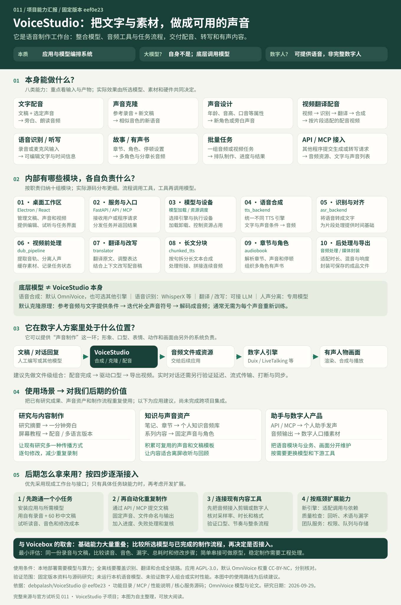

# 011 · VoiceStudio：声音能力与制作流程

> VoiceStudio 把本地语音模型、音频处理和任务管理接成一个工作台：输入文稿、参考录音或视频，制作指定音色的旁白、多语言配音、故事与有声书。

[在线能力摘要](https://yydshly.github.io/0929_codex_project/011-voicestudio/) · [本地展示页](../../site/011-voicestudio/index.html) · [完整汇报图 PNG](assets/capability-summary.png) · [矢量图 SVG](assets/capability-summary.svg) · [研究记录](RESEARCH.md) · [来源清单](SOURCES.md)

## 基本信息

| 项目 | 内容 |
| --- | --- |
| 原仓库 | https://github.com/debpalash/VoiceStudio |
| 固定版本 | eef0e2304be21c9bfd08cfca0254918522105b06 |
| 研究日期 | 2026-09-29 |
| 研究状态 | 已完成本轮资料研究与网页展示；上游模型未本机实测 |
| 软件许可 | AGPL-3.0；模型、分词器与第三方资源保留各自许可 |
| 默认模型权重 | OmniVoice 模型卡当前标注 CC-BY-NC；与应用许可分开看 |
| 展示状态 | 发布目标为 GitHub Pages；实际部署与验证记录见 RESEARCH.md |

## 摘要：它何时对我有用

VoiceStudio 是整合语音模型、媒体工具和任务管理的工作台。它能把文稿与参考声音变成指定音色的旁白，把录音转为文字，把长篇内容制作成有声书，并组织视频翻译配音与批量制作。它本身不是基础大模型；在数字人方案中可以提供声音，形象、口型与画面需由另外的系统完成。

对我而言，当开源研究需要一分钟旁白、录屏教程需要配音、笔记需要转为可听资料、系列内容需要固定声音，或数字人与个人助手需要发声时，可以用它。价值是复用已有研究，减少重复录音，积累声音与文稿模板，并让语音模块和业务、画面独立维护。

先用自有录音和 60 秒中文稿验证；任务重复后通过 API / MCP 自动化；需要人物画面时再把音频交给数字人系统。跨项目接口、实际收益与实时能力尚未实测。

## 能力总览



| 能力 | 输入 | 产物 | 适用场景 |
| --- | --- | --- | --- |
| 文字 → 配音 | 文稿 + 语言 + 选定声音 | 可保存、试听和复用的语音文件 | 教程旁白、文章朗读、产品介绍 |
| 参考录音 → 克隆音色 | 干净参考录音 + 对应文字 + 新文稿 | 用相似音色朗读全新内容 | 自己的系列旁白、授权角色配音 |
| 属性描述 → 设计声音 | 性别、年龄、音高、口音等属性 + 文稿 | 按描述生成的新声音 | 角色草稿、旁白方向探索 |
| 视频 → 翻译配音 | 视频 + 目标语言 + 翻译与声音设置 | 按片段匹配时间的配音视频 | 教程本地化、已有内容多语言版本 |
| 录音 → 文字 | 音频文件或麦克风录音 | 转写文本与可用的时间信息 | 采访整理、口述记录、字幕准备 |
| 长文 → 故事 / 有声书 | 分章文稿 + 角色声音 + 停顿 | 分章音频及有声书导出 | 个人知识音频库、多角色故事 |
| 多任务 → 批量制作 | 多个制作任务或批量视频 | 排队执行的音频 / 视频结果 | 系列课程、重复内容生产 |
| 程序请求 → 语音能力 | 本地 API 或 MCP 工具请求 | 生成音频、转写结果、声音列表 | 为个人工具、内容流程和 AI 助手提供语音 |

### 文字 → 配音

选择 TTS 引擎，准备文本和声音条件，运行推理，再做音频后处理。

边界：自然度、读音和表达由模型与素材决定；长文通常分段生成。

[实现或文档依据](https://github.com/debpalash/VoiceStudio/blob/eef0e2304be21c9bfd08cfca0254918522105b06/docs/feature-catalog.md)

### 参考录音 → 克隆音色

默认引擎把参考录音编码为声音提示，结合目标文字生成；使用时通常不重新训练。

边界：相似度并非保证；跨语言可能保留口音。参考录音的转写也会影响结果。

[实现或文档依据](https://github.com/debpalash/VoiceStudio/blob/eef0e2304be21c9bfd08cfca0254918522105b06/backend/services/tts_backend.py)

### 属性描述 → 设计声音

支持该能力的模型把说话人属性作为生成条件，不需要指定人物的录音。

边界：不能保证生成某个具体人物；默认模型的声音设计主要基于中英文训练。

[实现或文档依据](https://github.com/debpalash/VoiceStudio/blob/eef0e2304be21c9bfd08cfca0254918522105b06/docs/feature-catalog.md)

### 视频 → 翻译配音

提取音轨、分离人声、转写和分段、翻译、逐段合成、时间适配、混音导出。

边界：翻译、分离和时长适配都可能出错；时间匹配不等于重绘嘴型。

[实现或文档依据](https://github.com/debpalash/VoiceStudio/blob/eef0e2304be21c9bfd08cfca0254918522105b06/docs/performance.md)

### 录音 → 文字

调用所选 ASR 引擎；WhisperX 等路径可进一步进行对齐。

边界：语音识别的语言覆盖与 TTS 分开看；背景噪声、术语、重叠讲话影响准确率。

[实现或文档依据](https://github.com/debpalash/VoiceStudio/blob/eef0e2304be21c9bfd08cfca0254918522105b06/backend/services/asr_backend.py)

### 长文 → 故事 / 有声书

解析章节和声音标记，分块合成，衔接停顿；有声书模块可构造 M4B 章节封装。

边界：章节重音、段落衔接与音色一致性需要试听。

[实现或文档依据](https://github.com/debpalash/VoiceStudio/blob/eef0e2304be21c9bfd08cfca0254918522105b06/backend/services/audiobook.py)

### 多任务 → 批量制作

协调模型加载、算力与任务状态，并向界面报告进度。

边界：批量不等于无限并发；显存、CPU 与任务时长决定吞吐。

[实现或文档依据](https://github.com/debpalash/VoiceStudio/blob/eef0e2304be21c9bfd08cfca0254918522105b06/docs/performance.md)

### 程序请求 → 语音能力

后端提供 generate_speech、clone_voice、transcribe 等 MCP 工具。

边界：完整自动化还需要调用方编排；语音工具不承担全部对话与业务逻辑。

[实现或文档依据](https://github.com/debpalash/VoiceStudio/blob/eef0e2304be21c9bfd08cfca0254918522105b06/docs/mcp.md)

## 页面可以看到什么效果

- 3 组、5 段官方模型音频：中文克隆参考与结果、两种声音设计、多音字控制。音频直接来自 [OmniVoice 官方演示](https://zhu-han.github.io/omnivoice/)，不是本机测试。
- 4 张固定版本官方界面截图：克隆、配音、声音设计、模型管理。
- 5 种任务可切换的流程图：输入、顺序、模块、结果与检查点。
- 可拖动的配音时长示意：解释生成语音超过原视频时间窗口时的问题；不执行合成或真实时长算法。
- 可下载的中文分章文稿和本研究能力图。

## 内部原理与模块

模型层提供识别、生成、翻译和分离；工具层处理统一调用、分块、时间、缓存和媒体文件；流程层组织配音、有声书与批处理。模型能力不能靠修改界面凭空补齐。

默认 OmniVoice 使用离散扩散式语音生成：参考音频和文字提供条件，目标声音符号经迭代补全再解码成音频。通常无需为每个人重新训练模型。论文设置采用 32 轮补全、Qwen3-0.6B 初始化主干；这只是默认模型的原理，不代表所有可选引擎。[论文](https://arxiv.org/html/2604.00688v1)

| 模块 | 职责 | 输入输出 | 依据 |
| --- | --- | --- | --- |
| 桌面与工作区 | 呈现声音、文稿、视频、模型与任务界面；启动并监督本地后端。 | 用户操作 → API 请求与结果展示 | [Electron / React](https://github.com/debpalash/VoiceStudio/blob/eef0e2304be21c9bfd08cfca0254918522105b06/electron/README.md) |
| 服务与任务入口 | 把界面或其他程序的请求交给业务模块，返回进度与文件。 | 请求 → 任务 / 结果 | [FastAPI / API、MCP](https://github.com/debpalash/VoiceStudio/blob/eef0e2304be21c9bfd08cfca0254918522105b06/docs/mcp.md) |
| 模型与设备调度 | 按引擎与硬件选择执行路径，按需加载与卸载模型，避免多个重任务抢占内存。 | 引擎设置 → 可运行的模型 | [引擎选择 / 内存管理](https://github.com/debpalash/VoiceStudio/blob/eef0e2304be21c9bfd08cfca0254918522105b06/docs/performance.md) |
| 语音合成适配 | 统一不同 TTS 引擎的调用；准备参考声音、生成参数与音频输出。 | 文字 + 声音条件 → 音频 | [tts_backend.py](https://github.com/debpalash/VoiceStudio/blob/eef0e2304be21c9bfd08cfca0254918522105b06/backend/services/tts_backend.py) |
| 识别与时间信息 | 调用语音识别引擎，处理运行设备、超时和可用性，给后续分段提供文字基础。 | 音频 → 转写结果 | [asr_backend.py](https://github.com/debpalash/VoiceStudio/blob/eef0e2304be21c9bfd08cfca0254918522105b06/backend/services/asr_backend.py) |
| 视频前处理与任务记录 | 使用 FFmpeg、Demucs 等处理媒体，复用缓存，维护配音任务状态与持久化数据。 | 视频 → 音轨与项目状态 | [dub_pipeline.py](https://github.com/debpalash/VoiceStudio/blob/eef0e2304be21c9bfd08cfca0254918522105b06/backend/services/dub_pipeline.py) |
| 翻译与表达改写 | 在基础译文上可用 LLM 反思并改写语气、习惯表达和长度；失败时保留基础译文。 | 原文 / 初译 → 配音文稿 | [translator.py](https://github.com/debpalash/VoiceStudio/blob/eef0e2304be21c9bfd08cfca0254918522105b06/backend/services/translator.py) |
| 长文分块与拼接 | 按句界分割长文并交叉淡化拼接音频，处理中文等密集文字的分块长度。 | 长文 → 文本块 → 连续音频 | [chunked_tts.py](https://github.com/debpalash/VoiceStudio/blob/eef0e2304be21c9bfd08cfca0254918522105b06/backend/services/chunked_tts.py) |
| 章节与角色编排 | 识别章节、声音切换与停顿，调用合成函数，构造有声书章节元数据。 | 章节文稿 → 分章成品 | [audiobook.py](https://github.com/debpalash/VoiceStudio/blob/eef0e2304be21c9bfd08cfca0254918522105b06/backend/services/audiobook.py) |
| 媒体后处理与导出 | 衔接生成片段与背景音，处理响度、音频水印与媒体封装。 | 合成结果 → 可交付文件 | [混音 / 水印 / 文件](https://github.com/debpalash/VoiceStudio/blob/eef0e2304be21c9bfd08cfca0254918522105b06/docs/performance.md) |

## 与 Voicebox 的关系

| 比较项 | Voicebox | VoiceStudio | 理解 |
| --- | --- | --- | --- |
| 基础语音能力 | 本地 TTS、克隆、转写、长文音频 | 同类能力大量重叠 | 做一段中文旁白时，两者是替代候选。 |
| 模型选择 | Qwen3-TTS、Chatterbox、TADA、Kokoro 等 | 默认 OmniVoice，另有 CosyVoice、IndexTTS 等 | 具体语言、音质与速度取决于所选模型。 |
| 流程重点 | 口述输入、声音档案、音效、多轨故事与助手发声 | 声音设计、视频配音、有声书及批量制作 | 按你想交付的成果选择已有流程。 |
| 视频翻译配音 | 当前文档未列出同等完整的视频制作链 | 已经组织媒体、识别、翻译、合成与导出 | 自行适配能做原型；稳定工作台需要处理更多边界。 |
| 代码与许可 | Tauri / React / FastAPI；应用 MIT | Electron / React / FastAPI；应用 AGPL-3.0 | 应用代码许可与模型权重许可必须分别核对。 |

两者基础能力大量重叠；模型选型与已实现的流程不同。连接接口生成一段音频较简单，稳定的视频配音还需要处理多人、术语、时长、混音与失败恢复。[Voicebox 对照版本](https://github.com/jamiepine/voicebox/blob/51f49dea198384b4eb6087b72c17057c6eb1c1cd/README.md)

源码实证：VoiceStudio 的 [chunked_tts.py](https://github.com/debpalash/VoiceStudio/blob/eef0e2304be21c9bfd08cfca0254918522105b06/backend/services/chunked_tts.py) 明确注明改编自 Voicebox，并调整拼接与采样率处理。这能证明具体模块复用，不能据此断言整个项目是同一库或完整 fork。

## 使用场景与对我的意义

### 研究文章配音

把已整理的开源研究摘要变成可听内容。 先写成适合听的文稿，再用固定声音生成；同一篇文章提供阅读与收听入口。

价值：复用研究成果；不是直接朗读所有代码、链接和表格。

### 教程与演示视频

已有屏幕录制需要中文旁白或其他语言版本。 生成旁白并对齐片段；先核对术语翻译，再检查画面节奏。

价值：减少重复录制，保留逐句修改的空间。

### 知识音频库

把自己的笔记与章节内容做成有声资料。 按章节整理，添加适当停顿，批量合成后抽查长篇衔接。

价值：把通勤与离屏时间用于回顾；优先选择有权处理的材料。

### 个人助手发声

让自己的工具用固定音色输出状态或内容。 通过 API / MCP 传入文字，读取音频，再由应用控制播放。

价值：复用语音层；助手的理解、记忆与业务仍由应用负责。

### 数字人内容组合

已有 LiveTalking、Duix 或其他人物渲染研究。 先生成音频，再交给数字人系统驱动口型与画面。

价值：语音与人物渲染分别替换；跨项目接口尚未验证。

### 模型与流程学习

理解为什么同类语音工作台功能相似。 比较模型适配、分块、缓存、进度与失败恢复，而不只看界面。

价值：积累自己的内容工具设计方法，减少重复搭建。

## 可扩展方向

以下是建议，未实现跨项目集成；工程量不是工期承诺。

| 方向 | 复杂度判断 | 目标 | 需要解决 |
| --- | --- | --- | --- |
| 接入自己的文稿来源 | 较轻 | 将 Markdown、研究摘要或现有工具输出整理成合成任务。 | 文本清洗、声音选择、文件命名与错误反馈。 |
| 连接数字人渲染 | 中等 | 把生成音频交给已研究的口型或人物渲染系统。 | 采样率、时长、延迟、任务状态和失败重试。 |
| 添加语音引擎 | 中等到较高 | 实现统一适配接口，为特定语言或硬件选择模型。 | 不能只改模型名称；需处理依赖、声音条件、输出格式与授权。 |
| 建立质量检查 | 中等到较高 | 回听转写、比对漏字与术语、检测过长或过短片段。 | 指标只能辅助，不能替代自然度与情绪的人工试听。 |
| 整合内容发布 | 中等 | 配音完成后进入视频合成、检查与发布工具。 | 资产管理、发布账号、平台规格和人工审核节点。 |
| 做多人使用的服务 | 较高 | 把个人工作台扩展成团队任务服务。 | 身份权限、任务隔离、配额、存储、监控与全部模型许可。 |

## 使用条件与最小验证

先准备一份自己的干净录音和中文短稿，核对模型已下载、设备路径正确；试听数字、多音字、漏字、停顿与相似度，再测试长文和一分钟视频。参考录音转写与首次模型加载会增加等待。全离线要求识别、翻译、合成等全链路均使用本地依赖。

应用采用 AGPL-3.0；默认 OmniVoice 权重当前为 CC-BY-NC。下载和使用其他引擎前分别核对许可，不把应用商业许可当成模型授权。[许可说明](https://github.com/debpalash/VoiceStudio/blob/eef0e2304be21c9bfd08cfca0254918522105b06/LICENSE-NOTICE.md) / [模型卡](https://huggingface.co/k2-fsa/OmniVoice#license)

## 本地构建与查看

在仓库根目录执行：

```powershell
node projects/011-voicestudio/web/build.mjs
python -m http.server 8791 --bind 127.0.0.1 --directory site
```

访问 http://127.0.0.1:8791/011-voicestudio/ 。页面可直接打开；官方截图与音频需要联网，不依赖模型安装或 API Key。源码与发布目录独立，生成页面不会覆盖总索引。

## 验证范围

网页交互与显示检查记录见 [RESEARCH.md](RESEARCH.md)。未安装 VoiceStudio 本体、未下载模型权重、未运行本地合成，也未验证与数字人、发布工具的接口兼容性。页面不提供真实上传或生成服务。

[返回总索引](../../README.md)
